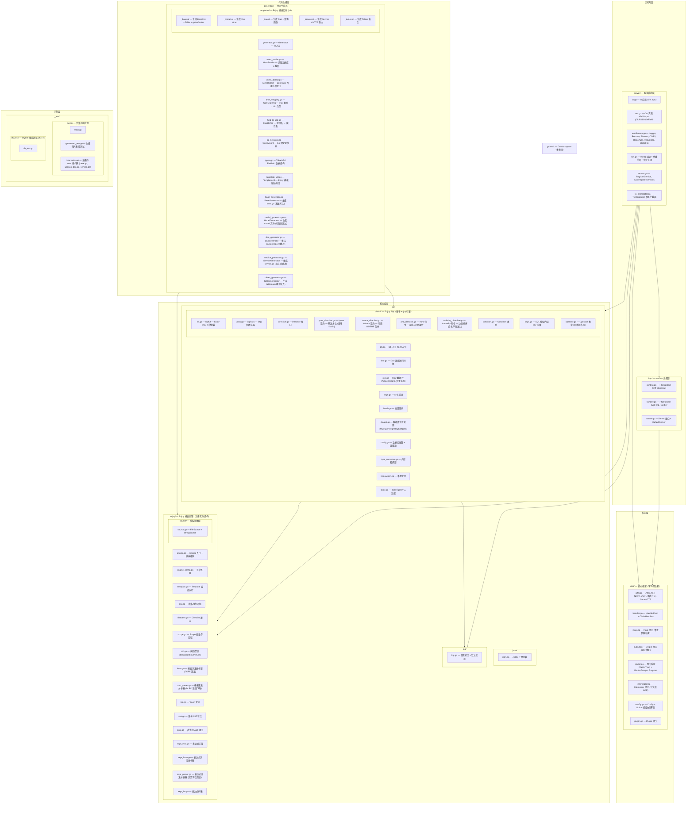

# Aifei Go - 实施方案总览

> 将 Java 版 Aifei 框架 (v1.0.0) 改写为 Go 语言版本

## 一、项目概况

### Java 版核心特征

| 特征 | 说明 |
|------|------|
| 核心代码量 | ~3333 行，零第三方依赖 |
| Java 版本 | Java 8+ |
| 架构风格 | "Just Service" — 扁平化，消除 Controller/Service/DAO 分层 |
| 请求处理 | HIO 模式 (Handler\<Input, Output\>) + 责任链 |
| 数据库 | Db + Row 模式，链式 API，Enjoy SQL 模板，多数据库方言 |
| 模块数 | 8 个 Maven 子模块 |

### Java 模块清单

| Java 模块 | 职责 | Go 处理方式 |
|-----------|------|------------|
| aifei (core) | 核心框架: Handler, Input, Output, Config, Router, AOP | 保留 → Go 核心包 |
| aifei-db | 数据库访问: Db, Row, Dao, Page, Dialect, Enjoy SQL | 保留 → Go db 子包 |
| aifei-json | JSON 处理: Json, JsonKit, FastJSON2 集成 | 保留 → Go json 子包 |
| aifei-log | 日志: SLF4J/Log4j2 抽象 | 保留 → Go log 子包 |
| aifei-proxy | AOP 动态代理: CGLIB/Javassist | **废弃** → Go 用 Handler wrapper + Interceptor 替代 |
| aifei-enjoy | 模板引擎: Lexer/Parser/Directive/Expression (特色) | **保留** → Go enjoy 子包 |
| aifei-undertow | HTTP 服务器: Undertow 集成 | **废弃** → Go 内置 net/http |
| aifei-all | 聚合模块 | **废弃** → Go import 按需引入 |

### 废弃模块的替代方案

| 废弃模块 | 原因 | Go 替代 |
|----------|------|---------|
| aifei-proxy | Go 无 JVM 动态代理机制 | Handler wrapper 链 + Interceptor 接口 |
| aifei-undertow | Go 有 net/http | http 适配器 + server 启动层 |
| aifei-all | Go 的 import 机制天然按需引入 | 不需要 |

---

## 二、Go 版实际结构

---

## 三、实施阶段总览

| 阶段 | 文档 | 内容 | 实际代码量 |
|------|------|------|-----------|
| P1 | `01-phase1-core.md` | 核心框架 (Input/Output, Router, Handler, Interceptor) | ~1,100 行 (aifei + http) |
| P2 | `02-phase2-enjoy.md` | **Enjoy 模板引擎** (Lexer, Parser, Expr, Directive, Scope) | ~2,500 行 |
| P3 | `03-phase3-db.md` | 数据库模块 (Db, Row, Dao, Page, Dialect, Enjoy SQL) + Generator | ~3,900 行 (db + db/sql + generator) |
| P4 | `04-phase4-utils.md` | JSON/日志模块 | ~150 行 |
| P5 | `05-phase5-advanced.md` | 高级特性 (Handler 包装器、优雅关闭、服务注册) | ~740 行 (server) |
| P6 | `06-phase6-example.md` | 示例应用、集成测试 | ~1,300 行 |
| **总计** | | | **~9,700 行**（含测试 ~2,060 行） |

> 注：实际代码量约 8,350 行库代码 + 2,057 行测试 = 74 个 Go 文件，超出最初预估的 5,800 行。增量主要来自 generator 模块（1,250 行）和 db/sql/ 子包（940 行）。

---

## 四、关键设计决策

| 决策点 | Java 方案 | Go 方案 | 理由 |
|--------|-----------|---------|------|
| 请求上下文 | Input + Output 两个接口 | Input / Output 接口（保持分离） | 与 Java API 一致，接口更清晰 |
| AOP/拦截 | CGLIB/Javassist 动态代理 + Interceptor | Handler wrapper 链 + Interceptor 接口 | Wrapper 替代链式拦截，Interceptor 保留方法级 AOP |
| 路由注册 | @Path 注解 + 反射扫描 | 代码注册 / struct 方法注册 | Go 无注解，代码注册更清晰 |
| 泛型 | Java 泛型 `Handler<I, O>` | Go 接口 | 简化接口，保持类型安全 |
| 错误处理 | throws Throwable | error 返回值 + panic/recover | Go 惯例 |
| 并发 | 同步阻塞 + 线程池 | goroutine 天然并发 | Go 优势 |
| 路由匹配 | HashMap + ActionGroup | Radix Tree | Go 高性能路由标准做法 |
| 依赖注入 | @Inject + 反射 | 构造函数注入 | Go 惯例 |
| 配置 | AifeiConfig 接口 + 多个 config() 方法 | Functional Options 模式 | Go 惯用的配置模式 |
| 包扫描 | ClassLoader + 文件系统/JAR 扫描 | 不需要 (Go 静态编译) | Go 编译时确定所有代码 |
| HTTP 服务器 | Undertow 嵌入式 | net/http (http 适配 + server 启动) | Go 标准库，零依赖 |
| 代码生成 | Java Generator (同仓库) | Go Generator 独立模块 | 每表一包策略，编译期类型安全 |

---

## 五、Go 重写核心原则

1. **保持 API 风格一致** — 链式 API、Db + Row 模式、Just Service 理念
2. **Go 惯用优先** — 使用 Go 的惯用模式而非生搬 Java
3. **最小依赖** — 核心零第三方依赖 (仅标准库)
4. **AI 友好** — 保持代码量少、结构扁平、易于 AI 生成
5. **性能优先** — 利用 Go 的并发优势和高效内存模型
