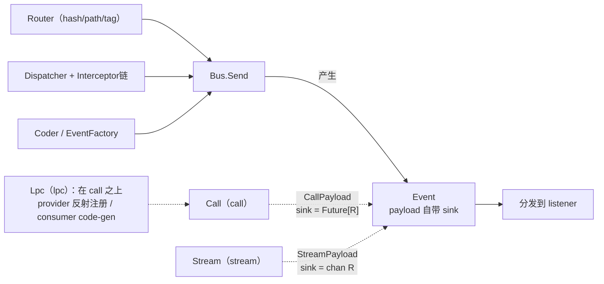

# DamiBus 迁移到 Go 的设计（dami-go）

> 本文是「DamiBus 迁移到 Go」调研的第二部分（设计规范，**已定稿**）。
> 前置：[`01-go-comparison.md`](01-go-comparison.md)（生态对比与可行性结论）。
> 源码参照：`/Users/airhead/WorkSpace/goldsyear/damibus`（`dami2` 2.0.5）。
> 目标宿主：`aifei-go` 工作区（Go 1.26，零外部依赖，多模块）。

---

## 0. TL;DR（设计摘要）

- **能忠实迁移约 85%**：事件分发 `send`、请求-响应 `call`、响应式流 `stream`、路由器（hash/path/tag）、拦截器、监听者排序、附件、可插拔的 router/dispatcher/coder、泛型、fallback、handled——这些都能在 Go 中以**等价语义**实现。
- **唯一无法 1:1 的是 `lpc` 的消费者代理**：Go 语言层面无法在运行时动态实现接口（[golang/go#41897](https://github.com/golang/go/issues/41897)），采用 **code-gen stub（默认）+ 泛型 `Call[R]` 助手（兜底）** 双轨替代；**provider 侧反射注册完全可行**（`aifei-go` 的 `server.Register` 已验证此模式）。
- **定位**：作为 `aifei-go` 生态的新模块 **`./dami`**（`github.com/crazy-airhead/aifei-go/dami`），**零外部依赖**，与现有 `nami`（远程 RPC）、`kafka`（跨进程消息）互补，填补「**进程内多模块解耦 / 事件总线**」的空白。
- **关键设计原则**：①Bus 用**具体 struct**（非 interface）；泛型 `Send/Listen` 为**包级函数**（Go 方法不能带类型参数，`SendOn/ListenOn` 取实例、`Send/Listen` 取默认总线）；②call 用自造 `Future[R]`，stream 用 `chan` + `context`；③拦截器链复用 `aifei.Handler` 的 wrapper 风格；④异常用 `error` 返回 + 可选 `panic/recover` 透传。

---

## 1. 背景与目标

### 1.1 为什么迁移

`aifei-go` 已具备：核心 Web 框架、`enjoy` 模板、`db` ORM、`nami`（HTTP RPC client）、`kafka`/`storage`/`cache`/`nacos`/`swagger` 等插件。但**缺少**一种「在同一进程内、跨未知/隔离模块、低耦合地互发事件或互调方法」的能力。DamiBus 正是为此而生，且其设计哲学（扁平、解耦、零依赖、Just Service）与 `aifei-go` 高度一致。

### 1.2 迁移目标（优先级排序）

1. **P0 核心**：`Bus` 的 `send`（事件分发）+ `call`（请求-响应）+ 路由器（hash/path/tag）+ 拦截器 + 监听者排序 + attach。
2. **P1 进阶**：`stream`（响应式流，基于 channel）+ `lpc` provider 反射注册。
3. **P2 增强**（已完成）：`lpc` consumer（code-gen stub）+ `Plugin` 生命周期。
4. **非目标**：跨进程 / 跨网络（那是 `nami` / `kafka` 的职责）；分布式事务。

### 1.3 非功能约束

- **零外部依赖**（仅 Go 标准库），与 `aifei-go` 所有库模块一致。
- **类型安全**：能用 Go 泛型的地方不用 `any`，优于 Java 版的运行时类型擦除。
- **API 命名**沿用 Java Aifei 习惯（`Send`/`Listen`/`Unlisten`/`Call`/`Intercept`），与 `aifei-go` 现有命名一致。
- **并发安全**：listener 注册/移除、dispatch 高并发下安全（`sync.RWMutex` / `sync.Map`）。

---

## 2. Java → Go 语言差异对设计的影响（必读）

| 维度 | DamiBus (Java) | dami-go (Go) | 影响 / 取舍 |
|------|----------------|--------------|------------|
| 接口 + 泛型方法 | `interface DamiBus { <P> void listen(...) }` | ❌ Go **方法（带接收者）也不能带类型参数** | **Bus 用具体 struct**；泛型 `Send/Listen` 为**包级函数**（`SendOn/ListenOn` 操作指定总线，`Send/Listen` 操作默认总线） |
| 动态代理 | `Proxy.newProxyInstance` 实现 lpc consumer | ❌ Go 无法运行时实现接口 | consumer 改 **code-gen** / 泛型助手；provider 用 reflect（可行） |
| CompletableFuture | `call` 返回 `CompletableFuture<R>` | 自造 `Future[R]`（`chan` + `context`） | 等价语义，支持 `Get(ctx)` 阻塞与 `Then` 回调 |
| Reactive Streams | `stream` 用 `Publisher/Subscriber` | `chan R` + `context`（背压 = 有界 buffer + select） | 拥抱 channel，不引入 rxgo |
| 异常 | `throw` + `InvocationTargetException` 包装 | `error` 返回 + 可选 `panic/recover` | 同步分发：listener `error` 直接 return；事务透传用 panic 或显式 |
| 注解 | `@DamiTopic`（Solon/Spring） | Go 无注解 | 用 **`init()` 自注册 + `Plugin`** 生命周期 |
| 泛型擦除 | 运行时无 P 信息 | Go 泛型非擦除（部分），但接口方法受限 | 见上 |
| 反射获取参数名 | `method.getParameters().getName()`（需 `-parameters`） | Go 反射**拿不到形参名** | lpc coder 改用**参数下标** `CoderForIndex`，或 code-gen 时注入名字 |
| Serializable | `Event implements Serializable` | Go 不需要 | 去掉，进程内对象直接传引用 |

> **最重要的两条**：①「接口方法不能带泛型」→ Bus 用 struct；②「Go 拿不到形参名」→ lpc coder 默认用下标对齐（这正是 Java 版保留的 `CoderForIndex`）。

---

## 3. 总体架构

```
dami/                         # 核心模块，零外部依赖
├── go.mod                    # module github.com/crazy-airhead/aifei-go/dami
├── doc.go                    # 包文档
├── event.go                  # Event[P]、Sink、eventView、attach、handled
├── listener.go               # Listener[P]、holder（类型擦除）、pipeline（index 排序）
├── payload.go                # RequestPayload[D]（call/stream 共用荷载）
├── router.go                 # Router 接口（Add/Remove/Match/Count/ClearAll）
├── router_hash.go            # HashRouter（默认，map 直查）
├── router_path.go            # PathRouter（* / ** 正则）
├── router_tag.go             # TagRouter（: + , tag 交集）
├── intercept.go              # Interceptor + chain（对齐 aifei.Handler wrapper）
├── dispatcher.go             # Dispatcher（拦截链→预检→分发→handled）
├── bus.go                    # Bus struct + Option + 包级泛型 SendOn/ListenOn + Stop
├── dami.go                   # 包级默认总线 + Send/Listen 便捷 + SetDefaultBus
├── future.go                 # Future[R]（call 答复）、futureSink
├── call.go                   # 包级泛型 CallOn/Call + ListenCallOn/ListenCall
├── stream.go                 # 包级泛型 StreamOn/Stream + ListenStreamOn/ListenStream
├── coder.go                  # Coder + CoderForIndex
├── lpc.go                    # Lpc.RegisterProvider（反射注册）+ invoke
├── lpc_call.go               # Call0/Call1 泛型助手（无 code-gen consumer 路径）
└── *_test.go                 # 单测 + 基准（对标 dami 的 benchmark/SendTest）

tools/                        # 代码生成工具（独立模块）
├── generator/                # db 代码生成（读 schema → dao/model/service；依赖 db+enjoy）
└── damigen/                  # P2：dami consumer 代码生成（go/ast 解析接口 + enjoy 模板）
    ├── gen.go / parser.go / template.go
    └── cmd/damigen/          # dami-gen CLI（go:generate / go run）

plugins/dami/                 # P2：aifei.Plugin 适配（独立模块，依赖 aifei+dami+log）
└── plugin.go                 # Plugin：Start 设默认总线 / Stop 经 Bus.Stop() 清理 listener
```

分层（自底向上）：


---

## 4. 核心类型设计

> 以下为类型契约与关键实现思路，实现时据此编码。命名与 `aifei-go` 现有风格对齐。

### 4.1 Event / Result / Sink

```go
package dami

// Event 是事件的载体：主题 + 荷载 + 附件 + 处理标识。
// 对应 Java Event<P> / SimpleEvent<P>。不再 implements Serializable（进程内直接传引用）。
type Event[P any] struct {
	Topic   string
	Payload P                  // 业务荷载；call/stream 时是 *CallPayload/*StreamPayload
	Attach  map[string]any     // 多 listener 共享，可相互协作（对应 Java attach）
	handled bool               // 是否有 listener 处理（dispatch 后置位）
	sink    sink               // 可选接收器（call→Future, stream→chan）
}

// Attach 取（懒初始化）附件 map。
func (e *Event[P]) AttachMap() map[string]any {
	if e.Attach == nil {
		e.Attach = make(map[string]any)
	}
	return e.Attach
}

func (e *Event[P]) Handled() bool      { return e.handled }
func (e *Event[P]) markHandled()       { e.handled = true }

// Result 是 Send 的返回，对应 Java Result<P>。
type Result[P any] interface {
	Handled() bool
	Attach() map[string]any
	Topic() string
	Payload() P
}

// sink 是 call/stream 的接收器统一抽象（内部）。
// call 的 sink：Next 只记第一个值，Complete 带最终 error。
// stream 的 sink：Next 多次推入 channel，Complete 关闭 channel。
type sink interface {
	next(v any)
	complete(err error)
}
```

### 4.2 Bus（核心，**具体 struct 而非 interface**）

> 设计决策：Go 既不允许接口方法带类型参数，**也不允许 struct 方法带类型参数**（这是与 Java 的关键差异 —— 设计稿初版误以为"struct 方法可带泛型"，实现时被编译器否决）。因此 `Bus` 是具体 struct，只承载**非泛型**方法（`Router / Intercept / UnlistenAll`）；泛型的 `Send/Listen` 落在**包级函数**上：`SendOn[P](b *Bus, …)` / `ListenOn[P](b *Bus, …)` 操作指定总线，`Send[P](…)` / `Listen[P](…)` 操作包级默认总线（对应 Java `Dami.bus().send()`）。这与 `aifei-go` 的 `Aifei` struct 风格一致。需要 mock 时，定义一个**非泛型**的窄接口 `BusCore`（仅暴露非泛型操作）即可。

```go
// Bus 是 DamiBus 的 Go 对应物。零值不可用，请用 New(opts...)。
type Bus struct {
	router     Router
	dispatcher Dispatcher
}

func New(opts ...Option) *Bus {
	b := &Bus{
		router:     NewHashRouter(),   // 默认 hash（最快）
		dispatcher: NewDispatcher(),    // 默认调度器（拦截链 + 分发）
	}
	for _, o := range opts {
		o(b)
	}
	return b
}

func (b *Bus) Router() Router                              { return b.router }
func (b *Bus) Intercept(index int, it Interceptor)         { b.dispatcher.AddInterceptor(index, it) }
func (b *Bus) UnlistenAll(topic string)                    { b.router.RemoveAll(topic) }

// SendOn 发送事件（事件分发/广播）到指定总线 b。fallback 在【无任何订阅者】时执行。
// 对应 Java DamiBus.send(topic, payload, fallback)。
// 包级泛型函数 —— Go 方法不能带类型参数，故泛型 API 落在函数上。
func SendOn[P any](b *Bus, topic string, payload P, fallback ...func(P)) (*Event[P], error) {
	assertTopic(topic)
	ev := &Event[P]{Topic: topic, Payload: payload}
	err := b.dispatcher.Dispatch(ev, b.router) // 同步分发；listener 的 error 透传出来
	if !ev.handled {
		for _, fb := range fallback {
			if fb != nil {
				fb(ev.Payload)
			}
		}
	}
	return ev, err
}

// ListenOn 监听事件（指定总线），返回【取消监听】函数。index 控制顺序（升序）。
// 对应 Java DamiBus.listen(topic, index, listener)。
func ListenOn[P any](b *Bus, topic string, listener Listener[P], index ...int) (unlisten func()) {
	idx := 0
	if len(index) > 0 {
		idx = index[0]
	}
	h := newHolder(idx, listener) // 内部做 ev.(*Event[P]) 类型擦除桥接
	b.router.Add(topic, h)
	return func() { b.router.Remove(topic, h) }
}

// 包级默认总线的便捷函数（对应 Java Dami.bus()）：
//
//	func Send[P any](topic string, payload P, fallback ...func(P)) (*Event[P], error)
//	func Listen[P any](topic string, listener Listener[P], index ...int) (unlisten func())
//
// 二者等价于 SendOn[P](Default(), …) / ListenOn[P](Default(), …)。
```

### 4.3 Listener / 拦截器 / Dispatcher（拦截链）

```go
// Listener 处理一个事件，返回 error。
// （Java 用 throws Throwable 透传；Go 用 error 返回 + 调度器决定是否 panic）
type Listener[P any] func(*Event[P]) error

// Interceptor 是事件级 AOP，对齐 aifei.Handler wrapper：
//   next() 继续链条，最终走到 listener。
type Interceptor func(ev *Event[any], next func() error) error

// Dispatcher 派发：1.拦截链 → 2.预检(有无目标) → 3.分发 → 4.标记 handled。
// 对应 Java EventDispatcherDefault。
type Dispatcher interface {
	AddInterceptor(index int, it Interceptor)
	Dispatch(ev any, router Router) error
}
```

> **拦截链实现**：与 DamiBus 的 `InterceptorChain`（前拦截 + 最终 handler）一一对应；可复用 `aifei.ChainHandlers` 的「从后往前包装」思路。拦截器处理的是类型擦除后的 `*Event[any]`（拦截器天然跨类型，如日志/监控）。

### 4.4 Call（请求-响应）— `Future[R]`

```go
// Call 发送调用事件，返回 Future。对应 Java bus.call(topic, data)。
// CallOn 发送调用事件到指定总线 b，返回 Future 答复。对应 Java bus.call(topic, data)。
// 包级泛型函数（Go 方法不能带类型参数）；dispatch 同步执行 handler 并答复。
// 内部：构造 RequestPayload{Data, Sink: futureSink[R]} 走 dispatch。
func CallOn[D, R any](b *Bus, topic string, data D, fallback ...func(*Future[R])) *Future[R] {
	fut := NewFuture[R]()
	ev := &Event[*RequestPayload[D]]{
		Topic:   topic,
		Payload: &RequestPayload[D]{Data: data, Sink: &futureSink[R]{fut: fut}},
	}
	_ = b.dispatcher.Dispatch(ev, b.router)
	if !ev.handled {
		for _, fb := range fallback {
			if fb != nil { fb(fut) }
		}
	}
	return fut
}

// Call 发送调用事件到默认总线。
func Call[D, R any](topic string, data D, fallback ...func(*Future[R])) *Future[R] {
	return CallOn[D, R](Default(), topic, data, fallback...)
}

// ListenCallOn 注册强类型请求-响应 handler（指定总线）：handler 返回 (R, error)，
// 框架把结果经 payload 的 Sink 答复。对应 Java CallEventListener。
func ListenCallOn[D, R any](b *Bus, topic string, handler func(D) (R, error), index ...int) (unlisten func()) {
	return ListenOn(b, topic, func(ev *Event[*RequestPayload[D]]) error {
		r, err := handler(ev.Payload.Data)
		if err != nil { ev.Payload.Sink.Complete(err); return nil }
		ev.Payload.Sink.Next(r)
		return nil
	}, index...)
}

// Future[R] 对应 Java CompletableFuture<R>。首个答复生效（幂等 settle）。
type Future[R any] struct {
	done chan futureResult[R] // buffered=1
}
type futureResult[R any] struct {
	val R
	err error
}

func NewFuture[R any]() *Future[R] {
	return &Future[R]{done: make(chan futureResult[R], 1)}
}
func (f *Future[R]) settle(r futureResult[R]) {
	select { case f.done <- r: default: } // 首个答复生效
}
// Get 阻塞到答复或 ctx 取消。
func (f *Future[R]) Get(ctx context.Context) (R, error) {
	select {
	case r := <-f.done:
		return r.val, r.err
	case <-ctx.Done():
		var zero R
		return zero, ctx.Err()
	}
}
func (f *Future[R]) Then(fn func(R, error)) { go func() { r := <-f.done; fn(r.val, r.err) }() }

// futureSink[R] 把 *Future[R] 适配为 Sink（call 的答复通道）。
type futureSink[R any] struct{ fut *Future[R] }
```

### 4.5 Stream（响应式流）— `chan` + `context`

```go
// StreamOn 发送流事件到指定总线 b，返回只读 item channel。对应 Java bus.stream(topic, data)。
// 背压：channel 有界 buffer（消费者慢时生产者阻塞或丢弃）；ctx 取消时关闭 channel。
func StreamOn[D, R any](b *Bus, ctx context.Context, topic string, data D, fallback ...func(<-chan StreamItem[R])) <-chan StreamItem[R] {
	ch := make(chan StreamItem[R], 16)
	sink := &streamSink[R]{ch: ch, ctx: ctx, done: make(chan struct{})}
	ev := &Event[*RequestPayload[D]]{
		Topic:   topic,
		Payload: &RequestPayload[D]{Data: data, Sink: sink},
	}
	_ = b.dispatcher.Dispatch(ev, b.router)
	if !ev.handled {
		for _, fb := range fallback {
			if fb != nil { fb(ch) }
		}
	}
	go func() {
		<-ctx.Done()
		sink.terminate(ctx.Err())
	}()
	return ch
}

// StreamItem 携带一个值或最终错误（Err 非 nil 时为流的最后一项）。
type StreamItem[R any] struct {
	Val R
	Err error
}
```

> **与 Java 版的语义差异**：Java 版 stream 对接 `org.reactivestreams`（背压协议、`request(n)`）。Go 版**不实现完整 RS 协议、也不引入 rxgo**，而用 `chan`（有界 buffer）表达「有限缓冲 + 取消（ctx）」，这在 Go 中是地道且足够覆盖进程内流式场景的。

### 4.6 Router（hash / path / tag）

```go
type Router interface {
	Add(topic string, h *holder)
	Remove(topic string, h *holder)
	RemoveAll(topic string)
	Match(topic string) []*holder
}

// HashRouter：map[topic]*pipeline，O(1) 直查（默认，最快）。对应 HashTopicEventRouter。
// PathRouter：含 * / ** 的模式进 CopyOnWrite slice + 正则；精确的进 map。对应 PathTopicEventRouter。
// TagRouter：topic:expr 按 ":" 切 topic、按 "," 切 tags；双方都有 tag 时需交集。对应 TagTopicEventRouter。
```

> 三种路由器的**算法直接照搬** Java 版（`PathRouting` 的正则转换、`TagRouting.TopicTags` 的解析与缓存），Go 实现无难度。

### 4.7 Coder（参数编码）— 默认下标对齐

```go
// Coder 把 provider 方法的参数与事件荷载互转。对应 Java Coder。
// Go 反射拿不到形参名，故【默认用下标对齐】CoderForIndex（Java 版亦有此实现）。
type Coder interface {
	Encode(method reflect.Method, args []any) any                  // args → payload（map）
	Decode(method reflect.Method, payload any) ([]any, error)       // payload → args
}
```

> 形参名问题：Go 的 `reflect` 无法获取形参名。两个出路——①默认 `CoderForIndex`（`{"0": a, "1": b}`），简单可靠；②code-gen consumer/provider 时把名字写死（编译期已知）。**provider 端反射注册 + 消费端 code-gen** 的组合下，name 由生成代码提供，CoderForIndex 仅作无 code-gen 时的兜底。

### 4.8 Lpc（本地过程调用）— **迁移的核心难点**

#### Provider 侧（**完全可移植**，反射注册）

```go
type Lpc struct {
	bus   *Bus
	coder Coder
	mu    sync.Mutex
	providers map[reflect.Type][]topicListen // 注销用
}

// RegisterProvider 反射 provider（非 nil 指针）的所有导出方法，逐个注册为 call
// listener，topic = topicMapping + "." + MethodName。对应 Java
// DamiLpcImpl.registerProvider；模式与 aifei-go 的 server.Register 一致。
func (l *Lpc) RegisterProvider(topicMapping string, provider any) error {
	v := reflect.ValueOf(provider)
	t := v.Type()
	// ... 非 nil 指针校验、防重复注册 ...
	var records []topicListen
	for i := 0; i < t.NumMethod(); i++ {
		m := t.Method(i)
		if m.PkgPath != "" { continue } // 跳过未导出方法
		topic := topicMapping + "." + m.Name
		unlisten := l.registerMethod(topic, v, m)
		records = append(records, topicListen{topic, unlisten})
	}
	l.providers[t] = records
	return nil
}

// registerMethod：把一个方法包成 ListenCallOn[map[string]any, any] handler ——
// coder.Decode 还原参数 → m.Func.Call 反射调用 → 首个返回值 + 尾随 error 答复。
func (l *Lpc) registerMethod(topic string, v reflect.Value, m reflect.Method) func() {
	handler := func(data map[string]any) (any, error) {
		args, err := l.coder.Decode(m, data)
		if err != nil { return nil, err }
		return l.invoke(v, m, args)
	}
	return ListenCallOn(l.bus, topic, handler)
}
```

#### Consumer 侧（**无法 1:1，提供两条出路**）

Java 的 `lpc.createConsumer(iface)` 用动态代理生成接口实现。Go 做不到。提供：

**方案 A（默认）— code-gen 生成 client struct（类型安全、Go-idiomatic）**

```go
// 用户接口（带 tag 指定 topic mapping）
//dami:provider user
type UserService interface {
	GetUserID(ctx context.Context, name string) (int64, error)
}

// 由 tools/damigen 生成（go/ast 解析接口 + enjoy 模板；tools/damigen/cmd/damigen 是 CLI）：
type UserServiceClient struct{ Bus *dami.Bus }

func NewUserServiceClient(bus *dami.Bus) *UserServiceClient { return &UserServiceClient{Bus: bus} }

func (c *UserServiceClient) GetUserID(ctx context.Context, name string) (int64, error) {
	return dami.Call1[int64](c.Bus, ctx, "user.GetUserID", name)
}
```

**方案 B — 泛型 `Call[R]` 助手（无 code-gen，灵活但需手写调用）**

```go
// 直接调用，不走"接口代理"，但语义等价。
id, err := lpc.Call1[int64](ctx, "user.GetUserID", Args{"name": name})
// 多返回值：
n, sum, err := lpc.Call2[int, float64](ctx, "stat.Compute", Args{"x": x})
```

> **取舍**：方案 A 给编译期类型安全 + IDE 友好，代价是多一步 code-gen（`aifei-go` 已有 `generator` + `enjoy` 模板能力，复用成本低，且 `aifei-go` 生态本身就重度依赖 code-gen 生成 dao/service）。方案 B 零生成、上手快，适合简单场景。**两者都提供，默认 code-gen（方案 A）。**
>
> 这是 Go 版相对 Java 版的**改进点**：Java 版的 `createConsumer` 是运行时反射代理，类型错误要到运行时才暴露；Go 版 code-gen 的 client 是编译期检查。

---

## 5. 能力迁移映射表（Java → Go）

| Java (dami2) | Go (dami-go) | 难度 | 说明 |
|--------------|--------------|:----:|------|
| `Dami` 主类 / `Dami.newBus()` | `dami.New()` + 包级默认实例 | 易 | 对齐 aifei 风格 |
| `DamiBus.send` | `Bus.Send[P]` | 易 | 直接对应 |
| `DamiBus.listen(index)` | `Bus.Listen[P](idx)` 返回 unlisten | 易 | index 排序 |
| `DamiBus.unlisten` | `unlisten()` 闭包 / `Bus.UnlistenAll` | 易 | |
| `DamiBus.intercept` | `Bus.Intercept` + `Interceptor` | 易 | 对齐 aifei.Handler |
| `Result` / handled | `Result[P]` / `ev.Handled()` | 易 | |
| fallback | `Send(..., fallback)` 变参 | 易 | |
| `Event` / attach | `Event[P]` / `Attach` map | 易 | |
| `call` / `CompletableFuture` | `Bus.Call[D,R]` / `Future[R]` | 中 | 自造 Future |
| `stream` / `Publisher` | `Bus.Stream[D,R]` / `chan StreamItem[R]` | 中 | channel 化，非完整 RS |
| `HashTopicEventRouter` | `HashRouter` | 易 | map |
| `PathTopicEventRouter` | `PathRouter`（正则） | 易 | 照搬算法 |
| `TagTopicEventRouter` | `TagRouter`（: + , 解析） | 易 | 照搬算法 |
| `EventDispatcher` 可插拔 | `Dispatcher` 接口 + Option | 易 | |
| `EventFactory` | `EventFactory` | 易 | |
| `Coder` (ForName/ForIndex) | `Coder`（默认 ForIndex） | 易 | 形参名限制 → 下标 |
| `lpc.registerProvider` | `Lpc.RegisterProvider`（reflect） | 中 | aifei-go server.Register 先例 |
| `lpc.createConsumer`（**动态代理**） | **code-gen stub / `Call[R]` 助手** | **高** | 语言限制，需改方案 |
| `@DamiTopic`（Solon/Spring） | `init()` 自注册 + `Plugin` | 中 | Go 无注解 |
| `implements Serializable` | （移除） | — | 进程内传引用 |
| `throws Throwable` 透传 | `error` 返回 + `panic/recover`（可选） | 中 | 语义调整 |

---

## 6. 关键难点与取舍

1. **Bus 不能是 interface，且泛型 `Send/Listen` 不能是方法**（Go 既禁止接口方法带类型参数，也禁止 struct 方法带类型参数）→ `Bus` 用具体 struct 承载非泛型方法，泛型 `Send/Listen` 落在**包级函数**（`SendOn/ListenOn` 取实例、`Send/Listen` 取默认总线）。mock 时定义窄的非泛型 `BusCore` 接口。**这是与 Java 版最大的 API 形态差异**。
2. **lpc consumer 无动态代理** → code-gen + 泛型助手双轨；provider 反射注册沿用 `server.Register` 模式。
3. **形参名缺失** → Coder 默认下标对齐；code-gen 路径下名字由生成器注入。
4. **异常模型**：DamiBus 强调「异常透传/事务传导」（同步栈内）。Go 版策略——
   - 默认：`Send` 同步遍历 listener，**遇到第一个 error 即停止后续 listener 并返回该 error**（最贴近"异常透传"）。
   - 可选：`Option{PanicOnListenError: true}` 或 `Option{RecoverOnListenError: true}`，适配不同事务边界需求。
   - call/stream 的 error 经 `Future`/`StreamItem.Err` 传导。
5. **stream 的背压**：不实现完整 RS 协议、不引入 rxgo，用有界 `chan` + `ctx` 取消即可满足进程内流式场景；保持零依赖。
6. **handled 与 fallback 的交互**：与 Java 版一致——只有「无任何匹配 listener」才触发 fallback。
7. **并发安全**：listener 增删用 `sync.RWMutex` 保护 pipeline；dispatch 遍历用快照（拷贝 holder 切片），避免遍历时增删 panic（对应 Java 版 `for (int i=0; i<size; i++)` 的同样考虑）。

---

## 7. 与 aifei-go 生态的集成

- **复用设计语言**：`Interceptor` 对齐 `aifei.Handler`（`func(next) ...` wrapper）、`Plugin` 对齐 `aifei.Plugin`（`Start/Stop`）、`Option` 对齐 `aifei.WithXxx`。
- **定位互补**：
  - `dami` = **进程内**解耦 / 事件 / 本地调用；
  - `nami` = **跨进程** HTTP RPC client；
  - `kafka` = **跨进程**异步消息。
  三者覆盖「进程内 → 本地调用 → 远程 → 异步消息」的完整解耦光谱。
- **Plugin 集成**（P2 已实现）：独立模块 `plugins/dami` 的 `dami.NewPlugin()` 实现 `aifei.Plugin`——`Start()` 把自有 Bus 经 `dami.SetDefaultBus` 设为包级默认，`Stop()` 经 `Bus.Stop()`（`Router.ClearAll`）清理全部 listener，挂到 `server.Run` 生命周期。dami 核心零依赖，Plugin 单独成模块以引入 `aifei`/`log` 依赖。
- **可选与 server 联动**：service 方法可通过 dami 的 lpc 暴露给「非 HTTP 调用方」（如定时任务、其他模块），实现同一 service 既能被 HTTP 路由、又能被进程内事件总线调用。
- **零依赖保证**：`dami` 仅用标准库，不引入 rxgo 或任何响应式框架。

---

## 8. 分阶段实现计划

| 阶段 | 内容 | 产出 | 依赖 |
|------|------|------|------|
| **P0** | `Event`/`Result`/`Bus`/`Router`(hash) + `Dispatcher`/`Interceptor` + `Listener` 排序 + `attach`/`handled`/`fallback` | 事件分发可用 + 单测 + 基准（对标 `SendTest`） | 无 |
| **P0** | `Router`(path/tag) + `Coder`(ForIndex) | 路由定制可用（对标 `RouterPathTest`/`RouterTagTest`） | P0 |
| **P1** | `Future` + `Bus.Call[D,R]` + `CallPayload` | 请求-响应可用（对标 `Demo12`） | P0 |
| **P1** | `Stream` + `Bus.Stream[D,R]`（chan 化） | 响应式流可用（对标 `Demo13`） | P1 |
| **P1** | `Lpc.RegisterProvider`（反射）+ 泛型 `Call[R]` 助手 | provider 注册 + 无生成 consumer 可用（对标 `Demo31`） | P1 |
| **P2** ✅ | code-gen consumer（`tools/damigen`，go/ast+enjoy 模板）+ `plugins/dami`（`aifei.Plugin` 生命周期） | 强类型 client stub + server 集成 | P1 |
| **P2** | `Plugin`（`aifei.Plugin` 生命周期） | 与 server 集成，`Stop()` 注销 listener / 关闭 stream | P1 |

每阶段配单测；P0/P1 配基准测试，目标吞吐对标 Java 版（Go 进程内 channel 调度应能达到同量级，5000 万/秒量级取决于 dispatch 路径开销，需实测）。

---

## 9. 已定的设计决策

以下 5 项决策已按推荐项定稿，构成本设计的约束前提，直接据此进入实现：

1. **模块归属**：新建独立模块 `./dami`（`github.com/crazy-airhead/aifei-go/dami`），零依赖、可单独 `go get`，**不**融入 `aifei` 核心包。
2. **lpc consumer 方案**：code-gen stub（默认）+ 泛型 `Call[R]` 助手（兜底）双轨提供；provider 侧反射注册。
3. **异常透传策略**：`Send` 同步遍历 listener，遇到**第一个 error 即停止后续 listener 并返回该 error**（最贴近 Java 的异常透传/事务传导）；call/stream 的 error 经 `Future` / `StreamItem.Err` 传导。
4. **IoC 集成方式**：`init()` 自注册 + `Plugin` 生命周期管理；**不**使用 code-gen tag、**不**做纯手工注册。
5. **包级默认实例**：提供 `dami.Send / Listen / Call / Stream` 包级便捷函数（对应 Java 的 `Dami.bus()` 全局单例），支持「包级默认 + 显式 `New()`」双模式，与 `aifei-go` 其他模块一致。

> 这 5 项决策均为「最贴合 DamiBus 语义 + 最符合 `aifei-go` 现有约定 + 零依赖」的组合。决策已定稿，据此进入 P0 实现。

---

## 附：与 Java 版的关键 API 对照速查

```java
// Java                                                 // Go (dami-go)
Dami.bus().listen(topic, e -> {...});                   dami.Listen(topic, func(e *Event[Msg]) error {...})  // 默认总线；实例用 dami.ListenOn(b, …)
Dami.bus().send(topic, payload);                        dami.Send(topic, payload)
Dami.bus().<String,String>call(topic, data).get();      r, err := dami.Call[Resp](ctx, topic, data).Get(ctx)
Dami.bus().<String,String>stream(topic, data);          for it := range dami.Stream[Resp](ctx, topic, data) {...}
Dami.lpc().registerProvider(map, impl);                 lpc.RegisterProvider(map, impl)
Dami.lpc().createConsumer(map, Iface.class);            // gen: &IfaceClient{...}  或  lpc.Call1[R](...)
Dami.bus().intercept(idx, interceptor);                 b.Intercept(idx, func(ev, next) error {...})
DamiConfig.configure(new PathTopicEventRouter());       dami.New(dami.WithRouter(dami.NewPathRouter()))
```
