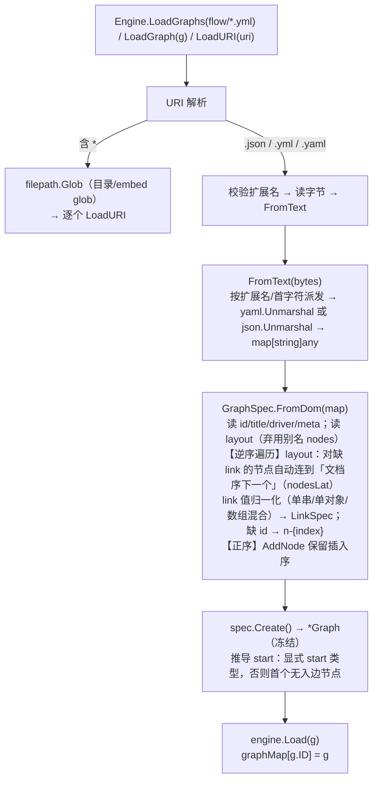

# 配置 / 快照 / 表达式 / 集成（flow-go）

> 本文是「Solon-Flow 迁移到 Go」系列的第四篇。
> 前置：[`00-overview.md`](00-overview.md)、[`01-go-comparison.md`](01-go-comparison.md)、[`02-core-design.md`](02-core-design.md)。
> 涵盖：①YAML/JSON 图配置 schema；②图加载与注册；③快照持久化（中断/恢复）；④可插拔表达式引擎（默认复用 enjoy，附 Snel↔enjoy 差异表）；⑤aifei-go 集成插件。

---

## 1. 配置 schema（YAML / JSON 图）

### 1.1 顶层键

| 键 | 必填 | 类型 | 说明 |
|----|------|------|------|
| `id` | 是 | string | 图标识；Engine 注册表的 key |
| `title` | 否 | string | 显示标题；缺省 = `id` |
| `driver` | 否 | string | 选择已注册的 driver 名（如 `"case2FlowDriver"`）；空 = 默认 driver |
| `meta` | 否 | map | 图级元数据；用于 `$script` 间接（见 `script_case8`）或任意应用数据 |
| `layout` | 是 | node 列表 | **扁平**节点列表（无嵌套）。弃用别名 `nodes`（v3.1）仍解析 |

> **无** `actor` 顶层/节点键——`actor`/`role`/`cc`/`form` 只在自由 `meta` map 里（见 `sf1.yml`）。

### 1.2 节点键（`layout` 内每个 map）

| 键 | 必填 | 说明 |
|----|------|------|
| `id` | 否 | 缺失自动生成 `n-{位置}`（位置 = 1-based layout 索引） |
| `type` | 否 | 缺省 `activity`（`NodeTypeOf(name, NodeActivity)`）。见类型列表 |
| `title` | 否 | 显示标签 |
| `meta` | 否 | 任意 map；驱动 loop（`$for`/`$in`）、视图/演员（`actor`/`cc`/`form`/`role`）等 |
| `when` | 否 | **节点级任务守卫**——节点 task 执行前求值的条件（默认 true） |
| `task` | 否 | 任务描述串。前缀驱动（见 §1.4） |
| `link` | 否 | 出边。**缺失则自动连到 layout 序的下一个节点**（线性链式） |

**节点类型**（配置中小写）：`start` / `end` / `activity` / `exclusive` / `inclusive` / `parallel` / `loop`；弃用 `iterator`→`loop`。

### 1.3 连接（link）的四种形态（YAML/JSON 通用）

```
1. 单字符串：       link: "n2"            或  "link": "n2"
2. 单对象：         link: {nextId: "n2", when: "...", title: "...", meta: {...}}
3. 字符串数组：     link: ["p1", "p2"]                              # 并行/单选扇出
4. 对象数组：       link: [{nextId: "n3", when: "day>=3 && day<7", title: "3天以上"},
                        {nextId: "n5", condition: "day<3"}]         # condition 是弃用别名
```
link 对象键：`nextId`（必填）、`when`（条件；`condition` 是弃用别名仍读）、`title`、`meta`。（`priority` 仅程序式 `LinkSpec.Priority()` 设置，不在配置 parser 暴露。）

**混合形态示例**（`demo_case2.graph.yml`）：
```yaml
id: "demo2"
layout:
  - { id: "n1", type: "start", link: "n2"}
  - { id: "n3", type: "exclusive", title: "分流", link: [
       {nextId: "n7", title: "优质用户", when: "score > 90"},
       {nextId: "n4", title: "普通用户"}]}
```

### 1.4 task / when 的前缀语法（`AbstractDriver` 运行时派发）

| 前缀 | 含义 | 示例 |
|------|------|------|
| `@` | **组件引用**——`Container.GetComponent(name)`；必须是 `TaskComponent`（task）或 `ConditionComponent`（when） | `task: "@OaMetaProcessCom"` |
| `#` | **子图调用**——`engine.GraphOrThrow(id)` / `exchanger.RunGraph` | `task: "#subGraph1"` |
| `$` | **meta 间接**——从图 `meta` 取真实脚本串（点分路径，如 `$script.script1`） | `task: "$script.script1"` |
| （无） | **脚本/表达式**——交 `Evaluation.RunTask`/`RunCondition`；尾 `;` 只是语句终止符 | `task: "context.put(\"result\", 111);"`、`when: "s.amount>=100"` |

**loop 网关专用 meta**：
- `$for`：接收每次迭代项的变量名。
- `$in`：集合源——list 字面量（`[1,2,3]`）、变量名（`communityIds`，从 context 解析）、或 **Stepper 串**（`"1...9"`=start…end step 1；`"1:3:1"`=start:end:step）。

**图级 meta 的脚本间接**（`script_case8`）：
```yaml
meta:
  script:
    script1: |
      context.put("result", result + 1);
  script2: |
      context.put("result", result + 1);
layout:
  - { task: '$script.script1'}   # 解析到 meta.script.script1
  - { task: '$script2'}           # 解析到 meta.script2
```

### 1.5 YAML vs JSON

**结构与可互换**：YAML flow-style `{ }` 与 JSON 对象产生**相同**的内存 `GraphSpec`。区别仅在易用：YAML 支持注释、多行串（`|`）、免引号 key；JSON 必须引号。

> **Go 注意**：Java 用 snakeyaml 一个解析器同时吃 YAML 和 JSON。**Go 分库**：按扩展名（`.json` vs `.yml`/`.yaml`）或内容首字符（`{`/`[`）派发 `json.Unmarshal` vs `yaml.Unmarshal`，归一化到 `map[string]any` 后走同一个 `FromDom`。

---

## 2. 图加载与注册

### 2.1 加载管线



### 2.2 注册表（Engine）

- `graphMap[id]*Graph`：`Load` put、`Unload` 删、`Graph(id)` 取。**多图共存，按 id**。
- `driverMap[name]Driver` + 默认 driver：`RegisterDriver(name,d)` / `RegisterDefaultDriver(d)`；`DriverOf(g)` 按 `g.Driver` 名，空取默认。
- `interceptors []rankedInterceptor`：每次 Add 按 rank 排序。

### 2.3 资源加载（classpath → embed/filesystem）

Java：`ResourceUtil.scanResources("classpath:flow/*.yml")`。Go：
- **内嵌**：`//go:embed flow/*.yml` + `//go:embed flow/*.json` → `embed.FS`，`fs.Glob`。
- **文件系统**：可配目录（`config.Props` 的 `flow.dir`），`filepath.Glob` + `os.ReadFile`。
- **无 `classpath:` 协议**：定义一个 resolver 接受 `embed:flow/*.yml` 或纯路径。

---

## 3. 快照持久化（中断/恢复）

### 3.1 快照 JSON 形状

```json
{
  "stopped": false,
  "vars": {
    "instanceId": "abc123",
    "result": 111,
    "day": 5
  },
  "trace": {
    "rootGraphId": "d1",
    "lastRecords": {
      "d1": {
        "graphId": "d1",
        "id": "n3",
        "title": "主管批",
        "type": "ACTIVITY",
        "timestamp": 1723555200000
      }
    }
  }
}
```

### 3.2 序列化什么 / 不序列化什么

| 序列化 | 不序列化（transient / NonSerializable） |
|--------|------------------------------------------|
| `stopped`（bool） | `exchanger`（活跃运行引用） |
| `vars` map——**过滤**：剔除实现 `NonSerializable` 的值。构造时塞入的 `context→自身`（NonSerializable）自动被剔除；`instanceId` 保留 | `eventBus`（懒 `*dami.Bus`） |
| `trace.rootGraphID`（string） | `trace.enabled`（bool） |
| `trace.lastRecords`（graphId→NodeRecord） | — |

`NodeRecord` 字段：`graphId`、`id`、`title`、`type`（枚举**按名**序列化，Go 用 `MarshalText`/`UnmarshalText`）、`timestamp`（int64 毫秒）。

### 3.3 快照里**没有**什么

- **引擎 id 与图定义是外部的**——快照只带 `graphId` 字符串；应用重新 `Load` 同一 `Graph` 进 Engine 再 `Eval(graph, ctx)`。
- **`steps`/步数计数**——per-execution（Exchanger 是 transient）。
- **`interrupted`** 标志——per-branch、per-execution。
- **`temporary`**（loop/inclusive 合并栈）——transient 运行态。

### 3.4 Go 实现（MarshalJSON / UnmarshalJSON）

```go
// marker：替代 NonSerializable
type nonSerializable interface{ nonSerializable() }

type snapshotDTO struct {
    Stopped bool                `json:"stopped"`
    Vars    map[string]any      `json:"vars"`
    Trace   *Trace              `json:"trace,omitempty"`
}

func (c *flowContext) MarshalJSON() ([]byte, error) {
    vars := make(map[string]any, len(c.vars))
    for k, v := range c.vars {
        if _, skip := v.(nonSerializable); skip { continue }   // 剔除（含 context 自身）
        vars[k] = v
    }
    return json.Marshal(snapshotDTO{Stopped: c.stopped.Load(), Vars: vars, Trace: c.trace})
}

func (c *flowContext) UnmarshalJSON(b []byte) error {
    var dto snapshotDTO
    if err := json.Unmarshal(b, &dto); err != nil { return err }
    c.vars = dto.Vars
    if c.vars == nil { c.vars = map[string]any{} }
    c.vars["instanceId"] = dto.Vars["instanceId"]              // 还原
    c.vars["context"] = c                                       // 重新塞入自身引用（nonSerializable，下次序列化剔除）
    c.stopped.Store(dto.Stopped)
    c.trace = dto.Trace
    if c.trace == nil { c.trace = &Trace{} }
    return nil
}
// 包级：NewContextFromJSON(b) → unmarshal 到新 flowContext
```

> **多态类型约束**：Java snack4 的 `Write_ClassName`+`Read_AutoType` 能序列化任意类型对象并在读回时恢复类型。Go `encoding/json` 无此能力。**对策**：vars 限定为 **JSON 原生类型**（string/number/bool/nil/map/slice）+ 应用自定义结构（需自带 `UnmarshalJSON`）。文档明示：vars 存自定义结构时，读回为 `map[string]any`，需应用自行反序列化（或提供注册的类型表，P2）。

### 3.5 恢复机制

`Engine.Eval(graph, ctx)` 时：`ctx.Trace().LastNode(graph)` 有记录 → 该节点为 `startNode`；否则 `graph.Start()`。Exchanger 默认 `reverting=true`，从 start 走到 startNode 途中**跳过 taskExec/拦截/记录/步数**，命中后翻 false 恢复正常执行（详见 `02` §6）。

---

## 4. 可插拔表达式引擎

### 4.1 Evaluation 契约

```go
type Evaluation interface {
    RunCondition(ctx Context, code string) (bool, error)   // when/分支条件
    RunTask(ctx Context, code string) error                // 副作用任务脚本
}
```
两方法，都收 `Context` + 已去前缀的 `code`（`AbstractDriver` 已做 `@/#/$` 派发）。引擎本身**不持有** Evaluation——**driver 持有**。

### 4.2 默认：EnjoyEvaluation（复用 enjoy）

Java `LiquorEvaluation`：条件用 **Snel**（`snel.forEval().parse(code).eval(vars)`），任务用 **liquor `Scripts.eval(code, vars)`**。真值规则：null→false、Boolean→自身、其它→true。

Go **EnjoyEvaluation** 复用 `./enjoy`：
```go
type EnjoyEvaluation struct {
    engine *enjoy.Engine       // 或 enjoy.New()
}
func (e *EnjoyEvaluation) RunCondition(ctx Context, code string) (bool, error) {
    val, err := e.evalExpr(ctx, code)        // enjoy.Expr.Eval(scope)
    if err != nil { return false, err }
    return truthy(val), nil                   // nil→false, bool→自身, 其它→true（与 Snel 一致）
}
func (e *EnjoyEvaluation) RunTask(ctx Context, code string) error {
    _, err := e.engine.EvalString(code, enjoy.WithVars(ctx.Vars()))  // enjoy 语句求值
    return err
}
```
- 变量绑定：**通过 `ctx.Vars()`**——裸变量名 `a` 解析为 `vars["a"]`（enjoy 的 `IDExpr.Eval` 取 `scope.Get(name)`，天然等价）。
- 任务内 `node` 绑定：`AbstractDriver` 在调 `RunTask` 前临时把 `vars["node"] = node`，finally 还原（对照 Java `Node.TAG`）。

### 4.3 Snel ↔ enjoy 能力差异表（关键）

enjoy 表达式引擎已支持：算术、比较、逻辑、三元、null-safe（`??`/`?.`）、方法调用、字段访问、下标、赋值、Map/Array 字面量、范围、静态访问（`::`）。与 Snel 高度重合，但需核对**子集差异**：

| 能力 | Snel（条件） | enjoy | 对策 |
|------|-------------|-------|------|
| 算术/比较/逻辑/三元 | ✓ | ✓ | 直接用 |
| `&&` `\|\|` `!` | ✓ | ✓ | 直接用 |
| null-safe `??` `?.` | ✓ | ✓ | 直接用 |
| 方法调用 `obj.foo(a)` | ✓ | ✓（反射） | 直接用 |
| 字段访问 `obj.field` | ✓ | ✓（反射/字段） | 直接用 |
| 赋值 `x = 1` / `context.put(...)` | ✓（任务） | ✓（AssignExpr） | 任务用 enjoy |
| **语句块**（`a;b;c`、`if`/`for`） | liquor 支持 | enjoy **表达式为主**，多语句支持有限 | 复杂语句走 `@组件`（推荐）；简单 `;` 分隔的赋值享受支持 |
| 内置函数（如 `len`/字符串/日期） | Snel 自带 | enjoy shared methods 可注册 | 差异表 + 按需补 enjoy shared func |
| 集合字面量 `[1,2,3]` `{a:1}` | ✓ | ✓ | 直接用 |

> **结论**：条件（when）几乎 100% 可用 enjoy；任务里**表达式/赋值**可用 enjoy，**复杂语句**推荐用 `@组件`（类型安全、可测试，本就是生产推荐）。`Evaluation` 接口允许后续插入 yaegi（完整 Go 解释器）或其它引擎覆盖任务路径。**须在实现期建立差异表并在测试中固化**（搬 solon-flow 的 `script_case*` 用例）。

### 4.4 第三方引擎适配（未来）

Java 有 aviator/beetl/magic 三个适配模块。Go 侧：
- 不在 P0/P1 迁移这些（它们绑死具体 Java 引擎）。
- `Evaluation` 接口已留缝：未来可加 `./flow/evaluation/yaegi`（Go 解释器）等。
- 用户可自实现 `Evaluation`，经 `SimpleDriver.Builder().Evaluation(...)` 注入。

---

## 5. aifei-go 集成插件（`./plugins/flow`）

> **模块归属**：集成插件（`aifei.Plugin` 装配）与**内置 MySQL 仓储**都在独立模块 **`./plugins/flow`**（依赖 `./db`，对照 `plugins/dataisolate`）。核心 `./flow` 保持零外部依赖、不耦合 db。MySQL 仓储详见 [`06-mysql-repository.md`](06-mysql-repository.md)。

### 5.1 FlowPlugin（替代 Java FlowPlugin + FlowConfigurate）

Java 用 `@Configuration`/`@Bean`/`@Condition`/`subWrapsOfType` 自动装配。aifei-go **无 IoC**，改为命令式 `aifei.Plugin`：

```go
package flow   // import "github.com/crazy-airhead/aifei-go/plugins/flow"

type Plugin struct {
    engine    *flow.Engine
    executor  *workflow.Executor
    cfg       pluginConfig
}
type pluginConfig struct {
    Dir       string   // 图资源目录，默认 "flow"
    URIs      []string // 显式图 URI 列表（对应 solon.flow 配置）
    Embed     bool     // 是否从内嵌 FS 加载
    LoadDefault bool   // 无配置时是否自动发现 flow/*.yml + *.json
    Repo      repoConfig  // 仓储配置（见下 / 06）
    RecordHistory bool    // 是否写 bpm_flow_task
}
// functional option：WithDir / WithURIs / WithEmbed / WithEngine(用户已建的) / WithRepo / WithStateController

func NewPlugin(opts ...PluginOption) *Plugin

// aifei.Plugin 生命周期
func (p *Plugin) Start() error {
    // 1. 若用户未注入 engine，建默认：flow.NewEngine()（默认 SimpleDriver + MapContainer + EnjoyEvaluation）
    // 2. 装配 driver（用户注册的 MapContainer 组件在此前/此后 PutComponent）
    // 3. 仓储：Repo.Enabled → MysqlStateRepository；否则 workflow.NewInMemoryStateRepository()
    // 4. executor := workflow.NewExecutor(engine, stateController, repo)；RecordHistory → 装 TaskHistoryRecorder
    // 5. 读 config.Props["flow"]：dir / uris；无配置且 LoadDefault → 加载 flow/*.yml + *.json
    // 6. engine.LoadGraphs(...)
    // 7. SetDefault(engine / executor) 供业务取用
}
func (p *Plugin) Stop() error {
    // 关闭 eventBus（若 Context 持有）、清理
}
```

### 5.2 配置项（config.Props）

对应 Java `solon.flow`，迁移为 `flow.*`：

```yaml
flow:
  dir: "flow"            # 图资源目录（默认）
  uris:                  # 显式图列表（覆盖自动发现）
    - "flow/oa.graph.yml"
  load_default: true     # 无 uris 时自动发现 flow/*.yml + *.json
  repo:                  # MySQL 仓储（详见 06）
    enabled: true
    repo_table: bpm_flow_repository
    task_table: bpm_flow_task
  record_history: true   # 是否写 bpm_flow_task
  # 组件注册不通过配置（Go 无注解扫描），由应用在 Start 前 PutComponent
```

### 5.3 与 aifei 应用的接线

```go
import flowplugin "github.com/crazy-airhead/aifei-go/plugins/flow"

app := aifei.New()
db.Init("mysql", dsn)                       // 应用提供 MySQL 驱动（启用 repo 时）
fp := flowplugin.NewPlugin(
    flowplugin.WithDir("flow"),
    flowplugin.WithRepoEnabled(true),       // 启用 MysqlStateRepository（见 06）
)
// 注册工作流组件（@bean 解析）
fp.Container().PutComponent("OaMetaProcessCom", oaComp)
app.Use(aifei.WithPlugin(fp))
server.Run(app, ":8080")
// 业务里：flowplugin.DefaultExecutor().ClaimTask(graph, ctx)
```

> 对应 Java `FlowConfigurate.flowEngineInit` 的三件事（读配置 → 加载图 → 注册 driver/interceptor），全部在 `Plugin.Start()` 命令式完成，**无 IoC、无注解扫描**。

---

## 6. designer 契约（不迁实现，保兼容）

`solon-flow-designer`（Vue 可视化设计器）产物是符合 §1 schema 的 YAML/JSON。**flow-go 完整消费同一 schema**，因此设计器产物可直接用。需保证：
- `layout` 扁平结构 + 自动连边语义一致。
- 节点/连接 meta 自由字段透传（`actor`/`title`/`form` 等不入引擎核心，仅 `StateController`/视图消费）。
- `Graph.ToPlantuml()`（P2）可作反向导出，便于设计器往返。

---

## 7. 下一站

工作流子系统（claim/find/submit + 状态机 + 状态仓储）→ [`04-workflow-design.md`](04-workflow-design.md)。
