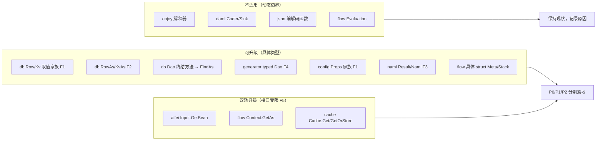

# 泛型方法升级（Go 1.27）—— 静态类型化补强专项

> 目标：Go 1.27 开放了**方法级类型参数**（泛型方法），本项目当年因「Go 不支持泛型方法」而绕路实现的位置，如今可以回归正形。本文**全量盘点**这些绕路点（按形态分类、精确到 `file:line`），并给出逐项升级**契约**（Go 签名 + 兼容策略 + 分期建议）。
>
> 约束先行：Go 1.27 的泛型方法**不能出现在接口里，也不能用于满足接口方法**（下文 §1 实测）。因此落在接口上的绕路（`aifei.Input`、`flow.Context`、`plugins/cache.Cache` 等）**不升级接口本身**，走「具体类型加泛型方法 + 包级泛型 helper」双轨。
>
> 所有旧 API **全部保留**（v0.1.0 已发布），本专项只做增量，不做破坏性变更。

---

## 目录

1. Go 1.27 泛型方法：能力与限制（实测）
2. 绕路形态分类
3. 全量盘点清单
4. 升级契约（P0 / P1 / P2）
5. 明确不升级的项与原因
6. 兼容策略
7. 测试方案
8. 实施步骤建议

---

## 1. Go 1.27 泛型方法：能力与限制（实测）

语言变化见 [Go 1.27 Release Notes](https://go.dev/doc/go1.27)：方法声明可以自带类型参数，与函数声明同构；接收者本身不必是泛型类型。以下三条结论均在本地 `go1.27.0` 上实测（工作区 42 个 `go.mod` 已全部声明 `go 1.27`，语言版本就绪）：

| # | 结论 | 实测依据 |
|---|------|----------|
| 1 | ✅ 具体类型的方法可声明类型参数，接收者可以是非泛型 struct | `func (s *Store) Get[T any](k string) (T, bool)` 编译运行通过 |
| 2 | ❌ 接口方法**不能**声明类型参数 | `interface method must have no type parameters` |
| 3 | ❌ 泛型方法**不能**满足普通接口方法（同名不同形） | `wrong type for method Get: have Get[T any](string) (T, bool), want Get(string) (any, bool)` |

最小验证代码（结论 1）：

```go
type Store struct{ m map[string]any }

func (s *Store) Get[T any](k string) (T, bool) {
	v, ok := s.m[k]
	t, _ := v.(T)
	return t, ok
}

s.Get[int]("a") // (1, true)
```

结论 2、3 决定了本专项的边界：**凡是绕路发生在接口方法上的，接口保持原样**；升级出口只有两个——

- **具体类型上加泛型方法**（直接调用者受益）；
- **包级泛型函数包住接口**（`pkg.Fn[T](iface, ...)`，这一形态其实 Go 1.18 起就合法，但当时没有与方法族统一设计的动因，本专项一并补齐）。

另有一条实现性约束需要在设计时牢记：泛型方法**无特化、走字典分发**，与泛型函数一致；本专项的形态（取值转换、结果反序列化）不在热路径上，无性能顾虑。

---

## 2. 绕路形态分类

把「本可以是一个泛型方法，当年做不成」的代码归为四种形态，外加一类语言仍不支持的接口形态：

| 形态 | 当年的替代做法 | 典型位置 |
|------|----------------|----------|
| F1 类型家族拆分 | 一个 `Get[T]` 拆成 `GetStr/GetInt/GetBool/...` ×N 个方法 | `db.Row`、`db.Kv`、`config.Props` |
| F2 接收者前置的包级泛型函数 | 方法做不了 → 拆成 `RowAs[T](r *Row, ...)`，接收者当第一个参数 | `db.RowAs`、`db.KvAs`、`nami/util.GetJSON[T]` |
| F3 指针出参 | 不能 `T getBean()` → 变成 `GetBean(obj any) error` 塞指针 | `aifei.Input.GetBean`、`nami.Result.Bind`、`cache.Get(dest)` |
| F4 代码生成替代 | 编译期单态化：生成 typed 包装层、链式方法重声明只为窄化返回类型 | `tools/generator` 的 `_dao.af` |
| F5 接口受限 | 落在接口方法上，Go 1.27 依旧不允许泛型 | `flow.Context.GetAs`、`plugins/cache.Cache.Get` |



---

## 3. 全量盘点清单

### 3.1 `db`（核心，收益最大）

| 位置 | 现状 | 形态 |
|------|------|------|
| `db/row.go:224` | `Get(field) interface{}` | F1 根源 |
| `db/row.go:259` | `GetDefault(field, def interface{}) interface{}` | F1 |
| `db/row.go:268-350` | 类型化家族 16 个：`GetStr/GetStrDefault/GetInt/GetIntDefault/GetInt64/GetInt64Default/GetFloat64/GetFloat64Default/GetBool/GetBoolDefault/GetTime/GetTimeE/GetTimeDefault/GetBytes` | F1 |
| `db/row.go:234` | `RowAs[T any](r *Row, field string, fn func(interface{}) T) T` —— 接收者前置的包级泛型函数，泛型方法缺失的直接补丁 | F2 |
| `db/kv.go:60-125` | `Kv` 同款家族 14 个（`Get/GetDefault/GetStr/...`） | F1 |
| `db/kv.go:194` | `KvAs[T any](k Kv, key string, fn func(interface{}) T) T` | F2 |
| `db/type_converter.go:12-216` | `ToInt/ToInt64/ToFloat64/ToBool/ToString/ToTime/ToTimeE` 宽松转换器（家族的语义载体，**保留**，成为 `GetAs[T]` 的分派后端） | 支撑 |
| `db/dao.go:165-205` | 终结方法 `Find() ([]*Row, error)` / `FindFirst() (*Row, error)` / `Paginate(pageNum, pageSize int) (*Page, error)` 只能返回非类型化行 | F1/F3 |
| `db/page.go:4-7` | `Page.Rows []*Row` 固定为行切片 | F1 |

### 3.2 `tools/generator`（F4：代码生成替代泛型）

| 位置 | 现状 | 形态 |
|------|------|------|
| `tools/generator/templates/_dao.af`（全文 18 个方法） | 每张表重新声明 ~15 个链式方法（`Sql/SqlWithArgs/Select/...`），**只为把返回类型从 `*db.Dao` 窄化回 typed `*Dao`**——返回类型协方差的手工模拟 | F4 |
| `_dao.af:84/93/117` | typed 终结方法 `Find() ([]*User, error)` 等，配 `toRow/toRows` 手工包装 | F4 |
| `tools/generator/templates/_base.af:36` | `NewWithRow(row *db.Row)` 手工包装入口 | F4 |
| `_base.af:39-60` | Typed Getters/Setters 模板段，逐列生成 `func (r *BaseUser) Name() string { return r.GetStr("name") }`（命名取值器是人体工学设计，Java 版同样生成，**保留**；但其实现依赖 3.1 的类型家族） | F1 支撑 |

### 3.3 `config`

| 位置 | 现状 | 形态 |
|------|------|------|
| `config/props.go:38` | `Get(key string, def ...interface{}) interface{}` | F1 根源 |
| `config/props.go:71-161` | `GetStr/GetBool/GetInt/GetInt64/GetFloat64` 五件套 | F1 |
| `config/global.go:22-95` | 包级镜像同族 6 个（包级泛型函数 Go 1.18 起本可用，当年为与方法族同构而保持 `interface{}` 形态） | F1 |
| `config/props.go:280/330` | `SubBind(prefix, v any)` / `Bind(v any)` 指针出参 | F3 |

### 3.4 `nami`

| 位置 | 现状 | 形态 |
|------|------|------|
| `nami/result.go:82` | `Bind(val any) error` 指针出参 | F3 |
| `nami/result.go:101` | `AsAny() (any, error)` 退化为 `any` | F3 |
| `nami/client.go:159/182` | `CallAndBind(..., val any) error` / `GetObject(val any) error` | F3 |
| `nami/util/util.go:147/155` | `GetJSON[T]/GetJSONWith[T]` 包级泛型函数（1.18 权宜：方法做不了 → 拆包级；**保留**，补回方法形态） | F2 |

### 3.5 `aifei` / `http` / `server`

| 位置 | 现状 | 形态 |
|------|------|------|
| `aifei/input.go:51` | `GetBean(obj interface{}, keys ...string) error` —— Java 版 `<T> T getBean()` 是泛型方法，直译丢失后变成塞指针；这是 Input 接口方法，**升级受限**（F5） | F3+F5 |
| `http/context.go:366` | `(*HttpContext).GetBean` 具体实现（form 逐字段强制转换 + JSON 双路径） | 实现层 |
| `server/in.go:18` | `In` 嵌入 `*http.HttpContext`，方法提升——具体类型上加泛型方法可同时惠及 `In` | 出口 |

### 3.6 `flow`

| 位置 | 现状 | 形态 |
|------|------|------|
| `flow/context.go:21-23` | `Context` **接口**：`Get(key) any` + `GetAs(key) any`，注释明言「Java getAs&lt;T&gt;」——Java 泛型方法的直译丢失，`GetAs` 是返回 `any` 的伪泛型 | F5 |
| `flow/context_impl.go:131` | 调用点 `c.Get("instanceId").(string)` 类型断言 | 症状 |
| `flow/node.go:68/76/127`、`flow/link.go:47/55/58`、`flow/graph.go:130/138/141` | `Meta/MetaAs/MetaOrDefault` 三件套 ×3（`Node/Link/Graph` 是**具体 struct**，可加泛型方法） | F1 |
| `flow/temporary.go:29/40` | `Temporary`（具体 struct）`StackPeek/StackPop` 返回 `any` | F1 |
| `flow/container.go:42` | `Container` **接口** `GetComponent(key) any`（`MapContainer` 是具体实现） | F5 |

### 3.7 `plugins/cache`

| 位置 | 现状 | 形态 |
|------|------|------|
| `plugins/cache/cache.go:46` | `Cache` **接口**：`Get(ctx, key, dest any) (bool, error)` 指针出参 | F3+F5 |
| `plugins/cache/cache.go:175/216` | `Get` / `GetOrStore(ctx, key, dest, Loader, ttl...)`；`Loader`（`cache.go:41`）是 `func(ctx) (any, error)`，因进不了接口而无法泛型化 | F3+F5 |
| `plugins/cache/cache_default.go:50-70` | 包级镜像 5 个，同样 `dest any` 出参 | F3 |

---

## 4. 升级契约（P0 / P1 / P2）

> 以下签名均已用 `go1.27.0` 编译验证（含双类型参数推导惯用法），不是纸面推演。宽松/严格双轨沿用既有时间 API 约定：默认宽松（零值容错），`E` 后缀严格（返回 error）。

### 4.1 P0-1 `db`：取值与查询的类型化出口

```go
// db/row.go —— 取代 16 个类型化取值方法的「第 17 个统一入口」
// 宽松：缺失或类型不符返回 T 零值（对齐 GetStr/GetInt 现语义，分派到 To* 转换器）
func (r *Row) GetAs[T any](field string) T
// 严格：缺失/NULL 返回 (零值, nil)——缺失不是脏数据；无法无损转换才返回 error（对齐 GetTimeE 约定）
func (r *Row) GetAsE[T any](field string) (T, error)
// 带默认值（对齐 GetDefault/GetStrDefault 的家族语义）
func (r *Row) GetAsDefault[T any](field string, def T) T

// db/kv.go —— 同款
func (k Kv) GetAs[T any](key string) T
func (k Kv) GetAsE[T any](key string) (T, error)

// db/dao.go —— 行模型约束 + 双类型参数惯用法（已验证：FindAs[User]() 可推导出 PT=*User）
type RowEntity interface { InitRow(row *Row) }

func (d *Dao) FindAs[T any, PT interface{ *T; RowEntity }]() ([]PT, error)
func (d *Dao) FindFirstAs[T any, PT interface{ *T; RowEntity }]() (PT, error)
func (d *Dao) PaginateAs[T any, PT interface{ *T; RowEntity }](pageNum, pageSize int) (*PageAs[PT], error)

// db/page.go —— 类型化分页结果（Page 保持不动，向后兼容；P 实例化为模型指针，与 FindAs 一致）
type PageAs[P any] struct {
    PageNum, PageSize, TotalPages int
    TotalRows                     int64
    Rows                          []P
}
```

要点：

- `To*` 转换器家族**保留**：`GetAs[T]` 内部按 `reflect.TypeFor[T]()` 分派到它们，宽松语义（数字/字符串互转）不回退。旧家族方法不删，`RowAs/KvAs` 标记 `Deprecated`（注释指到 `GetAs`），v2 再移除。
- `InitRow` 由生成器的 `_base.af` 提供（一行实现：`func (b *BaseUser) InitRow(r *db.Row) { b.Row = r }`），手写模型同样可实现。
- `db` 包级便捷函数（`db.Find` 等 45 个）不逐个加 `As` 变体——`db.Use().Table(...).FindAs[User]()` 已覆盖；包级形态留到确有需求时再议。

### 4.2 P0-2 `tools/generator`：typed Dao 瘦身

- `_dao.af` 删除 ~15 个链式窄化重声明与 `toRow/toRows`、typed `Find/FindFirst/Paginate`（`_dao.af:84/93/117`）；保留 `NewDao()`（绑定表名）与少量便捷方法。链式调用直接用 `*db.Dao`，终结时 `.FindAs[User]()`。
- `_base.af` 新增 `InitRow`；Typed Getters 保留（人体工学，Java 同款），模板实现可改为 `r.GetAs[string]("name")`（也可维持 `f.RowGetter` 映射不变，零改动）。
- `_service.af` 的 `NewDao().Sql(listSql, filter).Find()` 改为 `.FindAs[User]()`,`Paginate` 改 `PaginateAs`。
- 预期：`_dao.af` 模板缩水约 70%，每张表生成代码量显著下降；已生成代码**不受影响**（不覆盖用户已有 `dao.go`，仅新生成的形态变化）。

### 4.3 P1-1 `config`：读取类型化

```go
// config/props.go
func (p *Props) GetAs[T any](key string, def ...T) T      // 宽松，def 变参保持家族风格
func (p *Props) GetAsE[T any](key string) (T, error)      // 严格

// config/global.go —— 包级镜像（1.18 起即合法，本专项补齐）
func GetAs[T any](key string, def ...T) T
func GetAsE[T any](key string) (T, error)
```

`GetStr/GetBool/GetInt/GetInt64/GetFloat64` 保留（高频且语义微妙——如 `GetStr` 对空串回退 def——不强迫迁移）。`Bind/SubBind` 指针出参**不动**：目标类型是用户自定义 struct，YAML 往返语义清晰，泛型化无收益。

### 4.4 P1-2 `nami` + `json` 底座

```go
// json —— 反序列化的 T 直出底座（供 nami/aifei 复用，亦独立可用）
func Parse[T any](data []byte) (T, error)
func ParseString[T any](s string) (T, error)

// nami/result.go
func (r *Result) As[T any]() (T, error)        // 取代 Bind(&v) + AsAny() 的组合位
// nami/client.go
func (n *Nami) GetObjectAs[T any]() (T, error) // GetObject 的 T 直出形态
```

`Bind(val any)` 保留（零值复用、传入既有对象的场景仍需要）。`util.GetJSON[T]` 保留。

### 4.5 P2 双轨项（接口受限，只加出口不动接口）

```go
// aifei —— 包级 helper 走 Input 接口（服务方法签名是 func(in aifei.Input)，这是主出口）
func Bean[T any](in Input, keys ...string) (T, error)
// http —— 具体类型泛型方法（经嵌入自动提升到 server.In，供持有具体类型者使用）
func (c *HttpContext) Bean[T any](keys ...string) (T, error)

// flow —— 包级 helper 走 Context 接口；具体 struct 直接加方法
func GetAs[T any](ctx Context, key string) (T, bool)          // 包级
func (n *Node) MetaAs[T any](key string) (T, bool)            // Node/Link/Graph 同款
func (t *Temporary) StackPopAs[T any](graphID, key string) T  // Temporary 是具体 struct

// plugins/cache —— 包级 helper 走 Cache 接口
func GetAs[T any](ctx context.Context, key string) (T, bool, error)
func GetOrStoreAs[T any](ctx context.Context, key string, loader func(context.Context) (T, error), ttl ...time.Duration) (T, error)
```

`flow.Context.GetAs(key) any`（伪泛型）与 `Container.GetComponent(key) any` 标记 `Deprecated`，注释指向包级 helper；接口签名永不变化（语言不允许，也无需）。

---

## 5. 明确不升级的项与原因

| 位置 | 原因 |
|------|------|
| `enjoy/expr_eval.go`、`enjoy/scope.go` 全部 `interface{}` | 模板语言是动态类型语言，解释器内部的 `any` 是**语义本身**而非类型系统缺口 |
| `dami/coder.go` `Encode/Decode`、`dami/dispatcher.go` `Dispatch(ev any)` | 序列化与事件路由边界，进出都是动态载荷 |
| `dami/event.go:62` `Sink` 接口 + `streamSink[R].Next(v any)`（`stream.go:28`、`future.go:69` 内 `v.(R)` 断言） | 上游 `Coder.Decode` 产出 `[]any`，接口方法不能泛型化，运行时断言不可避免；已有 mismatch 报错兜底 |
| `flow/evaluation.go` `Evaluation` 接口 | 条件/任务表达式是动态求值字符串（复用 enjoy） |
| `json.Marshal/Unmarshal(v any)` | 编解码边界，函数形态本就正确（泛型增强只加 `Parse[T]` 新出口，见 4.4） |
| `server.Out.Get(field) interface{}`（`out.go:186`）、`aifei.Output.Data()` | 响应体本质动态；`Out` 是流式 builder，`Data()` 在接口上 |
| `server.Register`、`dami/lpc.RegisterProvider(provider any)` | 反射注册边界，与泛型方法正交 |
| `db/json_codec.go` 的 reflect 转换 | 内部实现细节，不是公开 API |

---

## 6. 兼容策略

1. **只增不删**：全部旧 API 原样保留（v0.1.0 已按多模块标签发布）。`RowAs/KvAs/flow GetAs(key) any/GetComponent` 四处标 `Deprecated`（仅注释，不移除），v2 再评估清理。
2. **命名统一**：新出口一律 `XxxAs[T]` 后缀（与既有 `RowAs/KvAs/GetAs` 命名先例一致）；严格版 `E` 后缀（与 `GetTime/GetTimeE` 时间 API 约定一致）。
3. **语义不漂移**：宽松版零值容错语义与现家族完全对齐（`To*` 转换器仍是后端）；严格版只做「缺失/类型不符 → error」。
4. **版本门槛**：导出泛型方法落地后，各模块最低 Go 版本即 1.27（工作区已就位，commit `b3fb029` 已完成 `go.mod` 升级，无额外动作）。按多模块发布约定打 `<dir>/vX.Y.Z` 标签：涉及 `db`、`config`、`nami`、`json`、`aifei`、`http`、`flow`、`plugins/cache`、`tools/generator` 九个模块的 minor 版本。
5. **生成器兼容**：`_dao.af` 新模板只影响新生成的表；已生成的 `dao.go`/`model.go` 本就不被覆盖，存量项目零影响。`base.go` 总是覆盖，新增的 `InitRow` 随再生成进入存量项目（纯增量方法，无冲突）。

---

## 7. 测试方案

不新增 `_test` 模块，全部扩展现有区域（遵循 `_test` 约定——外部测试包、只测导出 API、自包含依赖）：

| 测试模块 | 新增用例 |
|----------|----------|
| `_test/db_test` | `Row.GetAs/GetAsE/GetAsDefault` 宽松严格矩阵（含脏数据）；`Kv.GetAs`；`Dao.FindAs/FindFirstAs/PaginateAs`（sqlite 建表 + 手写 `InitRow` 模型，验证双类型参数推导与空结果零值） |
| `_test/generator_test` | 新模板 golden 对比：生成物包含 `InitRow`、typed Dao 不再有链式重声明；生成代码可编译可运行（sqlite round-trip） |
| `_test/config_test` | `Props.GetAs/GetAsE` 与 `GetStr/GetInt` 语义等价性（同输入同输出）；包级镜像 |
| `_test/nami_test` | `Result.As[T]`（配合 httptest）、`GetObjectAs[T]`、`json.Parse[T]` 往返 |
| `_test/flow_test` | `flow.GetAs[T]` 包级 helper、`Node.MetaAs[T]`、`StackPopAs[T]` |
| `_test/cache_test` | `cache.GetAs[T]`/`GetOrStoreAs[T]`（miniredis 两级缓存路径） |
| `_test/server_test` | `aifei.Bean[T](in)`（JSON body / form / query 三来源，对齐 GetBean 行为） |

---

## 8. 实施步骤建议

| 期 | 范围 | 交付 | 依赖 |
|----|------|------|------|
| P0 | `db`（Row/Kv/Dao/PageAs）+ `tools/generator` 模板 | 核心库类型化出口 + 生成代码瘦身 ~70% | 无 |
| P1 | `config` + `json.Parse[T]` + `nami` | 读取与 RPC 结果类型化 | 无 |
| P2 | `aifei.Bean[T]` + `http` 具体方法 + `flow` + `plugins/cache` | 接口受限项的双轨出口与 Deprecated 标记 | P1 的 `json.Parse[T]` |

每期独立可合入、独立打 tag；P0 建议先行单独评审（涉及 `db` 公开契约与生成器 golden 更新，是本专项收益最大、也最需要仔细评审的一期）。

---

## 9. 实施记录（2026-08-29，P0/P1/P2 全部落地）

三期一次实施完成，全量测试绿（21 个 `_test` 包）。落地物与契约的偏差在此逐条记录。

### 9.1 落地清单

| 模块 | 文件 | 内容 |
|------|------|------|
| `db` | `db/get_as.go`（新增） | `Row.GetAs/GetAsE/GetAsDefault`、`Kv.GetAs/GetAsE`、宽松分派 `asLoose`（走 To* 转换器）/严格 `asStrict` |
| `db` | `db/dao_as.go`（新增） | `RowEntity` 约束、`FindAs/FindFirstAs/FindOneAs/PaginateAs/FindByAs/FindFirstByAs/FindByIDAs` |
| `db` | `db/page.go` | `PageAs[P]` 及翻页判断方法 |
| `db` | `db/row.go`、`db/kv.go` | `RowAs`/`KvAs` 标 Deprecated |
| `tools/generator` | `templates/_base.af` | 新增 `InitRow`（委托既有 `initRow`，旧存量 dao.go 不受影响） |
| `tools/generator` | `templates/_dao.af` | 重写为极简形态：18 个方法 → 8 个（`NewDao` 返回 `*db.Dao` + 7 个包级便捷函数委托 As 家族），链式窄化重声明与 `toRow/toRows` 全删 |
| `tools/generator` | `templates/_service.af` | `Find()` → `FindAs[User]()`，`Paginate` → `PaginateAs` |
| `config` | `config/props.go`、`config/global.go` | `(*Props).GetAs/GetAsE` + 包级镜像 |
| `json` | `json/json.go` | `Parse[T]`/`ParseString[T]` |
| `nami` | `nami/result.go`、`nami/client.go` | `Result.As[T]`、`Nami.GetObjectAs[T]` |
| `aifei` | `aifei/bean.go`（新增） | `Bean[T](in Input, keys...)` 包级 helper |
| `http` | `http/context.go` | `(*HttpContext).Bean[T]`（经嵌入提升到 `*server.In`） |
| `flow` | `flow/get_as.go`（新增） | 包级 `GetAs[T]`/`ComponentAs[T]`；`Node/Link/Graph.MetaAs[T]`、`Temporary.StackPopAs/StackPeekAs`；接口方法 `Context.GetAs`/`Container.GetComponent` 标 Deprecated |
| `plugins/cache` | `plugins/cache/get_as.go`（新增） | 包级 `GetAs[T]`/`GetOrStoreAs[T]`（typed loader） |

测试新增：`_test/db_test/get_as_test.go`、`_test/generator_test`（新形态断言 + 生成代码离线编译 harness：临时模块 + go.work 指向本地框架模块）、`_test/config_test/get_as_test.go`、`_test/json_test/parse_test.go`、`_test/nami_test/as_test.go` + `channel/http/as_test.go`、`_test/flow_test/get_as_test.go`、`_test/server_test/bean_test.go`、`_test/cache_test/get_as_test.go`。

### 9.2 与契约的偏差（已按实测定稿）

1. **`GetAsE` 语义修正**：契约原稿写「缺失或类型不符返回 error」，实施对齐 `GetTimeE` 惯例定稿为「缺失/NULL → (零值, nil)——缺失不是脏数据；跨类型无损转换（数字族宽度、[]byte→string、时间解析）放行，静默强制转换（数字→字符串、脏字符串→数字）报错」。可空列上 NULL 极常见，error-on-NULL 会让严格版不可用。`config.GetAsE` 例外：缺失仍返回 error（配置缺键是装配错误，严格读的意义所在）。
2. **db As 家族扩到 7 个**：契约只列 `FindAs/FindFirstAs/PaginateAs`，实施补 `FindOneAs/FindByAs/FindFirstByAs/FindByIDAs`——旧生成模板的 typed `FindOne/FindBy/FindFirstBy/FindByID` 需要这四个承接，否则生成的包级便捷函数得手写包装循环，违背瘦身初衷。
3. **`flow` 具体 struct 的伪泛型 `MetaAs(key) any` 被同名替换**：这是全专项唯一非「只增不删」点。理由：旧版是 `Meta(key)` 的纯别名（方法体一行 `return n.Meta(key)`），全库零调用方；Go 无重载，真泛型 `MetaAs[T](key) (T, bool)` 必须占用该名。需要旧语义的调用方机械替换为 `Meta(key)`。
4. **flow 增补**：`StackPeekAs`（与 `StackPopAs` 成对）与包级 `ComponentAs[T]`（`Container.GetComponent` 弃用的承接出口）。
5. **`config.GetAs[string]` 与 `GetStr` 的语义差异**（写入 godoc）：空串不回退 def——`GetStr` 把空串当缺失是历史约定，新 API 不复制该特例。
6. **顺带修复 nami 存量 bug**：`Result.BodyAsString` 首次调用后释放 `r.body`，而 jsoncoder `Decode` 检查 `rst.Body()`——同一次调用结果二次解码（如 `Bind` 后 `GetObject`）拿到 `(nil, nil)` 后 `reflect.Set` panic。修复：`Decode` 改走缓存字符串，`GetObject`/`GetObjectAs` 对空 body 零值返回。由新增的 `GetObjectAs` 测试暴露。
7. **生成器测试的「可运行」以 `_test/db_test` 承担**：生成代码的编译校验在 `_test/generator_test` 内完成（临时模块 + workspace 离线编译）；sqlite 运行时行为由 `db_test` 的 `FindAs` 家族集成测试覆盖，未在生成 harness 里重复搭运行环境。

### 9.3 待办

- 发布：九个模块（`db`/`config`/`json`/`aifei`/`http`/`nami`/`flow`/`plugins/cache`/`tools/generator`）按多模块标签约定打 minor tag。
- 存量项目重新生成：`base.go` 会被覆盖并获得 `InitRow`；`dao.go`/`model.go`/`service.go` 不覆盖，可手动迁移到 As 家族形态。
