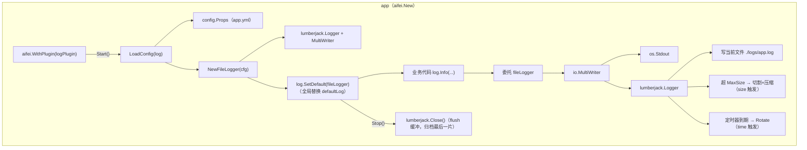
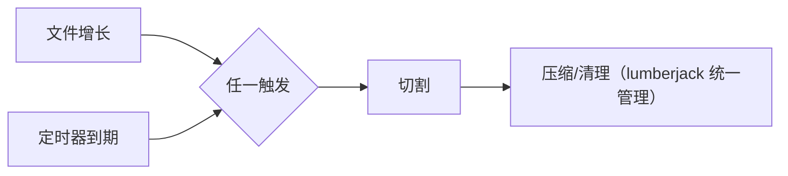

# 日志插件设计（plugins/log）—— 文件落盘 + 轮转

> 目标：为 `log` 库补齐生产环境必需的**落盘**与**轮转**能力（按大小切割、保留份数、过期清理、gzip 压缩），同时**不破坏 `log` 库的零外部依赖契约**——轮转依赖（lumberjack）只进 `plugins/log`，用户按需 `go get`。
>
> 本文**不写实现代码的最终形态**，只给出：模块清单、接口契约（Go 签名）、配置项、依赖与改动点、分期建议——作为后续实现的**契约**。

---

## 目录

1. 背景与现状
2. 设计原则
3. 总体架构
4. 模块结构
5. 配置参考
6. 核心类型设计（接口契约）
7. 关键设计决策
8. 与 `log` 库的边界
9. 测试方案
10. 使用示例
11. 边界与限制（不做什么）
12. 实现步骤建议
13. 未来扩展
14. 附：与现有代码的衔接点速查

---

## 1. 背景与现状

### 1.1 问题

`log` 库（`log/log.go`）刻意只用标准库：默认 `defaultLogger` 用 `log.New(os.Stdout, "", log.LstdFlags|log.Lshortfile)` 输出到 stdout，不具备：

- **落盘**：进程结束 / 容器重启后日志丢失；
- **轮转**：日志文件无限增长，撑爆磁盘；
- **保留策略**：无份数 / 天数上限，无法做日志归档与清理；
- **压缩**：旧日志无法 gzip，磁盘成本高。

这是"核心库零依赖"原则的**刻意代价**——生产级落盘能力应当作为可选插件，由需要它的应用显式引入。

### 1.2 现有能力（已核实）

| 能力 | 载体 | 说明 |
|------|------|------|
| `Logger` 接口 | `log/log.go:22` | 5 个日志方法（Trace/Debug/Info/Warn/Error）+ 5 个 `IsXxxEnabled` |
| 全局替换 | `log.SetDefault(Logger)` | 插件注入的入口 |
| 全局 level | `log.SetLevel(Level)` | **仅对 `*defaultLogger` 生效**（type assert），见 §7.4 |
| 全局便捷函数 | `log.Trace/Debug/Info/Warn/Error` | 委托给 `defaultLog`，业务代码主要用这套 |
| `Level` 常量 | `LevelTrace…LevelOff` | 与字符串的双向转换由插件 `parseLevel` 完成 |

本方案把这套能力规范化为标准插件：配置驱动、生命周期托管、全局注入。

---

## 2. 设计原则

- **核心库零外部依赖不变**：`log` 保持仅标准库；lumberjack 只进 `plugins/log`。
- **与既有插件一致**：沿用 storage/cache 的插件套路——`NewPlugin(logger, prefix...)` → `LoadConfig(prefix)` → `Start` install default → `Stop` 清理。
- **配置驱动**：所有开关读 `config.Props` 下的 `log.*` 段，与 cache/kafka 等插件一致。
- **单实例、无 Manager**：与 storage/cache 的多命名路由不同，日志是单实例；`Start` 直接 `log.SetDefault(fileLogger)`，不引入 `Manager`。
- **零副作用降级**：装了插件但 `file.path` 为空时，退化为纯 stdout，行为等价于不装插件。
- **契约先行**：本文的接口签名是后续实现的契约；实现可优化，公共 API 不偏离。

---

## 3. 总体架构



与 storage/cache 的唯一结构差异：log 无 `Manager`。`Start` 不调 `SetDefault(mgr)`（包级路由表），而是调 `log.SetDefault(fl)`（核心库全局 logger）。

---

## 4. 模块结构

```
plugins/log/
├── go.mod              # module …/aifei-go/plugins/log
├── config.go           # Config + LoadConfig(prefix)
├── file_logger.go      # FileLogger（实现 log.Logger）+ NewFileLogger
└── plugin.go           # Plugin + NewPlugin/Start/Stop
```

### 4.1 `go.mod`

```go
module github.com/crazy-airhead/aifei-go/plugins/log

go 1.26

require (
    github.com/crazy-airhead/aifei-go/aifei  v0.0.42
    github.com/crazy-airhead/aifei-go/config v0.0.42
    github.com/crazy-airhead/aifei-go/log    v0.0.42
    gopkg.in/natefinch/lumberjack.v2 v2.2.0   // 唯一外部依赖
)

replace (
    github.com/crazy-airhead/aifei-go/aifei  => ../../aifei
    github.com/crazy-airhead/aifei-go/config => ../../config
    github.com/crazy-airhead/aifei-go/log    => ../../log
)
```

> lumberjack 是 `gopkg.in` 老式版本化，module path 即 `gopkg.in/natefinch/lumberjack.v2`（`.v2` 后缀，go.mod 不写 `/v2`）。

### 4.2 `go.work`

新增一行 `./plugins/log`。

### 4.3 包名与 import 约定

包名 `log`（保持目录 = 包名惯例，与 cache/kafka 一致）。由于核心库 `aifei-go/log` 也叫 `log`，**用户 import 插件时需加别名**：

```go
import (
    "github.com/crazy-airhead/aifei-go/log"              // 业务代码用它（全局函数）
    logfile "github.com/crazy-airhead/aifei-go/plugins/log" // bootstrap 里用一次
)
```

实际冲突很小：业务代码只用核心库的全局函数 `log.Info(...)`，插件只在 `main.go` bootstrap 里 import 一次。

### 4.4 测试模块

`_test/logfile_test`（**注意**：`_test/log_test` 已被核心 `log` 库占用，按 `_test/<area>_test` 规则换名）。模块 `github.com/crazy-airhead/aifei-go/_test/logfile_test`，`use ./_test/logfile_test` 加入 `go.work`，`replace` 指向 `../../plugins/log` + `../../log`。

### 4.5 发布

`go get github.com/crazy-airhead/aifei-go/plugins/log`，标签 `log/vX.Y.Z`（符合多模块打标签约定）。

---

## 5. 配置参考

### 5.1 `app.yml`

```yaml
log:
  level: info              # trace|debug|info|warn|error，默认 info
  stdout: true             # 输出 stdout（与 file.path 组合出三种模式，见下表）
  format: text             # v1 仅 text；预留 json（见 §13）
  file:
    path: ./logs/app.log   # 空 = 不落盘（零副作用降级）
    maxSize: 100           # MB，单文件上限，超即切割（size 触发）；默认 100
    maxBackups: 10         # 保留旧文件份数；默认 10
    maxAge: 30             # 旧文件保留天数；默认 30
    compress: true         # 旧文件 gzip；默认 true
    localTime: true        # 备份文件名用本地时间而非 UTC；默认 true
    timeRotate:            # 时间触发（可选）；不配 = 仅按 size 轮转
      interval: 24h        # 轮转周期（Go duration）：24h=每天 / 1h=每小时；默认关闭
      alignBoundary: true  # true=对齐本地自然边界（每日 0 点 / 每整点）；false=从启动起算
```

**输出模式**：`stdout` 与 `file.path` 双开关组合出三种模式，按部署形态选用：

| 模式 | `stdout` | `file.path` | 适用场景 |
|------|----------|-------------|----------|
| 仅 stdout | `true` | `""` | 容器 / k8s，日志由采集器（filebeat/OTel）接管 |
| 仅落盘 | `false` | `./logs/app.log` | 传统部署，不占终端 |
| 两者（默认） | `true` | `./logs/app.log` | 开发 / 调试，终端可观察 + 文件归档 |

> `file.path` 为空时 `file.*`（含 `timeRotate`）整体失效，退化为纯 stdout。

### 5.2 读取策略

配置全是**扁平标量字段**（无 `cache.instances.<name>` 那种 map 子树），因此用 `config.GetStr/GetInt/GetBool` 直接读，**不依赖 `SubBind`**，默认值就地表达：

```go
cfg.Level  = config.GetStr(prefix+".level", "info")
cfg.Stdout = config.GetBool(prefix+".stdout", true)
cfg.Format = config.GetStr(prefix+".format", "text")
cfg.File.Path       = config.GetStr(prefix+".file.path")
cfg.File.MaxSize    = config.GetInt(prefix+".file.maxSize", 100)
cfg.File.MaxBackups = config.GetInt(prefix+".file.maxBackups", 10)
cfg.File.MaxAge     = config.GetInt(prefix+".file.maxAge", 30)
cfg.File.Compress   = config.GetBool(prefix+".file.compress", true)
cfg.File.LocalTime  = config.GetBool(prefix+".file.localTime", true)
// timeRotate（可选）：interval 为 Go duration 字符串，空/非法 = 关闭时间轮转
if s := config.GetStr(prefix+".file.timeRotate.interval"); s != "" {
    if d, err := time.ParseDuration(s); err == nil && d > 0 {
        cfg.File.TimeRotate.Enabled = true
        cfg.File.TimeRotate.Interval = d
        cfg.File.TimeRotate.AlignBoundary = config.GetBool(prefix+".file.timeRotate.alignBoundary", true)
    }
}
```

---

## 6. 核心类型设计（接口契约）

### 6.1 `config.go`

```go
package log

// Config 是 plugins/log 的配置，由 LoadConfig 从 config.Props 读取。
type Config struct {
    Level  string     // trace|debug|info|warn|error
    Stdout bool       // 是否输出到 stdout
    Format string     // v1 仅 "text"；其它值忽略并 Warn
    File   FileConfig
}

// FileConfig 描述单个轮转文件的设置。
// MaxSize/MaxBackups/MaxAge/Compress/LocalTime 一对一映射 lumberjack.Logger（size 触发 + 备份管理）；
// TimeRotate 是外层定时器，按时间强制 Rotate（time 触发），见 §7.1。
type FileConfig struct {
    Path       string           // 日志文件路径；空 = 不落盘
    MaxSize    int              // MB，单文件上限（size 触发）
    MaxBackups int              // 保留旧文件份数
    MaxAge     int              // 旧文件保留天数
    Compress   bool             // 旧文件是否 gzip
    LocalTime  bool             // 备份文件名是否用本地时间
    TimeRotate TimeRotateConfig // 时间触发（可选）
}

// TimeRotateConfig 描述按时间轮转的设置。
type TimeRotateConfig struct {
    Enabled       bool          // 是否启用时间轮转
    Interval      time.Duration // 轮转周期：24h=每天 / 1h=每小时
    AlignBoundary bool          // true=对齐本地自然边界（每日 0 点 / 每整点）
}

// LoadConfig 从全局 config 读 prefix 段（空默认 "log"）。
func LoadConfig(prefix string) (*Config, error)
```

### 6.2 `file_logger.go`

```go
package log

// FileLogger 实现 aifeilog.Logger：stdout（可选）+ lumberjack 轮转文件的 MultiWriter。
// 线程安全：写日志靠标准库 log.Logger 内部的锁；SetLevel 靠自带 RWMutex。
// 若启用 timeRotate，额外跑一个定时 goroutine 周期性调 lumberjack.Rotate()。
type FileLogger struct {
    level  aifeilog.Level
    logger *log.Logger        // 标准库，LstdFlags|Lshortfile，MultiWriter 作 sink
    lumber *lumberjack.Logger // 落盘 sink；nil = 仅 stdout
    mu     sync.RWMutex       // 仅保护运行时 SetLevel
    stopCh chan struct{}      // 通知 timeRotate goroutine 退出；nil = 未启用
    done   chan struct{}      // timeRotate goroutine 退出后关闭
}

// NewFileLogger 按 cfg 构造。path 为空时退化为纯 stdout。
// 启用 timeRotate 时启动定时 goroutine（对齐边界或从启动起算，见 §7.1）。
func NewFileLogger(cfg *Config) (*FileLogger, error)

// SetLevel 运行时调整 level（配合 §7.4 方案 B 的 log.SetLevel）。
func (l *FileLogger) SetLevel(level aifeilog.Level)

// Close 先停 timeRotate goroutine（close stopCh 并等 done），再关 lumberjack。
// 顺序重要：先停定时器，避免 Rotate 与 Close 并发；最后 Close flush 缓冲。
func (l *FileLogger) Close() error

// startTimer 启动按时间轮转的 goroutine：
//   alignBoundary=true：先 sleep 到 interval 的下一个本地自然边界（24h→本地 0 点，1h→整点），
//                       再按 interval 周期 ticker，每次到期调 l.lumber.Rotate()。
//   alignBoundary=false：直接按 interval ticker。
//   监听 stopCh 优雅退出。
func (l *FileLogger) startTimer(tr TimeRotateConfig)

// 实现 log.Logger 接口：
//   Trace/Debug/Info/Warn/Error(msg string, args ...interface{})
//   IsTraceEnabled/IsDebugEnabled/IsInfoEnabled/IsWarnEnabled/IsErrorEnabled() bool
```

**日志方法实现要点**：

```go
func (l *FileLogger) logf(level aifeilog.Level, prefix, msg string, args ...interface{}) {
    l.mu.RLock()
    enabled := l.level <= level
    l.mu.RUnlock()
    if !enabled {
        return
    }
    line := prefix + fmt.Sprintf(msg, args...)
    // calldepth=3：Output(1)=logf 帧，Output(2)=Info/Debug... 帧，Output(3)=用户调用点
    // —— 让 Lshortfile 指向真正的业务代码而非本文件。
    l.logger.Output(3, line)
}
```

> **calldepth 校准**：若把 `logf` 内联进各 level 方法（`Info` 直接调 `Output`），calldepth 应改为 `2`。实现时按实际调用链确认，否则 `Lshortfile` 会指向插件自身而非业务代码。本契约示例保留 `logf` 中间层，故取 `3`。

### 6.3 `plugin.go`

```go
package log

// Plugin 把文件落盘 + 轮转能力接入 aifei 生命周期。
// Start 读 config.Props 的 log.* 段、构造 FileLogger、log.SetDefault 全局注入。
// Stop 关闭 lumberjack（flush 缓冲）。
//
// 编译期断言：var _ aifei.Plugin = (*Plugin)(nil)
type Plugin struct {
    prefix string
    log    log.Logger   // 启动期用的 logger（注入前还是旧 default）
    fl     *FileLogger
}

// NewPlugin 构造插件。prefix 空 默认 "log"；logger nil 降级 log.Default()。
// 与 storage/cache 同签名（logger, prefix...）。
func NewPlugin(logger log.Logger, prefix ...string) (*Plugin, error)

// Start 读配置 → 构造 FileLogger → log.SetDefault(fl)。
func (p *Plugin) Start() error

// Stop 关闭 FileLogger（lumberjack.Close）。
func (p *Plugin) Stop() error

// FileLogger 返回 Start 构造的实例，便于需要运行时 SetLevel / 直接持有的场景。
func (p *Plugin) FileLogger() *FileLogger
```

---

## 7. 关键设计决策

### 7.1 轮转：size（lumberjack）+ time（定时 Rotate）

**选** `gopkg.in/natefinch/lumberjack.v2` 作为落盘与轮转底座：

| 维度 | lumberjack |
|------|-----------|
| 成熟度 | Go 生态事实标准，久经验证 |
| API | 极简：实现 `io.Writer` + `Close()` + `Rotate()` |
| 能力 | 按大小切割、保留份数、按天数清理、gzip 压缩、本地时间文件名 |
| 依赖 | 零传递依赖（仅标准库） |

lumberjack 原生只支持 **size 触发**（文件达 `MaxSize` 即切）。本方案在其上叠加 **time 触发**——一个定时 goroutine 周期性调 `lumberjack.Rotate()` 强制切割，二者**正交并存、先到先切**：



**为什么不换轮转库**（如 `lestrrat-go/file-rotatelogs`）：lumberjack 暴露的 `Rotate()` 足以表达"按时间切"，复用其久经验证的备份/清理/压缩逻辑，不引入第二个外部依赖、不推翻选型。

**time 触发细节**：

- **周期**：`timeRotate.interval` 是 Go duration（`24h` / `1h` / `30m` …），由 `time.ParseDuration` 解析；空/非法 = 不启用时间轮转。
- **对齐边界**：`alignBoundary=true`（默认）时对齐到 **本地**自然边界——`24h`→每天本地 0 点切，`1h`→每整点切；先 sleep 到下一个边界的 duration，再按 interval ticker。`false` 则从启动时刻起算。
- **纯时间模式**：lumberjack 的 `MaxSize=0` 会回落默认 100MB（无法真正"不限"），所以"几乎只按时间切"应把 `maxSize` 设大（如 `10240` = 10GB）作兜底；严格"绝不按 size"需换库，本期不支持。

**goroutine 生命周期**：`startTimer` 起 goroutine，`Close` 先 `close(stopCh)` 并等 `done`，再 `lumberjack.Close()`——保证定时器不会与 Close 并发 `Rotate`，最后 flush 缓冲。

### 7.2 MultiWriter + 可配置输出目标

用 `io.MultiWriter` 组合多个 sink，目标可配置：

- `stdout: true`（默认）→ 加入 `os.Stdout`；
- `file.path != ""` → 加入 `lumberjack.Logger`；
- 两者可同时、可单一、可全空（全空时仅 stdout，等价不装插件）。

**零副作用降级**：装了插件但没配 `file.path`，行为与原生 `defaultLogger` 一致——避免"装了反而坏掉"的陷阱。

### 7.3 并发安全：不重复加锁

**标准库 `log.Logger` 自带 `mu`，已是并发安全**，因此 `FileLogger` 写日志不再额外加锁：

- 写日志：不加锁，直接 `logger.Output(...)`（靠 `log.Logger` 内部锁）；
- 仅保留一把 `sync.RWMutex` 给**运行时 `SetLevel`**（读 level 用 RLock，改 level 用 Lock）。

### 7.4 `log.SetLevel` 冲突（最需拍板）

**现状**：`log.SetLevel(Level)` 实现为

```go
func SetLevel(level Level) {
    if dl, ok := defaultLog.(*defaultLogger); ok {  // type assert
        dl.level = level
    }
}
```

插件把全局换成 `*FileLogger` 后，**类型断言静默失败，`log.SetLevel` 失效**。三个方案：

| 方案 | 改 `log` 库 | 行为 | 推荐度 |
|------|------------|------|--------|
| **A** | 不改 | 插件模式下 `log.SetLevel` 失效；level 仅构造时定；运行时改 level 需 `plugin.FileLogger().SetLevel()` | 可接受，零侵入 |
| **B** | 最小增强（推荐） | `log` 加可选接口 `type levelSetter interface{ SetLevel(Level) }`，`SetLevel` 先断言它，再回退 `*defaultLogger` | **推荐** |
| C | 不改库 | FileLogger 暴露 `SetLevel`，用户直接拿实例调 | 备选，绕开全局函数 |

**方案 B 的 `log` 库改动**（纯向后兼容，零新依赖）：

```go
// 新增（log/level.go 或并入 log.go）
type levelSetter interface{ SetLevel(Level) }

func SetLevel(level Level) {
    if ls, ok := defaultLog.(levelSetter); ok {   // 优先：FileLogger 等自定义实现
        ls.SetLevel(level)
        return
    }
    if dl, ok := defaultLog.(*defaultLogger); ok { // 回退：原生实现
        dl.level = level
    }
}
```

**建议随插件一起做方案 B**——5 行增量、零破坏性，让 `log.SetLevel` 在两种 logger 下都工作。本文档以方案 B 为基线。

### 7.5 Stop 顺序约束

lumberjack `Close()` 后不应再写。需保证 `server.Run` 的停止序列里 **log 插件最后 `Stop`**，否则其它插件 `Stop` 里的日志会写到一个已关闭的 writer（写入报错或静默丢失）。

- **v1**：以**文档约束**为主——在 `server.Run` 的 plugin 停止说明里注明"log 类插件应最后停"。当前 `server` 未定义 plugin 顺序。
- **后续**（可选）：`server` 给 plugin 加优先级 / 注册顺序语义。本期不动 `server`。

### 7.6 format=text 锁定

v1 不做 JSON。`Format` 字段保留但**仅识别 `text`**，其它值在 `Start` 时 `Warn` 一次并按 text 处理，避免现在过度设计。JSON 留作 §13 扩展点（加 `Encoder` 接口）。

### 7.7 ERROR 不分流

v1 不做 ERROR 单独文件（很多生产部署用 `grep ERROR` 或采集器分流）。留作 §13 扩展点（`file.errorPath`）。

---

## 8. 与 `log` 库的边界

| 维度 | `log` 库（核心） | `plugins/log`（插件） |
|------|------------------|----------------------|
| 外部依赖 | **仅标准库**（不变） | lumberjack.v2 |
| 能力 | 接口 + stdout 默认实现 + 全局注入 | 落盘 + 轮转实现 |
| 接入点 | `SetDefault(Logger)` / `SetLevel(Level)` | 调上述两个入口 |
| 改动 | （方案 B）新增 `levelSetter` 接口，5 行 | 新模块 |

**核心库的零依赖契约不被破坏**——lumberjack 不进 `log/`。唯一的"对核心库的改动"是方案 B 的 `levelSetter`，它是**纯增量接口**，不引入任何依赖、不改变既有行为。

---

## 9. 测试方案

模块：`_test/logfile_test`（`package log_test`，black-box，仅测导出 API）。自包含集成测试，用 `t.TempDir()` 落盘临时文件，无外部服务：

| 测试 | 断言 |
|------|------|
| `TestNewFileLogger_StdoutOnly` | `path=""` 不报错；level 生效（info 开、debug 关） |
| `TestNewFileLogger_WithFile` | 写各 level → 读文件断言内容齐全 |
| `TestLevelFiltering` | warn level 下 debug/info 不落盘，warn/error 落盘 |
| `TestRotation` | `MaxSize=1` 写超量 → 出现备份文件（`*.log.1`；`Compress=true` 时 `*.gz`），且 `MaxBackups` 上限生效 |
| `TestTimeRotation` | `interval=50ms` + `alignBoundary=false` → 写日志后等 ticker 触发，断言出现备份文件 |
| `TestClose_StopsTimer` | 启用 timeRotate → `Close()` 前后 `runtime.NumGoroutine()` 无净增长，确认定时 goroutine 已退出 |
| `TestOutputModes` | 三种组合：仅 stdout（`path=""`）不产生文件；仅落盘（`stdout=false`）日志进文件；两者皆写入 |
| `TestParseLevel` | trace/TRACE/debug/info/warn/error/unknown/"" 全覆盖 |
| `TestLoadConfig_Defaults` | 空 config → 所有字段取默认值 |
| `TestPluginLifecycle` | `NewPlugin` → `Start`（校验 `log.Default()` 已被替换为 `*FileLogger`）→ 写日志 → `Stop` 不报错 |

> `TestPluginLifecycle` 注意：替换全局 `log.Default()` 会影响同进程其它测试，须在测试结束 `log.SetDefault(origLogger)` 还原（仿 `_test/log_test/log_test.go` 的 `origLogger` 模式）。
>
> `TestTimeRotation` 用 `alignBoundary=false` + 极短 interval：`alignBoundary=true` 对齐到自然边界（整点 / 0 点）在单测里不可等；`false` 从启动起算，ticker 周期可控。`TestClose_StopsTimer` 用 `runtime.NumGoroutine()` 间接验证（`done` 是未导出字段，black-box 测试无法直接读）。

---

## 10. 使用示例

```go
package main

import (
    "os"

    "github.com/crazy-airhead/aifei-go/aifei"
    "github.com/crazy-airhead/aifei-go/config"
    "github.com/crazy-airhead/aifei-go/log"
    logfile "github.com/crazy-airhead/aifei-go/plugins/log"
    "github.com/crazy-airhead/aifei-go/server"
)

func main() {
    if err := config.Init(os.Args); err != nil {
        panic(err)
    }
    p, err := logfile.NewPlugin(nil)           // 读 log.* 配置；nil 用 log.Default()
    if err != nil {
        panic(err)
    }
    app := aifei.New(aifei.WithPlugin(p))
    // 之后业务代码照常用全局函数，已自动落盘 + 轮转：
    log.Info("server starting")
    server.Run(app, ":8080")
}
```

---

## 11. 边界与限制（不做什么）

- **不做结构化 JSON 输出**——v1 仅文本（`LstdFlags|Lshortfile` + `[LEVEL] ` 前缀）。见 §13。
- **不做 ERROR 分流**——单文件。见 §13。
- **不做多命名 logger**（类似 cache 的 `Manager`）——日志是单实例，无需求。
- **不接管 `server` 的 plugin 停止顺序**——Stop 顺序靠文档约束（§7.5）。
- **不做远程日志采集**（syslog / kafka appender）——那是可观测层的事，见 `observability.md`（Logs 方案直写 GreptimeDB）；本插件只管本地落盘。

---

## 12. 实现步骤建议

建议拆为两期，每期可独立编译、独立合入：

### Phase A — 插件主体（不含 `log` 库改动）

1. 新建 `plugins/log` 模块（`go.mod` + `go.work`）。
2. `config.go`：`Config` + `LoadConfig`。
3. `file_logger.go`：`FileLogger` + `NewFileLogger`（含 `parseLevel`、`defaultInt`；按 §7.3 写日志不加锁；按 §7.1 起 timeRotate goroutine；加 `SetLevel`/`Close`）。
4. `plugin.go`：`Plugin` + `NewPlugin/Start/Stop`。
5. `_test/logfile_test`：§9 全部用例。
6. `CLAUDE.md` 模块表追加一行（Layer=Plugin，`plugins/log`）。

此期采用 §7.4 方案 A（不改 `log` 库）即可工作，运行时改 level 走 `plugin.FileLogger().SetLevel()`。

### Phase B — `log` 库最小增强（§7.4 方案 B）

1. `log` 加 `levelSetter` 接口 + `SetLevel` 优先断言（5 行）。
2. `_test/log_test` 增一条：`SetLevel` 对自定义 logger 生效。

两期完成后，`log.SetLevel` 在原生与插件两种 logger 下行为一致。

---

## 13. 未来扩展（非本期）

| 扩展 | 思路 | 触发条件 |
|------|------|----------|
| `format: json` | 加 `Encoder` 接口（text/json），json 复用 aifei-go `json` 包；`format` 字段已预留 | 接入日志采集 / 结构化查询 |
| ERROR 分流 | `file.errorPath` 额外挂一个 lumberjack writer，error 级同时写主文件与 error 文件 | 告警 / 快速排障 |
| cron 表达式轮转 | `timeRotate` 升级为 cron（如"每周一 0 点"），替代固定 interval | 需非整周期归档 |
| 远程采集 | 作为 `aifei.Handler` 或 appender 把日志发 Kafka / OTLP → GreptimeDB | 与 `observability.md` Logs 方案衔接 |
| 多命名 logger | 引入 `Manager`（仿 cache），按 name 路由 | 出现子模块独立日志需求 |

---

## 14. 附：与现有代码的衔接点速查

| 衔接点 | 位置 | 说明 |
|--------|------|------|
| `Logger` 接口 | `log/log.go:22` | 插件 `FileLogger` 实现它 |
| `SetDefault` | `log/log.go:89` | `Plugin.Start` 调它注入 |
| `SetLevel` | `log/log.go:92` | 方案 B 改它（加 `levelSetter` 断言） |
| 插件套路参考 | `plugins/storage/plugin.go`、`plugins/cache/plugin.go` | `NewPlugin/Start/Stop` + `var _ aifei.Plugin` |
| 配置读取 | `config.GetStr/GetInt/GetBool`（`config/global.go`） | `LoadConfig` 用扁平标量读法 |
| 测试约定 | `_test/log_test/log_test.go` | `origLogger` 还原模式 + black-box |
| lumberjack | `gopkg.in/natefinch/lumberjack.v2` | `Logger{Filename,MaxSize,MaxBackups,MaxAge,Compress,LocalTime}` + `Write/Close/Rotate` |
| 相关文档 | `docs/arch/observability.md`（Logs 方案） | 远程采集的可观测衔接点 |
