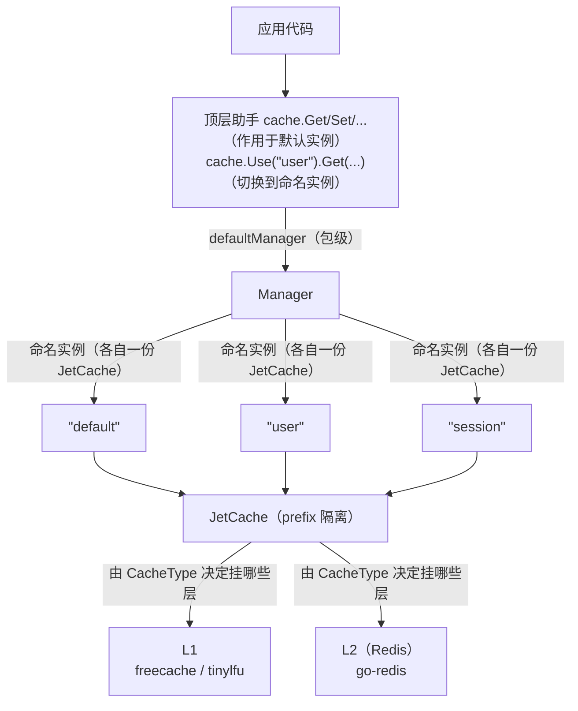

# Aifei-Go 缓存插件：两级缓存统一抽象

> **本地 L1 + Redis L2 两级缓存，按实例隔离。** 以插件方式（`plugins/cache`）为应用提供缓存能力，基于 jetcache-go，应用代码只面向 `Cache` 接口与顶层 `cache.Get/Set/...` 助手。

---

## 1. 背景与定位

缓存是高并发服务最常见的性能手段。一个典型的 Web 服务通常需要两级缓存：

- **L1 本地缓存**：进程内内存命中，纳秒级延迟，用于抗热 Key、减轻 L2 压力
- **L2 分布式缓存**（Redis）：跨实例共享，容量大，用于一致性可接受的跨进程命中

但「两级」一旦裸写就会引入一堆问题：穿透/击穿/雪崩防护、单飞合并（singleflight）、L1 与 L2 一致性、序列化、TTL 策略、多实例隔离……自己实现既繁琐又易踩坑。

Aifei-Go 的 `plugins/cache` 选用成熟的 [jetcache-go](https://github.com/mgtv-tech/jetcache-go) 作为内核，在其之上提供一套**面向接口、配置驱动、与框架无缝集成**的缓存抽象。

### 定位

| 维度 | 说明 |
|------|------|
| 是什么 | `plugins/cache`：基于 jetcache-go 的两级缓存抽象插件 |
| 解决什么 | 多实例缓存的路由、隔离、穿透防护、单飞合并、与 aifei 生命周期绑定 |
| Java 对应 | 移植自 ficat 的 `CacheService` 思路（接口风格对齐 Aifei 生态） |
| 依赖 | 内部模块 `aifei` / `config` / `log`；外部库 `jetcache-go`、`go-redis/v9` |
| 测试 | `_test/cache_test` 用 `miniredis` 做集成测试，无需外部 Redis |

> 不熟悉 aifei 插件机制的读者，可先读 [核心框架](core.md) 的 Plugin 接口一节。

---

## 2. 核心概念与总体架构

插件的核心设计思想是：**一个 `Manager` 管理多个命名实例，一个默认实例服务顶层助手函数**。每个实例是一份独立的 `Cache`（L1/L2/两者），通过 key 前缀相互隔离。

### 关键类型一览

| 类型 | 职责 |
|------|------|
| `Cache` | 缓存抽象接口（一个命名实例） |
| `JetCache` | `Cache` 的唯一实现，包装 jetcache-go 的 `jcache.Cache` |
| `Loader` | 未命中时的加载函数（签名与 jetcache `DoFunc` 对齐） |
| `Manager` | 多实例门面：按名路由 + 默认实例 |
| `Plugin` | `aifei.Plugin` 实现：读配置 → 建 Manager → 装包级默认 |
| `Config` / `InstanceConfig` / `LocalConfig` / `RemoteConfig` / `RefreshConfig` | 配置模型 |
| `CacheType` | 拓扑类型：`local` / `remote` / `both` |
| `LocalDriver` | L1 后端：`freecache`（默认）/ `tinylfu` |

### 数据流



关键设计点：

- **每个实例一把前缀**：`JetCache.fullKey()` 把用户 key 加成 `<keyPrefix>:<instance>:<key>`，多实例共用同一个 Redis 也不会撞键。
- **默认实例兜底**：顶层 `cache.Get/Set/...` 总是走默认实例；`cache.Use(name)` 切到命名实例；未配置任何实例时 `Manager` 会自动建一个本地 freecache 实例兜底。
- **错误即错误，未命中即 false**：`Get` 返回 `(found bool, err error)`，把「未命中」与「真错误」分开，调用方无需用 `errors.Is` 区分。

---

## 3. 关键 API：Cache 接口

`Cache` 定义在 `plugins/cache/cache.go`，是整个模块的对外契约：

```go
type Cache interface {
    // Get：未命中（含已缓存的"not found"占位）返回 (false, nil)；真错误返回 (false, err)
    Get(ctx context.Context, key string, dest any) (found bool, err error)

    // Set：ttl 省略则用实例默认 TTL；Redis 用 SETEX，远端值必过期
    Set(ctx context.Context, key string, value any, ttl ...time.Duration) error

    // Delete：本地+远端两层都删；删不存在的 key 不是错误
    Delete(ctx context.Context, key string) error

    // Exists：key 是否存在（不含"not found"占位）
    Exists(ctx context.Context, key string) bool

    // GetOrStore：命中返回缓存值；未命中调 loader，缓存其结果后返回
    //   - singleflight 合并同 key 并发加载
    //   - loader 返回 ErrNotFound 时缓存占位（防穿透），并返回 ErrNotFound
    GetOrStore(ctx context.Context, key string, dest any, loader Loader, ttl ...time.Duration) error

    CacheType() string              // "local" / "remote" / "both"
    Close() error                   // 释放资源（如刷新 goroutine）
    JetCache() jcache.Cache         // 逃生口：拿到底层 jetcache 做高级用法
}
```

### 最小用法

```go
import "github.com/crazy-airhead/aifei-go/plugins/cache"

// 写
_ = cache.Set(ctx, "user:1", user, 10*time.Minute)

// 读（found=false 表示未命中，不是错误）
var u User
found, err := cache.Get(ctx, "user:1", &u)

// 防穿透 + 单飞
err = cache.GetOrStore(ctx, "user:1", &u, func(ctx context.Context) (any, error) {
    u, err := db.FindByID[User](1)
    if err == sql.ErrNoRows {
        return nil, cache.ErrNotFound   // 缓存"未命中占位"，防穿透
    }
    return u, err
})
```

### 切换实例

```go
// 操作命名实例（不通过默认）
c := cache.Use("session")
c.Set(ctx, token, payload, time.Hour)
```

---

## 4. 核心机制

### 4.1 未命中 vs 错误：Get 的双返回值

裸用 Redis 客户端时，调用方必须区分「key 不存在」与「网络错误」——通常靠 `errors.Is(err, redis.Nil)`。这种写法容易遗漏，且不同后端语义不一致。

`Cache.Get` 把这个分歧在接口层消化掉：返回 `(found bool, err error)`，**未命中返回 `(false, nil)`，真错误返回 `(false, err)`**。实现上统一了两种「未命中」：

| 底层返回 | 含义 | `Get` 返回 |
|---------|------|-----------|
| `nil` | 命中 | `(true, nil)` |
| `jcache.ErrCacheMiss` | 真·未命中 | `(false, nil)` |
| `ErrNotFound`（自定义） | loader 返回未命中后缓存的占位 | `(false, nil)` |
| 其他 | 网络/反序列化错误 | `(false, err)` |

`ErrNotFound` 同时是 loader 的契约：未命中数据库时返回它，插件会把占位写进缓存——这是防穿透的关键信号。

### 4.2 GetOrStore：单飞 + 防穿透 + 防击穿

`GetOrStore` 是日常最高频的入口，内置三重保护：

| 风险 | 保护机制 |
|------|---------|
| **缓存穿透**（反复查不存在的 key） | loader 返回 `ErrNotFound` → 缓存「未命中占位」→ 后续命中占位直接返回 `(false, nil)`，不再查源 |
| **缓存击穿**（热 key 失效瞬间大量并发回源） | jetcache 的 `Once`（singleflight）合并同 key 的并发加载，N 个 goroutine 只触发一次 loader |
| **缓存雪崩**（大量 key 同时过期） | 调用时显式传 `ttl` 随机化，或靠 jetcache 内置抖动 |

底层是 jetcache 的 `inner.Once(ctx, key, Do(DoFunc(loader)), Value(dest), TTL(ttl))`——`Loader` 的签名特意设计成与 `jcache.DoFunc` 一致，零转换传递。

### 4.3 按实例 key 前缀隔离

多个缓存实例常常共用同一个 Redis 集群（开发/测试环境尤其常见）。若不做隔离，`user:1` 在实例 A 写入的值会被实例 B 覆盖。

`JetCache` 在每次读写前用 `fullKey()` 加前缀：

```go
func (c *JetCache) fullKey(key string) string {
    if c.prefix == "" {
        return key
    }
    return c.prefix + keySeparator + key   // keySeparator = ":"
}
```

前缀由 `InstanceConfig.prefixedName(name)` 生成：`<KeyPrefix>:<instanceName>`。例如 `keyPrefix: "app"`、实例名 `"user"`，则实际 Redis key 是 `app:user:<原key>`。`KeyPrefix` 为空时退化为仅用实例名，再为空则不加前缀。

> 注意：jetcache 的 `WithName` 只用于日志/metrics，不参与 key 前缀——所以本插件自己实现了前缀逻辑。

### 4.4 L1 后端：FreeCache vs TinyLFU

L1 有两种实现，由 `local.driver` 选择：

| Driver | 大小语义 | 隔离性 | 适用 |
|--------|---------|--------|------|
| `freecache`（默认） | **字节**（默认 256MB；范围外被重置） | **进程全局共享**（jetcache 的 FreeCache 跨实例共享一块内存，仅靠 key 隔离） | 单实例、想用满内存 |
| `tinylfu` | **条数**（默认 10000） | **每实例独立**（ristretto 实例） | 多实例、需要各自独立内存预算 |

源码注释里专门点出了这个坑：不同 size 的两个 FreeCache 实例**仍共享同一块进程内存**——若需要真正的实例间内存隔离，请用 `tinylfu`。

### 4.5 L2 后端：单节点 vs Ring

L2 固定用 go-redis v9，拓扑由配置决定：

```go
func buildRedisClient(cfg RedisConfig) (redis.Cmdable, error) {
    if len(cfg.Addrs) > 0 {           // Addrs 优先 → Ring（分片集群）
        return redis.NewRing(...), nil
    }
    if cfg.Addr != "" {               // 单节点
        return redis.NewClient(...), nil
    }
    return nil, fmt.Errorf("redis addr(s) required")
}
```

`Addrs` 是 `map[string]string`（分片名 → 地址），非空时构建 `redis.Ring`；否则用 `Addr` 构建单节点 `Client`。两者都为空是配置错误。

### 4.6 拓扑推断：cacheTypeOf

`type` 可以显式写，也可以省略让插件按配置推断：

| `type` | `local` 配置 | `remote` 配置 | 推断结果 |
|--------|-------------|--------------|---------|
| 显式 `local` / `remote` / `both` | — | — | 即显式值（优先级最高） |
| 空 | 有 | 有 | `both` |
| 空 | 任意 | 有 | `remote` |
| 空 | 有 | 无 | `local` |
| 空 | 无 | 无 | `local`（兜底） |

`NewCache` 会按推断结果强制要求对应的配置：声明 `remote`/`both` 但没给 `remote` → 报错；声明 `local`/`both` 但没给 `local` → 报错。早失败好过静默用错后端。

---

## 5. Manager：多实例门面

`Manager` 持有所有命名实例并按名路由，结构与 `storage.Manager` 同构：

```go
type Manager struct {
    caches map[string]Cache
    def    Cache
    mu     sync.RWMutex
    log    log.Logger
}
```

核心方法：

| 方法 | 行为 |
|------|------|
| `NewManager(cfg, logger)` | 按 `cfg.Instances` 逐个 `NewCache`；`cfg.Default` 指向的实例设为默认；**无实例配置时自动建一个本地 freecache 兜底** |
| `Default() Cache` | 返回默认实例 |
| `Instance(name) Cache` | 按名查找；空名等价于 `Default()`；未配置返回 `nil`（方法名因 Go 不允许与返回类型同名而用 `Instance` 而非 `Cache`） |
| `Names() []string` | 全部实例名 |
| `Close() error` | 关闭所有实例（逐个 `Close`，保留首个错误） |

默认实例的选择规则：`name == cfg.Default` 命中即设为默认；若全程未命中，第一个被遍历到的实例兜底为默认——因此**强烈建议显式写 `cache.default`** 以保证确定性。

---

## 6. 包级默认与顶层助手

插件借鉴 storage 的做法，把「默认 Manager + 默认实例」暴露成包级顶层函数，让大多数调用方无需持有 Manager 引用：

| 顶层助手 | 等价于 |
|---------|--------|
| `cache.Get(ctx, key, dest)` | `DefaultManager().Default().Get(...)` |
| `cache.Set(ctx, key, val, ttl...)` | 同上 |
| `cache.Delete(ctx, key)` | 同上 |
| `cache.Exists(ctx, key)` | 同上 |
| `cache.GetOrStore(ctx, key, dest, loader, ttl...)` | 同上 |
| `cache.Use(name) Cache` | `DefaultManager().Instance(name)` |
| `cache.SetDefault(mgr)` | 装包级默认（手动装配时用） |
| `cache.DefaultManager() *Manager` | 取已装的默认 Manager |

### 未配置时的优雅失败

如果应用没装 `Plugin`、也没调 `SetDefault`，顶层助手不会 panic，而是返回一个明确的错误：

```go
func defaultCache() Cache {
    m := DefaultManager()
    if m == nil {
        return errCache{ErrNoDefault}    // 每个方法都返回 ErrNoDefault
    }
    c := m.Default()
    if c == nil {
        return errCache{ErrNoDefault}
    }
    return c
}
```

`errCache` 实现了完整的 `Cache` 接口，所有数据方法返回 `ErrNoDefault`，`Exists` 返回 `false`。这让「未配置」在业务代码里表现为一个普通的错误分支，而不是程序崩溃。

---

## 7. 配置与集成

### 配置模型

```go
type Config struct {
    Default   string                    `yaml:"default"`
    Instances map[string]InstanceConfig `yaml:"instances"`
}

type InstanceConfig struct {
    Type      string         `yaml:"type"`      // local / remote / both（空则推断）
    TTL       int            `yaml:"ttl"`       // L2 默认过期（秒），0=库默认（1h）
    Codec     string         `yaml:"codec"`     // msgpack（默认）/ json / sonic
    KeyPrefix string         `yaml:"keyPrefix"` // 额外前缀，如 "app"
    Local     *LocalConfig   `yaml:"local"`
    Remote    *RemoteConfig  `yaml:"remote"`
    Refresh   *RefreshConfig `yaml:"refresh"`
    SyncLocal bool           `yaml:"syncLocal"`
}
```

`LoadConfig(prefix)` 从全局 `config.Props` 读取：`<prefix>.default` 拿默认名，`<prefix>.instances` 子树用 `config.SubBind` 整段 YAML 反序列化。`prefix` 空 → `"cache"`。关于 `SubBind` 的细节见 [配置模块](config.md)。

### 完整 YAML 示例

```yaml
cache:
  default: user

  instances:
    # ① 纯本地（L1）：开发/单机够用，零外部依赖
    local:
      type: local
      local:
        driver: freecache
        size: 268435456        # 256MB

    # ② 纯 Redis（L2）：跨实例共享
    session:
      type: remote
      ttl: 3600
      codec: msgpack
      keyPrefix: app
      remote:
        ttl: 1800
        redis:
          addr: 127.0.0.1:6379
          db: 0
          poolSize: 20

    # ③ 两级（L1+L2）+ 后台刷新：生产推荐
    user:
      type: both
      ttl: 7200
      codec: msgpack
      keyPrefix: app
      local:
        driver: tinylfu         # 多实例时用 tinylfu 拿独立内存预算
        size: 10000             # 条数
        ttl: 600
      remote:
        ttl: 7200
        redis:
          addrs:                # 非空 → Ring 分片集群
            shard1: 10.0.0.1:6379
            shard2: 10.0.0.2:6379
          username: ""
          password: secret
          db: 0
          poolSize: 50
      refresh:
        duration: 300           # 每 300s 后台刷新一次热 key
        concurrency: 4
        stopAfter: 86400        # 最后一次访问后 24h 停止刷新
      syncLocal: true           # 开启 L1 失效事件广播（需自行接 pub/sub）
```

### 配置键速查

| 键 | 类型 | 说明 |
|----|------|------|
| `cache.default` | string | 默认实例名（建议显式设置） |
| `cache.instances.<name>.type` | string | `local`/`remote`/`both`；空则按 local/remote 是否配置推断 |
| `cache.instances.<name>.ttl` | int | L2 默认 TTL（秒）；0 用库默认 1h |
| `cache.instances.<name>.codec` | string | `msgpack`/`json`/`sonic`；后者需应用 import 注册 |
| `cache.instances.<name>.keyPrefix` | string | 额外 key 前缀 |
| `cache.instances.<name>.local.driver` | string | `freecache`（默认）/`tinylfu` |
| `cache.instances.<name>.local.size` | int | freecache: 字节；tinylfu: 条数 |
| `cache.instances.<name>.local.ttl` | int | L1 TTL（秒）；0=不过期 |
| `cache.instances.<name>.remote.ttl` | int | L2 TTL，覆盖实例级 `ttl` |
| `cache.instances.<name>.remote.redis.addr` | string | 单节点地址 |
| `cache.instances.<name>.remote.redis.addrs` | map | 非空 → Ring 分片 |
| `cache.instances.<name>.remote.redis.{username,password,db,poolSize}` | — | 连接认证 |
| `cache.instances.<name>.refresh.{duration,concurrency,stopAfter}` | int | 后台刷新参数 |
| `cache.instances.<name>.syncLocal` | bool | L1 失效事件（both 拓扑） |

### 代码集成

```go
func main() {
    // 1. 加载配置（app.yml + 环境变量）
    if err := config.Init(os.Args); err != nil {
        log.Fatal(err)
    }

    // 2. 创建插件（nil logger → log.Default()；prefix 空 → "cache"）
    p, err := cache.NewPlugin(nil)
    if err != nil {
        log.Fatal(err)
    }

    // 3. 注册为 aifei 插件
    app := aifei.New(aifei.WithPlugin(p))
    app.Use(server.Logger(), server.Recover())

    server.AutoRegisterServices(app)
    server.Run(app, ":8080")   // Run 会调 plugin.Start()/Stop()
}
```

`Plugin.Start()` 依次：`LoadConfig` → `NewManager` → `SetDefault` → 日志输出实例列表。`Plugin.Stop()` **不是 no-op**——缓存实例可能跑着后台刷新 goroutine，必须逐个 `Close()` 释放（这点与 storage 插件不同）。

### 不用框架时：直接装配 Manager

```go
cfg, _ := cache.LoadConfig("cache")
mgr, _ := cache.NewManager(cfg, nil)
cache.SetDefault(mgr)
defer mgr.Close()

cache.Set(ctx, "k", "v", time.Minute)
```

---

## 8. 逃生口：JetCache()

jetcache-go 提供了很多本插件接口未直接暴露的高级能力：`SetNX`/`SetXX`、`SkipLocal`、`SkipRemote`、`Refresh` 主动刷新、`SyncLocal` 广播等。通过 `Cache.JetCache()` 拿到底层 `jcache.Cache` 即可使用：

```go
c := cache.Use("user")
jc := c.JetCache()
// 直接用 jetcache 的高级 API（调用方自此与 jetcache-go 耦合）
ok, err := jc.SetNX(ctx, "lock:order:1", "owner", time.Minute)
```

> 代价：一旦使用 `JetCache()`，调用方代码便与 jetcache-go 直接耦合，升级 jetcache 时需注意。能在 `Cache` 接口上完成的日常操作，不建议下沉到这一层。

---

## 9. 插件结构总览

```
plugins/cache/
├── cache.go          # Cache 接口 + JetCache 实现（fullKey 前缀、Get/Set/Delete/Exists/GetOrStore/Close）
├── cache_default.go  # 包级默认：SetDefault/DefaultManager/Use + 顶层 Get/Set/... 助手 + errCache
├── config.go         # Config/InstanceConfig/LocalConfig/RemoteConfig/RefreshConfig + LoadConfig
├── local.go          # buildLocalCache：freecache / tinylfu
├── remote.go         # buildRedisClient：单节点/Ring + buildRemoteCache
├── manager.go        # Manager：多实例门面（NewManager/Default/Instance/Names/Close）
├── plugin.go         # aifei.Plugin 实现（Start 装默认、Stop 关所有实例）
└── type.go           # 常量与枚举：CacheType / LocalDriver / cacheTypeOf
```

源代码约 780 行。测试在 `_test/cache_test`（独立 Go 模块），用 `miniredis` 起内嵌 Redis，无需外部依赖即可跑完整两级缓存集成测试。

---

## 10. 总结

Aifei-Go 的缓存插件围绕几个核心设计原则构建：

1. **接口先行**：`Cache` 接口屏蔽 jetcache-go，业务代码只面向接口；下沉到 `JetCache()` 才产生耦合
2. **未命中 ≠ 错误**：`Get` 用 `(found, err)` 双返回值，把最常见的「未命中」从错误路径里剥离，调用方不再 `errors.Is`
3. **实例隔离**：每个 `JetCache` 自带 key 前缀，多实例共用一个 Redis 也安全
4. **三重保护内建**：`GetOrStore` 自带单飞（击穿）+ `ErrNotFound` 占位（穿透）+ TTL 控制（雪崩）
5. **包级默认 + 助手函数**：大多数场景 `cache.Get/Set` 直达，无需传 Manager；未配置时优雅返回 `ErrNoDefault` 而非 panic
6. **与框架同生命周期**：`Plugin.Stop()` 关闭所有实例的后台刷新 goroutine（这点比 storage 更重要）

### 延伸阅读

- [核心框架 · Plugin 接口](core.md)
- [分层配置 · SubBind](config.md)
- [存储插件 · 同构设计](storage.md)
- [数据隔离插件 · 风格范例](data-isolate.md)
