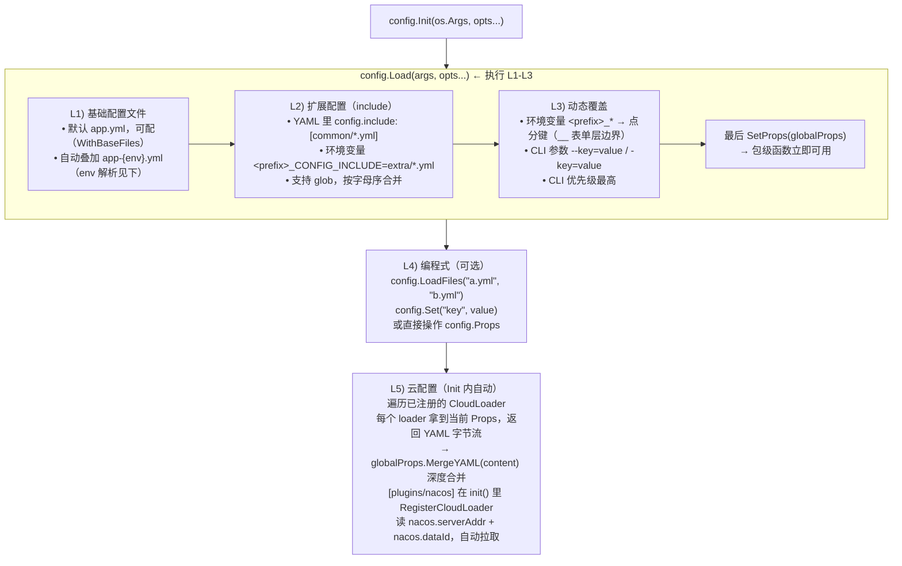
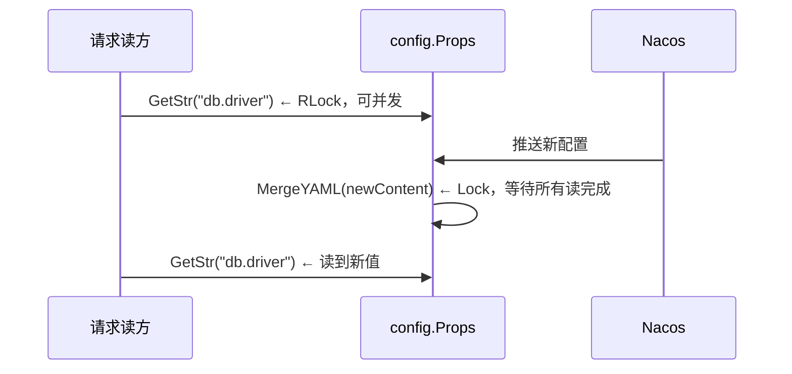

# Aifei-Go config：分层加载的泛型配置中心

> **一份 YAML，五个加载层。**L1 基础文件 → L2 扩展 include → L3 环境变量+CLI → L4 编程式 → L5 云配置（Nacos），按优先级深度合并；统一存进泛型 `Props`，按点分键取值或 YAML 往返到结构体。线程安全、键名大小写/分隔符无关。

---

## 1. 背景与定位

真实的 Go 服务通常要同时处理多份来源各异的配置：

- **环境差异**：dev / staging / prod 有不同的数据库、日志级别、依赖地址
- **部署差异**：同一份镜像在容器里跑，配置文件路径、敏感字段（密码、token）来自环境变量或 CLI 参数
- **拆分管理**：基础配置放仓库，敏感/动态配置走配置中心（Nacos、Apollo、Consul KV）
- **结构化绑定**：业务代码不想满屏 `config.GetStr("xxx")`，希望一次性反序列化到强类型 struct

Go 生态有 viper / koanf / envconfig 等成熟方案，但它们要么依赖重、要么行为隐式（viper 的优先级链对新人不直观）、要么只解决一面（envconfig 只管环境变量）。Aifei-Go 的 `config` 模块按「**显式分层 + 泛型 Store + YAML 往返**」三件事重新做了一遍，把加载顺序写进源码注释，所见即所得。

### Java Aifei 对应

Java Aifei 的 `props` / `config` 模块基于 Solon 的 `Solon.cfg()`，支持 `app.yml` + 环境覆盖 + 配置中心。Go 版本保留了同样的分层理念，但：

- 去掉了 Java 版对 `@Value`/`@ConfigurationProperties` 注解的依赖（Go 没有注解，改为 `Bind(v)` 显式绑定）
- 用 YAML round-trip（Marshal 再 Unmarshal）实现 struct 绑定，复用 `yaml.v3`，不引入额外映射库
- 把云配置抽象成 `CloudLoader` 回调，让 [plugins/nacos](nacos.md) 可自动注册，核心库不依赖任何配置中心 SDK

### 依赖

| 类型 | 依赖 |
|------|------|
| 外部第三方库 | `gopkg.in/yaml.v3` |
| 内部模块 | 无 |
| 标准库 | `os`、`path/filepath`、`strings`、`fmt`、`sync` |

模块路径：`github.com/crazy-airhead/aifei-go/config`。唯一的第三方依赖是 `yaml.v3`（YAML 解析的事实标准），不传染任何配置中心 SDK。

---

## 2. 核心概念与加载流程

整个模块的运转围绕两个抽象：

| 抽象 | 类型 | 作用 |
|------|------|------|
| `Props` | `struct` | 泛型键值仓库：点分键 → `interface{}`，支持深度合并、按类型取值、YAML 往返 |
| `CloudLoader` | `func(*Props) ([]byte, error)` | L5 云配置回调，接收当前 store，返回 YAML 字节流做最后一层合并 |

外加一组**包级便捷函数**（`config.Get`/`GetStr`/`Sub`/`Bind`...）操作一个全局 `Props`，让业务代码无需自己持有实例。

### L1-L5 加载流程



核心规则：**后加载的层覆盖前面的层**，对 map 做 `deepMerge`（递归合并），对 scalar 值直接覆盖。

### `Init` vs `Load` 的区别

| 函数 | 执行的层 | 何时用 |
|------|---------|--------|
| `Load(args, opts...)` | L1-L3 | 需要在 L4/L5 前检查或修改 Props（测试、特殊场景） |
| `Init(args, opts...)` | L1-L3 + L5 | 生产标准入口：一次性跑完全流程 |
| `LoadFiles(paths...)` | L4 单步 | 加载完 `Init` 后再补文件 |

绝大多数应用只需 `config.Init(os.Args)`。

---

## 3. Props：泛型键值仓库

`Props` 是整个模块的核心数据结构：

```go
type Props struct {
    mu   sync.RWMutex
    data map[string]interface{}
}
```

- `data` 是**嵌套的 `map[string]interface{}`**（不是扁平的 `map[string]string`），YAML 解析后的原生结构
- `sync.RWMutex` 保证读写并发安全（读多写少，L5 动态更新时上写锁）
- 键用**点分路径**寻址：`"server.port"` 等价于 `data["server"]["port"]`

### 按类型取值的访问器

```go
func (p *Props) Get(key string, def ...interface{}) interface{}
func (p *Props) GetStr(key string, def ...string) string
func (p *Props) GetBool(key string, def ...bool) bool
func (p *Props) GetInt(key string, def ...int) int
func (p *Props) GetInt64(key string, def ...int64) int64
func (p *Props) GetFloat64(key string, def ...float64) float64
func (p *Props) Has(key string) bool
func (p *Props) Keys() []string
```

设计要点：

1. **`def ...T` 可变参数默认值**：未传且键不存在时返回零值，传了就返回 `def[0]`。省去调用方再写 `if v == ""` 的样板。
2. **数字类型兼容 YAML 解析**：YAML 解析整数时 `yaml.v3` 会返回 `int`/`int64`，但解析浮点数字面量返回 `float64`。`GetInt` / `GetInt64` / `GetFloat64` 都做了 `int`/`int64`/`float64` 三种类型的自动转换，不会因为 YAML 写成 `port: 8080.0` 而取不到值。
3. **`GetStr` 的空串语义**：键存在但值为空串时也视为「未设置」，返回 `def[0]`——避免配置写一半（`driver:` 啥都没填）时静默拿空串。
4. **`GetBool` 严格匹配**：只认 `bool` 类型，不把字符串 `"true"`/`"1"` 转成 `true`。环境变量注入时若需要 `"true"` → `true`，请用 `Bind`（走 YAML 反序列化，YAML 规则会自动转换）。

```go
// 读取 server.port，默认 8080
port := config.GetInt("server.port", 8080)

// 读取 db.driver，默认 sqlite
driver := config.GetStr("db.driver", "sqlite")

// 读取 feature.flag（可能未配置）
if config.GetBool("feature.flag", false) { ... }
```

---

## 4. 键名归一化：大小写与分隔符无关

这是 `config` 模块最容易被忽视但最影响体验的一个设计。源码里有一段明确的规约：

```go
// normalizeKey normalizes a dot-separated key by normalizing each segment
// to lowerCamelCase. This allows users to use any convention (snake_case,
// kebab-case, CamelCase, UPPER_CASE) and still hit the same key.
```

即：**任何写法的键都会被归一到 lowerCamelCase**。

| 输入 | 归一化结果 |
|------|-----------|
| `server.port` | `server.port` |
| `Server.Port` | `server.port` |
| `db.max-connections` | `db.maxConnections` |
| `db.max_connections` | `db.maxConnections` |
| `DB.MAX_CONNECTIONS` | `db.maxConnections` |
| `db.MaxConnections` | `db.maxConnections` |

这意味着：

- YAML 文件写 `max-connections: 10`（kebab）
- 环境变量写 `AIFEI_DB__MAX_CONNECTIONS=20`（snake UPPER）
- CLI 参数写 `--db.MaxConnections=30`（Camel）

三者都命中同一个键 `db.maxConnections`，**不会出现「YAML 里能读到，环境变量覆盖不了」的诡异 bug**。

### 归一化算法

```go
func normalizeSegment(s string) string {
    // Step 1: split by _ and -
    rawWords := splitBySeparators(s)
    // Step 2: split each word by camelCase boundaries
    var words []string
    for _, w := range rawWords {
        words = append(words, splitCamel(w)...)
    }
    // Step 3: lowercase all words, capitalize from index 1 onward
    for i, w := range words {
        w = strings.ToLower(w)
        if i > 0 && len(w) > 0 {
            w = strings.ToUpper(w[:1]) + w[1:]
        }
        words[i] = w
    }
    return strings.Join(words, "")
}
```

`splitCamel` 把 camelCase 拆成 word，连续大写（如 `XMLParser`）按首字母缩略词处理成单个 word：

| 输入 | splitCamel 结果 |
|------|----------------|
| `maxConnections` | `["max", "Connections"]` |
| `XMLParser` | `["XML", "Parser"]` |
| `userID` | `["user", "ID"]` |

归一化在**写入时**（`deepMerge` 合并 YAML / `set` 设置值）和**读取时**（`get` 查找）都执行，保证两端一致。

---

## 5. 环境变量映射规则

`Props.LoadEnv(prefix)` 把带 `prefix_` 前缀的环境变量灌进仓库。映射规则有一个反直觉但必要的细节：

```
AIFEI_SERVER_PORT=9090        →  server.port = "9090"
AIFEI_DB__DRIVER=mysql        →  db.driver = "mysql"
AIFEI_DEBUG=true              →  debug = "true"
```

**单下划线 `_` 变点 `.`（降一层），双下划线 `__` 也变点但「不切层」**——具体实现是：先把 `__` 换成占位符 `\x00`，再把剩下的 `_` 换成 `.`，最后把 `\x00` 也换成 `.`。

看起来两者结果都是 `.`，为什么要分两种写法？因为**归一化是按 segment 做的**：

| 写法 | 第一次 split 后的 segments | 归一化键 |
|------|---------------------------|---------|
| `AIFEI_DB__DRIVER` | `["db", "driver"]`（先拆 `__` 占位符） | `db.driver` |
| `AIFEI_DB_DRIVER` | `["db.driver"]`（`_` 变 `.` 后才进 segment）| `db.driver` |

对 `db.driver` 这种全小写单词的键，两种写法结果相同；但**遇到 camelCase 键**时区别就出来了：

| 目标键 | 环境变量写法 |
|--------|-------------|
| `db.maxConnections` | `AIFEI_DB__MAX_CONNECTIONS`（推荐）|
| `db.maxConnections` | `AIFEI_DB_MAX_CONNECTIONS`（同样有效，因为 `max_connections` 归一化也是 `maxConnections`）|
| `db.maxConnections` | `AIFEI_DB_MAXCONNECTIONS`（也有效）|

简而言之：`__` 是「跨 segment 边界」的明确写法，`_` 是「同 segment 内分隔」的写法，归一化兜底让两者多数情况等价。**推荐 camelCase 键用 `__` 分层**，避免歧义。

### 全大写键的处理

环境变量通常是全大写（`AIFEI_DB_DRIVER`），归一化会把 `DRIVER` 拆成 `["DRIVER"]`（单个大写 word），再 lower → `driver`，结果正确。混写（`AIFEI_db_Driver`）也照常工作，但**不推荐混写**，影响可读性。

---

## 6. CLI 参数解析

`Props.LoadArgs(args)` 解析 `--key=value` 和 `-key=value`：

```go
// --server.port=9090     sets "server.port" = "9090"
// -db.driver=mysql       sets "db.driver"   = "mysql"
// positional（无 =）     忽略
```

要点：

- **前导 `-` 数量不限**：`--foo=1` 和 `-foo=1` 等价
- **值类型始终是 `string`**：`--server.port=9090` 拿到的是字符串 `"9090"`，要用 `GetInt` 才能转成数字
- **`--env=xxx` 会被分离**：不进入 store，专门用于指定 profile（见下）
- **键名归一化同样生效**：`--db.MaxConnections=30` 命中 `db.maxConnections`

### profile 解析优先级

`resolveEnv` 决定使用哪个 `app-{env}.yml`，按顺序检查：

1. `--env=xxx` / `-env=xxx` CLI 参数
2. `<prefix>_ENV` 环境变量（如 `AIFEI_ENV=dev`）
3. `<prefix>_PROFILE` 环境变量（兼容 Spring Boot 习惯）

三者都未设则不加载 profile 文件。

> **细节**：L3 执行完之后还会**再检查一次** `--env`——这是因为某些启动脚本会把 `--env=dynamic` 混在其他 CLI 参数里传进来，而 L1 之前只扫了 `args[1:]`。如果第一次没解析到，L3 之后会补加载 `app-dynamic.yml`（缺失文件忽略，不报错）。

---

## 7. Sub / Bind / SubBind：作用域与结构化绑定

### Sub：作用域切片

```go
func (p *Props) Sub(prefix string) *Props
```

返回一个**新的独立 Props**，只包含 `prefix` 下的子树，键相对于该 prefix。

```go
// 全局
// server:
//   port: 8080
//   host: 0.0.0.0

serverProps := config.Sub("server")
serverProps.GetStr("port")  // "8080"  等价于 config.GetStr("server.port")
serverProps.GetStr("host")  // "0.0.0.0"
```

**深拷贝语义**：`Sub` 内部对子树做了 `copyValue` 递归拷贝，子树和父树互不影响——改子树不会污染全局，反之亦然。这是刻意的隔离设计，让插件可以拿到自己的「配置视图」放心操作。

### Bind / SubBind：YAML 往返到 struct

业务代码通常更希望拿到一个强类型 struct，而不是满屏 `GetStr`。`Bind` 通过**YAML 序列化再反序列化**实现：

```go
func (p *Props) Bind(v interface{}) error
func (p *Props) SubBind(prefix string, v interface{}) error
```

`Bind` 的内部实现只有 4 行：

```go
func (p *Props) Bind(v interface{}) error {
    p.mu.RLock()
    b, err := yaml.Marshal(p.data)
    p.mu.RUnlock()
    if err != nil {
        return fmt.Errorf("marshal config: %w", err)
    }
    return yaml.Unmarshal(b, v)
}
```

即：**把 `data` map 重新 Marshal 成 YAML 字节流，再 Unmarshal 到用户 struct**。复用 `yaml.v3` 的所有规则：

- 按 `yaml:"xxx"` tag 映射字段
- 类型转换（字符串数字 → int、`"true"` → bool）
- 默认值（struct 字段没对应的 YAML 键时保持零值）
- 嵌套结构体自动展开

### 典型用法

```go
type ServerConf struct {
    Port int    `yaml:"port"`
    Host string `yaml:"host"`
}

type DBConf struct {
    Driver string `yaml:"driver"`
    DSN    string `yaml:"dsn"`
}

type AppConfig struct {
    Server ServerConf `yaml:"server"`
    DB     DBConf     `yaml:"db"`
}

func main() {
    if err := config.Init(os.Args); err != nil {
        log.Fatal(err)
    }

    // 方式一：整体绑定
    var cfg AppConfig
    _ = config.Bind(&cfg)
    // cfg.Server.Port, cfg.DB.Driver ...

    // 方式二：只绑某个子树（插件常用）
    var db DBConf
    _ = config.SubBind("db", &db)
}
```

`SubBind` 是 `Sub(prefix).Bind(v)` 的便捷缩写，但**比两步调用更高效**——只 Marshal 子树，避免序列化整个配置。

> **为什么用 YAML 往返而不是反射**：反射方案要自己处理类型转换、嵌套、slice、map、指针，工作量巨大且容易出 bug；YAML 往返把这一切交给成熟的 `yaml.v3`，核心库代码量从几百行降到 4 行。代价是一次 Marshal+Unmarshal 的开销（微秒级），对启动时一次性的绑定完全可以接受。

### 插件中的典型用法

各 [plugins](aifei-go.md) 在加载自己的配置时，几乎都是「`config.GetStr(prefix+".default")` 拿默认实例名 + `config.SubBind(prefix+".xxx", &cfg.Xxx)` 绑子树列表」的组合：

```go
// plugins/storage/config.go
cfg := &Config{Default: config.GetStr(prefix + ".default")}
if err := config.SubBind(prefix+".buckets", &cfg.Buckets); err != nil {
    return nil, err
}
```

这已经成为 Aifei-Go 插件的配置访问惯例。

---

## 8. 函数式选项

`Init` / `Load` 接受一组 `Option` 调整管线行为：

```go
type Option func(*loaderConfig)

type loaderConfig struct {
    envPrefix string   // 环境变量前缀，默认 "AIFEI"
    env       string   // 强制 profile，空则自动检测
    configDir string   // 配置文件根目录，默认 "."
    baseFiles []string // 基础文件名，默认 ["app.yml"]
}
```

| 选项 | 作用 | 典型用法 |
|------|------|---------|
| `WithEnvPrefix(prefix)` | 改 env 前缀（默认 `AIFEI`） | 多服务同机部署时区分，如 `MYAPP_` |
| `WithEnv(env)` | 强制 profile，跳过自动检测 | 测试里指定固定环境 |
| `WithConfigDir(dir)` | 配置文件根目录（默认当前目录） | `etc/`、`/opt/app/conf/` |
| `WithBaseFiles(files...)` | 基础文件名（默认 `app.yml`） | 用 `config.yml` 或多文件入口 |

### 选项组合示例

```go
err := config.Init(os.Args,
    config.WithConfigDir("/etc/myapp"),
    config.WithBaseFiles("application.yml"),
    config.WithEnvPrefix("MYAPP"),
)
```

这会读取 `/etc/myapp/application.yml` + `/etc/myapp/application-{env}.yml`，扫描 `MYAPP_*` 环境变量。

### 前缀的作用范围

`envPrefix` 影响三处：

1. L3 的环境变量扫描：`<prefix>_*`
2. profile 环境变量名：`<prefix>_ENV` / `<prefix>_PROFILE`
3. 扩展配置环境变量名：`<prefix>_CONFIG_INCLUDE`

**注意**：CLI 参数的 `--key=value` 不受前缀影响，所有 `--xxx` 都会被解析。

---

## 9. 扩展配置（L2）：include 机制

L1 的基础文件只能写一个 `app.yml`，但实际项目经常需要把配置拆成多个文件（按模块、按团队）。L2 的 include 机制支持两种入口：

### 从 YAML 配置声明

```yaml
# app.yml
config:
  include:
    - common/*.yml
    - extras/db.yml

server:
  port: 8080
```

`config.include` 是一个字符串列表，每项是一个相对于 `configDir` 的路径或 glob 模式。`LoadYAMLPattern` 会用 `filepath.Glob` 展开后按字母序合并。

### 从环境变量声明

```bash
export AIFEI_CONFIG_INCLUDE="extra/*.yml,secrets/*.yml"
```

`<prefix>_CONFIG_INCLUDE` 支持逗号分隔多个模式。适合在不改镜像的前提下，运行时注入额外配置（Kubernetes 的 ConfigMap 挂载场景）。

两者会合并，都会被加载。

---

## 10. 线程安全

`Props` 用 `sync.RWMutex` 保护 `data`：

| 操作 | 锁 |
|------|-----|
| `Get` / `GetStr` / `GetBool` / `GetInt` / ... | `RLock`（读锁，多读并发） |
| `Has` / `Keys` / `Sub` / `Bind` / `SubBind` / `Data` | `RLock` |
| `Set` / `LoadYAML` / `LoadYAMLBytes` / `LoadYAMLPattern` / `MergeYAML` / `LoadEnv` / `LoadArgs` | `Lock`（写锁，独占） |

这个设计是为 L5 云配置的**动态更新**服务的：



[plugins/nacos](nacos.md) 的 `BindProps` 方法就是利用这个机制——当 Nacos 推送配置变更时，回调里调用 `props.LoadYAMLBytes(content)`，Props 在写锁保护下完成深度合并，业务代码下一次 `config.GetStr` 就能拿到新值。

> **注意**：`Bind` 内部对 `data` 做 `yaml.Marshal` 时上的是 `RLock`，Marshal 完成后释放，然后 `yaml.Unmarshal` 到用户 struct 不再持锁——这是合理的，因为用户 struct 由调用方独占。

---

## 11. CloudLoader：L5 云配置扩展点

`CloudLoader` 是 `config` 模块对接配置中心的唯一扩展点：

```go
type CloudLoader func(store *Props) ([]byte, error)

func RegisterCloudLoader(cl CloudLoader)  // 包级注册
```

`Init` 在 L1-L3 完成后会遍历所有已注册的 `CloudLoader`，**把当前 store 作为参数传进去**，让 loader 能根据已有配置决定是否、以及如何拉取云端配置；返回的 YAML 字节流会被 `MergeYAML` 深度合并进同一个 store。

```go
// config.Init 内部（简化）
for _, cl := range cloudLoaders {
    content, err := cl(globalProps)   // 传入当前 store
    if err != nil {
        return fmt.Errorf("cloud loader: %w", err)
    }
    if len(content) > 0 {
        if err := globalProps.MergeYAML(content); err != nil {
            return fmt.Errorf("merge cloud config: %w", err)
        }
    }
}
```

### 设计要点

1. **注册式解耦**：核心库不依赖任何配置中心 SDK，`config` 包的 `go.mod` 干净得只有 `yaml.v3`。[plugins/nacos](nacos.md) 在自己的 `init()` 里调用 `RegisterCloudLoader` 完成接入，**import 了 nacos 插件就自动启用云配置**，不 import 则完全不感知。
2. **回调收 store**：loader 拿到的是已经加载完 L1-L3 的 store，可以读 `nacos.serverAddr` / `nacos.dataId` 判断「是否启用云配置」，避免在没配置的情况下强行连云。
3. **返回字节流而非 map**：loader 只负责「取」，合并仍由 `config` 的 `MergeYAML` 做——保证多层之间的深度合并逻辑统一，不会出现「Nacos 返回的 map 覆盖策略和 YAML 文件不一致」的问题。
4. **多 loader 串行**：如果有多个 `CloudLoader`（Nacos + Apollo + 自研），按注册顺序依次执行，后者覆盖前者。

### Nacos 接入示例

`plugins/nacos/config_loader.go` 全文就 30 行：

```go
func init() {
    config.RegisterCloudLoader(func(props *config.Props) ([]byte, error) {
        serverAddr := props.GetStr("nacos.serverAddr")
        if serverAddr == "" {
            return nil, nil // 未配置，跳过
        }
        dataID := props.GetStr("nacos.dataId")
        if dataID == "" {
            return nil, nil
        }
        cfg := &Config{
            ServerAddr: serverAddr,
            Namespace:  props.GetStr("nacos.namespace"),
            Group:      props.GetStr("nacos.group"),
            DataID:     dataID,
            Username:   props.GetStr("nacos.username"),
            Password:   props.GetStr("nacos.password"),
        }
        content, err := FetchConfig(cfg)
        if err != nil {
            return nil, err
        }
        return []byte(content), nil
    })
}
```

应用只需 `import _ "github.com/crazy-airhead/aifei-go/plugins/nacos"` + 写 `nacos.serverAddr` 配置，`config.Init` 就会自动拉取 Nacos 上的配置文件作为 L5 覆盖。详见 [nacos guide](nacos.md)。

### 运行时动态更新

`Init` 只在启动时调用一次 `CloudLoader`。运行时的动态推送（Nacos listener）需要插件自己实现回调，把新配置灌进同一个 Props：

```go
p := nacos.NewPlugin(cfg, nil)
p.BindProps(config.Props())  // Nacos 推送 → props.LoadYAMLBytes 自动合并
```

`BindProps` 把 Props 绑到插件的变更回调上，推送到来时调用 `LoadYAMLBytes` 做 L5 的「热更新」（依赖 `sync.RWMutex` 保证并发安全）。

---

## 12. 集成方式

### 典型 main 函数

```go
package main

import (
    "os"

    "github.com/crazy-airhead/aifei-go/config"
    _ "github.com/crazy-airhead/aifei-go/plugins/nacos" // 注册 CloudLoader
    "github.com/crazy-airhead/aifei-go/log"
)

func main() {
    // 一行加载完 L1-L5
    if err := config.Init(os.Args); err != nil {
        log.Fatal("config init failed: %v", err)
    }

    // 按类型取值 / 绑 struct / 作用域切片（传给子模块）
    port := config.GetInt("server.port", 8080)
    var appCfg AppConfig
    _ = config.Bind(&appCfg)
    dbProps := config.Sub("db")

    log.Info("server starting on port %d", port)
}
```

### 典型 app.yml

```yaml
server:
  port: 8080
db:
  driver: mysql
  dsn: root:pass@tcp(localhost:3306)/app?parseTime=true

config:                 # L2 扩展
  include:
    - common/*.yml

nacos:                  # L5 触发条件（import 了 plugins/nacos 才生效）
  serverAddr: nacos.example.com:8848
  dataId: app.yml
```

### 多环境与运行时覆盖

切换 profile 的三种方式（优先级从高到低）：

```bash
./myapp --env=prod                    # CLI 参数
AIFEI_ENV=prod ./myapp                # 环境变量
AIFEI_PROFILE=prod ./myapp            # Spring Boot 风格
```

L3 动态覆盖（不重启调整单值，CLI > 环境变量 > YAML）：

```bash
AIFEI_DB__DRIVER=postgres ./myapp                 # 环境变量
./myapp --db.driver=postgres --server.port=9091   # CLI（最高）
```

---

## 13. 模块结构

```
config/
├── config.go    # Init / Load / LoadFiles 入口、Option/CloudLoader、resolveEnv、
│                # envFileName、collectExtensionPaths、splitComma
├── global.go    # 包级全局 Props + 便捷函数（Get/GetStr/GetBool/GetInt/
│                # GetInt64/GetFloat64/Has/Keys/Set/Sub/SubBind/Bind/SetProps）
└── props.go     # Props struct + 所有方法（Get/GetStr/.../Sub/Bind/SubBind/
                 # LoadYAML/LoadYAMLBytes/LoadYAMLPattern/MergeYAML/
                 # LoadEnv/LoadArgs）+ deepMerge + normalizeKey/Segment +
                 # splitBySeparators/splitCamel + copyValue
```

- 源码约 1,056 行（`config.go` 296 行 + `global.go` 146 行 + `props.go` 617 行）
- 外部依赖：仅 `gopkg.in/yaml.v3`
- 测试在 `_test/config_test`（外部测试包 `package config_test`，覆盖 L1 profile、L2 include、L3 env/CLI、L4 LoadFiles、选项、键名归一化等）

---

## 14. 设计要点回顾

| 议题 | 处理 |
|------|------|
| **分层优先级** | L1 < L2 < L3 < L4 < L5，后者深度合并覆盖前者；scalar 覆盖，map 递归合并 |
| **键名归一化** | snake_case / kebab-case / CamelCase / UPPER_CASE 全部归一到 lowerCamelCase，多种写法命中同一键 |
| **YAML 整数** | `int` / `int64` / `float64` 三种类型在 `GetInt`/`GetInt64`/`GetFloat64` 里自动转换 |
| **类型严格性** | `GetBool` 只认 `bool`（不转字符串）；需要 `"true"` → `true` 走 `Bind` |
| **`GetStr` 空串** | 键存在但值为空串视为未设置，返回 `def[0]` |
| **环境变量分层** | `_` 跨层、`__` 同 segment 分隔（归一化兜底，多数情况等价） |
| **profile 解析** | CLI `--env` > `<prefix>_ENV` > `<prefix>_PROFILE`；L3 后再补检一次 |
| **线程安全** | `sync.RWMutex`，读多写少，L5 热更新在写锁下完成 |
| **struct 绑定** | YAML 往返（Marshal→Unmarshal），复用 `yaml.v3`，核心库零反射代码 |
| **云配置解耦** | `CloudLoader` 回调 + `RegisterCloudLoader`，核心库不依赖任何配置中心 |

---

## 15. 总结

1. **显式分层**：L1-L5 五层加载顺序写进源码注释，所见即所得，避免 viper 那种「隐式优先级链」的困惑
2. **泛型 Store**：`Props` 存 `map[string]interface{}`，保留 YAML 原生结构，按需按类型取值或整体绑定
3. **键名归一化**：大小写与分隔符无关，YAML / 环境变量 / CLI 三种入口写法天然对齐，杜绝「明明配了却读不到」的 bug
4. **YAML 往返绑定**：用 `yaml.v3` 做 map→struct 转换，核心库零反射代码，4 行实现 `Bind`
5. **线程安全 + 动态更新**：`sync.RWMutex` 让运行时配置热更新（Nacos 推送）和请求读不冲突
6. **云配置扩展点**：`CloudLoader` 注册式接入，[plugins/nacos](nacos.md) 等 SDK 不污染核心库依赖
7. **零业务侵入**：插件用 `SubBind` 拿自己的配置视图，应用用 `Bind` 拿强类型 struct，互不干扰

这种设计让 `config` 既能当「读一份 `app.yml`」的简单配置库用，也能支撑多环境、多来源、动态推送的生产级配置中心场景，而核心库始终只依赖一个 `yaml.v3`。

### 延伸阅读

- [nacos](nacos.md)：L5 云配置的标准实现，`CloudLoader` + `BindProps` 双向接入
- [json](json.md)：同为基础工具库，对 `encoding/json` 的轻量封装
- [log](log.md)：同为基础工具库，`Logger` 接口抽象
- [aifei-go 整体介绍](aifei-go.md)：`config` 在框架分层中的位置；所有 [plugins](aifei-go.md) 都通过 `config.Props` 读取自身配置
