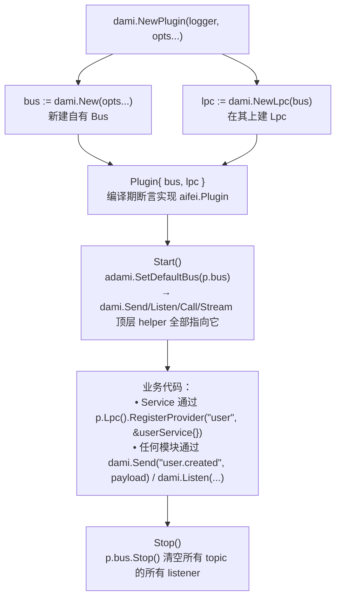

# Aifei-Go Dami 插件：把进程内事件总线接入应用生命周期

> **70 行的薄封装**：把 [dami](dami.md) 进程内事件总线装进 `aifei.Plugin`，由 `Start`/`Stop` 管理它持有的 `Bus`，并把总线安装为 dami 的包级默认——业务代码用 `dami.Send`/`dami.Listen` 等顶层 helper 即可对准它。

---

## 1. 背景与定位

[dami](dami.md) 是 Aifei-Go 的进程内事件总线（Java DamiBus 的 Go 移植），提供 send/call/stream/lpc 四类原语，以及 hash/path/tag 三种路由。它本身是个**零外部依赖的独立模块**——完全可以脱离 aifei 框架单独使用。

但一个 aifei 应用里，事件总线是**典型的基础设施**：它需要在应用启动时初始化、在应用关闭时清理监听器、最好让全应用通过统一入口使用同一条总线。`plugins/dami` 就是这层薄薄的胶水：

- 把一个 `Bus` + `Lpc` 作为插件**自有资源**创建出来；
- `Start` 时把这个 `Bus` 安装为 dami 的**包级默认**，让 `dami.Send`/`dami.Listen`/`dami.Call`/`dami.Stream` 这些顶层 helper 自动指向它；
- `Stop` 时清掉所有监听器，释放总线。

| 维度 | 说明 |
|------|------|
| 是什么 | `dami` 模块到 `aifei.Plugin` 的生命周期适配器 |
| 不是什么 | 不是另一套事件总线；**所有总线能力都在 `dami` 模块里**，本插件不重新实现 |
| 依赖 | [aifei](core.md)（Plugin 接口）+ [dami](dami.md) + [log](log.md) |
| 代码量 | 单文件 `plugin.go`，约 67 行 |
| 是否读配置 | **否**。dami 是纯进程内，没有外部依赖（不像 kafka/cache 要连 broker/redis），故无 `dami.*` 配置键，全部通过 `dami.Option` 传入 |

> 与 `plugins/kafka`、`plugins/cache` 这类插件相比，dami 插件刻意省掉了配置加载：一个进程内总线没有"连什么、连几台"的问题，需要定制的只有路由器等少量纯内存选项，直接用 `dami.Option` 传更直接。

---

## 2. 总体架构



关键点：**插件做的事极其有限，但都是必要的事**。没有它，开发者要么在 `main()` 里手写 `dami.Configure(...)` 并自己接生命周期，要么各模块各建一条总线——后者会直接破坏事件总线的意义（事件分到不同总线上就互相看不见了）。

---

## 3. 关键 API

### 3.1 Plugin

```go
var _ aifei.Plugin = (*Plugin)(nil)

type Plugin struct {
    log log.Logger
    bus *adami.Bus
    lpc *adami.Lpc
}

// NewPlugin 创建插件：用 opts 构造一个自有 Bus，并在其上建 Lpc。
// logger 为 nil 时用 log.Default()。
func NewPlugin(logger log.Logger, opts ...adami.Option) (*Plugin, error)

// Start 把自有 Bus 安装为 dami 的包级默认。
func (p *Plugin) Start() error

// Stop 清空 Bus 上所有 listener，释放总线。
func (p *Plugin) Stop() error

// Bus 返回插件自有的 Bus（NewPlugin 之前为 nil）。
func (p *Plugin) Bus() *adami.Bus

// Lpc 返回插件自有的 Lpc，用于注册 provider（NewPlugin 之前为 nil）。
func (p *Plugin) Lpc() *adami.Lpc
```

### 3.2 与 dami 模块的关系

插件**不重新实现**任何总线能力，它只做三件事：创建（`dami.New` + `dami.NewLpc`）、安装默认（`dami.SetDefaultBus`）、清理（`Bus.Stop`）。总线能力全部来自 [dami](dami.md) 模块：

| 能力 | dami 模块 API（顶层 helper，走包级默认 Bus） |
|------|---------------------------------------------|
| 广播事件 | `dami.Send[P](topic, payload, fallback...)` / `dami.Listen[P](topic, listener)` |
| 请求-响应 | `dami.Call[D,R](topic, data, fallback...)` |
| 流式 | `dami.Stream[...]` |
| 本地过程调用 | `dami.Call1[R](bus, ctx, "user.GetByID", id)` / `lpc.RegisterProvider("user", svc)` |

> 因为 `Start` 把插件 Bus 安装为默认，**顶层 helper 与 `bus` 方法的效果一致**——业务里写 `dami.Send(...)` 即可，不必到处传 `*Bus` 指针。需要作用在特定 Bus 上时（如多总线场景），用 `dami.SendOn(bus, ...)` / `dami.ListenOn(bus, ...)`。

---

## 4. 核心机制

### 4.1 Start：安装包级默认

```go
func (p *Plugin) Start() error {
    adami.SetDefaultBus(p.bus)
    p.log.Info("dami plugin started")
    return nil
}
```

`dami.SetDefaultBus` 替换 dami 模块内的包级 `defaultBus` 变量。替换后，所有 `dami.Send`/`dami.Listen`/`dami.Intercept` 等顶层 helper 都指向插件持有的 Bus。

> `SetDefaultBus(nil)` 会被忽略，避免误清空。测试或需要换总线时，业务自己调 `dami.SetDefaultBus(dami.New())` 即可（见 `dami.Configure(opts...)`）。

### 4.2 Stop：清空监听器

```go
func (p *Plugin) Stop() error {
    p.bus.Stop()   // 内部调 router.ClearAll()
    p.log.Info("dami plugin stopped")
    return nil
}
```

`Bus.Stop` 调用 `router.ClearAll()`，把所有 topic 下的所有 listener 移除。这对优雅停机很重要：监听器常持有 `*sql.DB`、HTTP client 等重资源，停机时一并释放。

### 4.3 Lpc：把结构体方法暴露为可调用端点

插件自有的 `Lpc` 把任意结构体的导出方法**通过反射注册为调用端点**（与 `server.Register` 反射 Service 的套路一致）：

```go
// topicMapping + "." + MethodName 成为调用 topic
p.Lpc().RegisterProvider("user", &userService{})
```

注册后，调用方经 `dami.Call1` 按位置传参触发方法：

```go
id, err := dami.Call1[int64](p.Bus(), ctx, "user.GetUserID", "noear")
```

详见 [dami](dami.md) 的 Lpc 章节。

---

## 5. 典型用法

### 5.1 最小集成

```go
package main

import (
    "github.com/crazy-airhead/aifei-go/aifei"
    pdami "github.com/crazy-airhead/aifei-go/plugins/dami"
    "github.com/crazy-airhead/aifei-go/server"
)

func main() {
    p, err := pdami.NewPlugin(nil)
    if err != nil { panic(err) }

    app := aifei.New(aifei.WithPlugin(p))
    server.AutoRegisterServices(app)
    server.Run(app, ":8080")
}
```

### 5.2 广播事件（事件订阅与发布可分散在不同模块）

```go
// 注册侧：模块 A 启动时订阅
dami.Listen("user.created", func(e *dami.Event[User]) error {
    log.Printf("welcome %s", e.Payload.Name)
    return nil
})

// 发布侧：Service 方法里
func (s *UserService) Create(in aifei.Input) aifei.Output {
    u := /* ... */
    _, _ = dami.Send("user.created", u)
    return out.Ok()
}
```

### 5.3 自定义路由器

```go
// 默认 HashRouter；需要层级 topic（如 user/created）时换 PathRouter
p, _ := pdami.NewPlugin(nil, dami.WithRouter(dami.NewPathRouter()))
```

`dami.Option` 透传给 `dami.New(opts...)`，可定制路由器（Hash/Path/Tag）、调度器等。

### 5.4 注册 Lpc provider（服务间本地过程调用）

```go
type userService struct{}

func (s *userService) GetUserID(name string) int64 { return int64(len(name)) }

// 在 main 里：注册后任何模块可通过 dami.Call1 调用
p.Lpc().RegisterProvider("user", &userService{})
```

---

## 6. 配置

**本插件不读配置**。定制点全部通过 `dami.Option` 传给 `NewPlugin`：

| 选项 | 作用 |
|------|------|
| `dami.WithRouter(r)` | 指定路由器（`NewHashRouter` 默认 / `NewPathRouter` / `NewTagRouter`） |
| `dami.WithDispatcher(d)` | 指定调度器（含拦截器链） |

需要日志时传一个实现 `log.Logger` 的 logger 作为第一参数；nil 则用 `log.Default()`。

---

## 7. 模块结构

```
plugins/dami/
├── plugin.go     # aifei.Plugin 适配器：NewPlugin + Start/Stop + Bus()/Lpc()
└── go.mod        # 依赖 aifei/dami/log（无外部第三方库）
```

单文件约 67 行。测试在 `_test/dami_test`（含 `plugin_test.go` 覆盖生命周期与自定义路由器）。

---

## 8. 总结

1. **薄适配器**：只做创建/安装默认/清理三件事，不重新发明总线。
2. **生命周期托管**：`Start` 装默认、`Stop` 清监听器——业务里不必手写这两步。
3. **包级默认 + helper**：`Start` 后全应用统一用 `dami.Send/Listen` 顶层 helper，避免到处传 `*Bus`。
4. **自有 Bus/Lpc 暴露**：需要直接持有（多总线、Lpc 注册 provider）时通过 `p.Bus()`/`p.Lpc()` 拿。
5. **零配置**：纯进程内，无 `dami.*` 键；定制点全走 `dami.Option`。

### 延伸阅读

- [Dami 事件总线](dami.md) —— 总线本体：send/call/stream/lpc、路由器、拦截器、附件
- [Aifei-Go 核心框架](core.md) —— `aifei.Plugin` 接口
- [数据隔离插件](data-isolate.md) —— 另一种 `aifei.Plugin` 的参考实现（对比：dami 插件不读配置、dataisolate 重度配置驱动）
