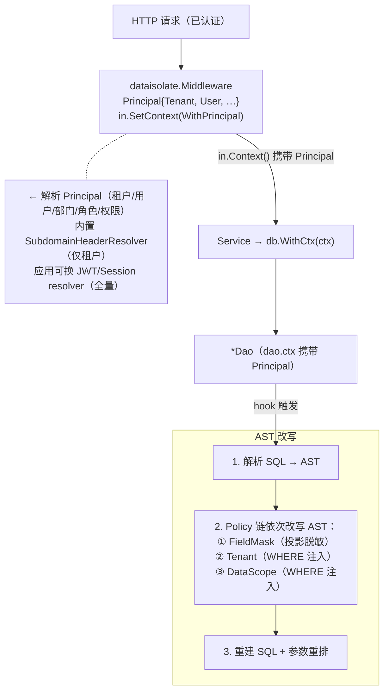

# Aifei-Go 数据隔离插件：设计与实现

> **数据隔离 = 租户隔离 + 行/列隔离。** 以插件方式（`plugins/dataisolate`）为 `db` 增加数据隔离能力，应用代码除配置外零隔离感知。

---

## 1. 背景与问题

在多租户 SaaS 系统中，数据隔离是最基础也最关键的安全需求。一个典型的场景是：同一套应用代码服务于多个客户（租户），每个租户只能看到自己的数据；在租户内部，不同角色的用户通过同一接口得到不同的结果集（如普通员工只能看自己的订单，部门经理看本部门，管理员看全部）；甚至同一行数据的不同字段对不同角色有不同的可见性（如 `salary` 字段仅 HR 角色可见）。

传统做法是在每个 Service 方法里手动拼接 `WHERE tenant_id = ?`、手动做字段过滤——这不仅繁琐、易遗漏，而且与业务逻辑耦合，安全审计困难。

Aifei-Go 的 `plugins/dataisolate` 插件提供了一套**声明式、配置驱动、对应用代码透明**的数据隔离方案。

---

## 2. 隔离的三个维度

插件将数据隔离拆解为三个正交维度，每个维度对应一个 Policy：

| 维度 | 隔离对象 | SQL 改写部位 | 典型场景 | Policy |
|------|---------|-------------|---------|--------|
| **租户隔离** | 租户之间 | WHERE `tenant_id = ?`（共享表）或 Config 路由（库/Schema 隔离） | 多租户互不可见 | `TenantPolicy` |
| **行隔离** | 租户内，按用户/部门/角色 | WHERE 范围谓词（本人/本部门/部门树/地区/自定义） | 不同用户同接口得到不同结果集 | `DataScopePolicy` |
| **列隔离** | 租户内，按用户/角色 | SELECT 投影脱敏/移除字段 | `password` 仅本人或超管可见 | `FieldMaskPolicy` |

三者可叠加。一次查询经过完整的 Policy 链之后，可能变成：

```sql
-- 原始 SQL
SELECT * FROM orders WHERE status = ?

-- 改写后（假设当前用户为普通员工，password 字段对普通角色脱敏）
SELECT id, tenant_id, status, creator_id, dept_id, NULL AS password
FROM orders
WHERE status = ?
  AND tenant_id = ?        -- TenantPolicy 注入
  AND creator_id = ?       -- DataScopePolicy 注入（ScopeSelf）
```

---

## 3. 总体架构

插件的核心设计思想是：**从 context 取主体 → Policy 链改写 AST → 重建 SQL**。整个流程对业务代码完全透明。



核心组件及其职责：

- **Principal**：当前用户的完整身份（租户 + 用户 + 部门 + 角色 + 权限），通过 context 透传。
- **Middleware**：拦截 HTTP 请求，解析 Principal 并写入 `in.Context()`。
- **Policy 链**：每条 Policy 按 Principal + 规则改写 AST 的一部分。投影与 WHERE 正交，多个 WHERE 谓词以 `AND` 合并。
- **AST 改写器**：解析一次、链式改写、重建一次 + 参数重排。占位符 `?` 与参数数组始终保持对齐。
- **DbHookKit**：六类 db hook 全覆盖（Insert/Update/Delete/Find/Query/Paginate），按操作类型分流——INSERT 行盖章、UPDATE/DELETE WHERE 注入、SELECT 投影 + WHERE。

---

## 4. Principal：从请求到 SQL 的身份载体

`Principal` 是贯穿整个隔离系统的身份载体，定义在 `plugins/dataisolate/principal.go`：

```go
type Principal struct {
    TenantID string   // 租户 id
    UserID   any      // 用户 id（int/string）
    UserName string
    DeptID   any      // 部门 id
    DeptTree []any    // 本部门 + 子部门树（预解析，避免改写时递归查库）
    RegionID any      // 地区 id
    Roles    []string // 角色列表
    Perms    []string // 权限点列表
}
```

Principal 通过 Go 标准的 `context.WithValue` 机制在请求链路中透传，goroutine 安全。

### Principal 解析

插件的 `Middleware()` 负责从 HTTP 请求中解析 Principal。内置了 `SubdomainHeaderResolver`（从 `X-Tenant-ID` 请求头或子域名中提取租户 id，**仅填 TenantID**）；对于需要完整身份的 row/column 隔离场景，应用需提供自己的 `PrincipalResolver` 实现（如从 JWT token 或 session 中解析全部字段）。

```go
// 内置：仅租户
app.Use(dataisolate.Middleware())

// 自定义：JWT 全量解析
app.Use(dataisolate.Middleware(
    dataisolate.WithResolver(myJWTResolver),
))
```

关键设计决策：**插件只做「取值」与「过滤」，不做「认证」**——请求可信由应用/网关保证（网关鉴权后注入 header、JWT 由应用校验）。

---

## 5. Policy 链与 AST 改写：核心机制

### 5.1 Policy 接口

每条 Policy 在 AST 上改写一类隔离逻辑，通过 `ParamCollector` 登记新增参数，确保重建后占位符与参数对齐：

```go
type Policy interface {
    Name() string
    Apply(stmt ast.Statement, p *Principal, pc *ParamCollector) bool
}
```

Policy 链顺序约定（投影先于 WHERE，WHERE 间以 AND 合并）：

1. **FieldMaskPolicy**（改 SELECT 投影）——先做，确定最终列集
2. **TenantPolicy**（WHERE `tenant_id = ?`）
3. **DataScopePolicy**（WHERE 范围谓词）

### 5.2 SQL 解析库：GoSQLX

插件选用 `github.com/ajitpratap0/GoSQLX` 作为 SQL 解析库——纯 Go、活跃维护、原生支持 PostgreSQL 语法（`$N` 占位、`::` 类型转换、`RETURNING`、JSON 操作符等）。AST 改写比字符串拼接在安全性上具有根本优势：值只进入 `LiteralValue{Type: "placeholder"}` 节点（最终是 `?` + 参数），绝不字符串拼接，从根本上杜绝 SQL 注入。

### 5.3 占位符桥接

GoSQLX 只解析 PostgreSQL 风格的 `$N` 占位符，不认 MySQL/SQLite 的 `?`。插件通过两次引号感知扫描解决这个问题：

1. **解析前**：`?` → `$N` 预扫（跳过字符串字面量和反引号标识符），第 k 个 `?` 换成 `$k`，值记入 `vals[k-1]`
2. **改写后**：`$N` → `?` 回扫，按出现序输出对齐的参数数组

原有占位符与 Policy 注入的新占位符使用**同一套 `$N` 编号方案**（新注入的值从 `$M+1` 续编），参数天然对齐。

### 5.4 改写分流

| 操作 | 触发 Hook | Tenant | DataScope | FieldMask |
|------|----------|--------|-----------|-----------|
| **INSERT** | `BeforeRowInsert` | 行盖章 `tenant_id` | 盖章 `creator_id`/`dept_id` | — |
| **UPDATE/DELETE** | `BeforeSqlUpdate/Delete` | WHERE `AND tenant_id=?` | WHERE `AND <范围>` | — |
| **SELECT** | `BeforeFind/Query` | WHERE `AND tenant_id=?` | WHERE `AND <范围>` | 改投影（脱敏/移除） |

- **INSERT 行盖章**不走 SQL 解析，直接 `row.Put("tenant_id", tid)` 让该列随 INSERT 写入
- **UPDATE/DELETE** 统一走 WHERE 注入，不碰 SET 子句，防越权改/删
- **SELECT** 先投影改写，再 WHERE 注入

### 5.5 改写作用域：递归 vs 不递归

两种改写策略的递归行为不同：

- **WHERE 注入**（租户/范围）：**递归**进入子查询、UNION 各分支、CTE——每次受控表访问都必须过滤
- **投影改写**（字段脱敏）：**只作用最外层 SELECT**，不递归——内层投影被外层引用（IN/EXISTS/UNION 对齐），改写内层会破坏 SQL 语义

---

## 6. 租户隔离：三种策略

插件支持三种租户隔离策略，可混用：

| 策略 | 隔离方式 | 是否改写 SQL | db 改动 | 适用场景 |
|------|---------|-------------|---------|---------|
| **① 库隔离** | 每租户一个独立 DB | 否 | 零 | 强隔离、租户少、可独立备份 |
| **② Schema 隔离** | 共库、每租户一个 Schema | 否 | 零 | 中等隔离、共库省运维 |
| **③ 共享表 + 判别列** | 共库共表，靠 `tenant_id` 列 | 是 | 4 项纯新增 | 租户多、省资源、最常见 |

### 策略 ①/②：零 db 改动

利用 `db` 既有的多命名 Config 机制（`InitWithID` / `GetConfig` / `UseWithID`），只需为每个租户初始化一个命名 `Config`：

```go
db.InitWithID("tenant_acme",  "mysql", dsnAcme)
db.InitWithID("tenant_globex", "mysql", dsnGlobex)
```

插件侧通过 `dataisolate.Use(ctx)` 自动路由——解析租户 id → 映射 Config → 返回对应 Dao。**不改写任何 SQL**，隔离强度最高。

```yaml
dataisolate:
  tenant:
    strategy: database
    tenants:
      acme:   { config: tenant_acme }
      globex: { config: tenant_globex }
```

### 策略 ③：TenantPolicy

共享表策略，插件 `Start()` 将覆盖全部 6 类 hook 的 `DbHookKit` 安装到目标 `db.Config`。

**租户表判定**（默认零配置）：由 `db.Table` 注册元数据自动发现——表声明了 `tenant_id` 列即为租户表。配置覆盖：`ignore_tables`（豁免全局表）、`tables`（强制纳入）、`mode`（`auto` 默认 / `whitelist` / `all`）。判定顺序：`ignore_tables` 优先 → `tables` 强制 → mode → 元数据。

```yaml
dataisolate:
  tenant:
    strategy: shared
    column: tenant_id
    scope:
      mode: auto
      ignore_tables: [sys_dict, region, sys_log]
```

---

## 7. 行隔离·数据范围（DataScopePolicy）

在租户之内，按用户/部门/角色限定可见行。规则信息分三层：

- **范围类型**（Self/Dept/…）——**动态**：由应用实现的 `ScopeRuleProvider` 按 `(表, Principal)` 运行时解析
- **身份列名**（creator/dept/region 列叫什么）——**稳定**：按表注册（`RegisterTableMeta`）或按约定自发现
- **列值**（UserID/DeptID/DeptTree/RegionID）——来自 `Principal`

### 预设范围类型

| 类型 | 注入谓词 | 参数来源 |
|------|---------|---------|
| `ScopeAll` | （无） | — |
| `ScopeSelf` | `<creator_col> = ?` | `Principal.UserID` |
| `ScopeDept` | `<dept_col> = ?` | `Principal.DeptID` |
| `ScopeDeptAndBelow` | `<dept_col> IN (?, ?, …)` | `Principal.DeptTree` |
| `ScopeRegion` | `<region_col> = ?` | `Principal.RegionID` |
| `ScopeCustom` | `<column> <op> ?` | 由 provider 指定字段/操作符/值 |

### 应用侧接口

插件只定义接口，不内置任何动态规则实现：

```go
type ScopeRuleProvider interface {
    ScopeRule(table string, p *Principal) (ScopeRule, bool)
}
```

应用注册方式：

```go
plugin.SetScopeProvider(myScopeProvider) // 调用在 plugin.Start() 之前
```

**性能职责在应用**：插件按查询调用 provider，故 provider 实现应自带缓存（按 `(table, roles)` 维度），避免每次查询查库。

### 关键约束

- **DeptTree 预解析**：部门树必须在中间件里算成 id 列表放入 `Principal.DeptTree`，不能在改写时递归查库（N+1 问题）
- **多角色合并**：默认取最宽档（`merge: broadest`）；严格场景 `strict`（取最窄）
- **Principal 缺失**：`enforce=false` 跳过该规则，`enforce=true` 报错（生产建议 `true`，与 fail-closed 一致）

---

## 8. 列隔离·字段脱敏（FieldMaskPolicy）

在租户之内，按用户/角色脱敏 SELECT 投影中的字段。

### 规则模型

```go
type FieldRule struct {
    Mode     FieldMode     // FieldAllowlist（Fields 为允许列）| FieldDenylist（Fields 为禁止列）
    Fields   []string
    Mask     MaskStrategy  // MaskNull（默认）| MaskConstant | MaskRemove
    Constant any           // MaskConstant 时的常量值
}
```

应用通过 `FieldRuleProvider` 接口实现动态规则：

```go
type FieldRuleProvider interface {
    Rule(table string, p *Principal) (FieldRule, bool)
}
```

### 三种脱敏策略

| 策略 | SQL 改写 | 优点 |
|------|---------|------|
| `MaskNull`（默认） | `NULL AS col` | 保留列形状，typed Dao getter 返回零值不崩 |
| `MaskConstant` | `<常量> AS col` | 显示占位值（如 `'***'`） |
| `MaskRemove` | 直接从投影剔除 | 彻底隐藏 |

### 投影改写细节

- **`SELECT *` / `t.*`**：用注册的 `db.Table` 元数据展开为显式列，再套字段规则
- **显式 `t.col` / 裸 `col`**：按规则处理——允许则保留；禁止则脱敏/移除
- **`COUNT(*)` / 聚合 / 表达式列 / 标量子查询投影 / `SELECT 1` / 无 FROM**：不脱敏（逐列 best-effort，非语句级失败）
- **只作用最外层 SELECT**：不递归进入子查询/UNION/CTE
- **未注册表的 `*`**：无法展开 → 跳过该表的字段过滤（逐表 best-effort）

### 脱敏盲区

字段权限只改 **SELECT 投影**；若被脱敏列仍出现在 WHERE/JOIN/ORDER BY 中，其**值在条件里仍被使用**（投影脱敏 ≠ 完全不可见）。需配合行权限或应用层把关。

---

## 9. 逃逸口与安全闸

某些操作需要绕过隔离（种子数据、数据迁移、系统表、跨租户导入），或以指定主体身份操作（超管代查）。

### Bypass：完全跳过 Policy 链

```go
// 仅作用单次调用——勿放请求级中间件，否则整条请求脱钩
db.WithCtx(dataisolate.Bypass(in.Context())).Insert(row)
```

hook 最前面短路：检测到 `IsBypass(ctx)` → 直接返回，不跑 Policy 链。

### As：以指定身份操作

```go
db.WithCtx(dataisolate.As(in.Context(), adminPrincipal)).Find()
```

### 安全闸

- `allow_bypass: false`（默认）使 `Bypass()` 在严格部署下被忽略
- 最强隔离：跨租户运维走**单独的、未装 HookKit 的 `db.Config`**

---

## 10. db.Sql 的处理

`db.Sql` / `SqlById` 走 Enjoy SQL 模板引擎。插件支持两条互补路径：

### Hook 路径（透明，对所有 db.Sql 生效）

Enjoy SQL 渲染后的最终 SQL 同样触发 hook，Policy 链正常改写。对于模板中已通过 `#and(tenant_id, "=", tenantId)` 做了租户过滤的场景，插件内置**双重注入守卫**：改写前检查 SQL 是否已含该列 token，已含则跳过该 Policy，避免重复注入。

### dataisolate.Sql helper：注入 Principal 变量

```go
// 自动将 Principal 的 tenantId/userId/deptId 注入 data map，供 #and 指令使用
rows, err := dataisolate.Sql(ctx, "listOrders", data).Find()
```

模板中可直接引用：

```sql
#sql("listOrders")
  SELECT * FROM orders
  #where(1, "=", 1)
    #and(tenant_id, "=", tenantId)   -- 由 helper 自动注入
    #and(creator_id, "=", userId)
  #end
#end
```

Bypass 时 helper 将变量设为 `nil`，`#and` 见空自动省略。

---

## 11. 批处理透明化

`db.Batch` 原与单条执行路径并列、不经 hook。插件通过 db 层的一项纯新增改动（`db.Batch` 执行前触发 `DbHookKit`）实现批处理的透明隔离：

- **行式批插入**：每行触发 `BeforeRowInsert` → 盖章 `tenant_id`/`creator_id`/`dept_id` → 进预编译 INSERT
- **批更新/删除**：每组生成基础 SQL → hook 注入 `AND tenant_id=? AND <范围>` → 尾随参数追加到每行 args
- **裸 Execute(sql, argsList)**：对 SQL 触发一次改写，每组 args 追加尾随参数

字段权限不作用于批处理（批处理无投影）。

---

## 12. 安全设计一览

| 议题 | 处理 |
|------|------|
| **Fail-closed** | 无法安全解析/改写 → `StatusFailed` → `dao.Fail(err)` **报错中止**，绝不原样放行未隔离查询 |
| **SQL 注入** | 值**只走参数占位** `?`，绝不字符串拼接 |
| **防越权写** | UPDATE/DELETE 强制执行 `AND tenant_id=? AND <范围>`，即便 PK 命中也只影响本租户+范围行 |
| **双重注入守卫** | SQL 已含列名 → 跳过该 Policy，防与 `#and` 模板撞车 |
| **PostgreSQL 兼容** | GoSQLX 原生解析 PG 语法（`::`、`RETURNING`、`ARRAY`、JSON 操作符），这些语句正常改写隔离 |
| **DDL 放行** | DDL 能正常解析且无受控表 → `StatusSkippedNoScoped` 放行 |
| **`on_failure: passthrough`** | 按路径放宽，适用于迁移/特殊语句 |
| **唯一约束** | 共享表的全局唯一索引须含 `tenant_id`（如 `(tenant_id, email)`） |
| **缓存键** | 与 `plugins/cache` 联用时，缓存 key 须含 Principal 维度 |

---

## 13. 集成方式

### 配置

```yaml
dataisolate:
  policies: [field, tenant, scope]   # 启用策略链（投影先于 WHERE）
  enforce: false                     # 命中受控项却无 Principal 时是否报错
  allow_bypass: false                # 是否允许 Bypass 逃逸
  on_failure: error                  # error（fail-closed）| passthrough
  configs: ["main"]                  # 安装 hook 的 db.Config id 列表

  tenant:
    strategy: shared
    column: tenant_id
    scope: { mode: auto, ignore_tables: [sys_dict, sys_log] }

  scope:
    merge: broadest                  # 多角色取最宽档

  field:
    default_mask: null               # 全局默认脱敏策略
```

### 代码

```go
func main() {
    // 1. 初始化 db
    _ = db.Init("sqlite", "file:app.db")

    // 2. 加载配置
    if err := config.Init(os.Args); err != nil { log.Fatal(err) }

    // 3. 创建插件并注册 Provider（可选，用于行/列隔离）
    tp, err := dataisolate.NewPlugin(nil)
    tp.SetScopeProvider(myScopeProvider)   // 行隔离规则
    tp.SetFieldProvider(myFieldProvider)   // 列隔离规则

    // 4. 应用启动
    app := aifei.New(aifei.WithPlugin(tp))
    app.Use(
        server.Logger(),
        server.Recover(),
        dataisolate.Middleware(),          // 解析 Principal → ctx
    )
    server.AutoRegisterServices(app)
    server.Run(app, ":8080")
}
```

### Service 层代码

隔离对业务代码完全透明——只需使用 ctx 感知的 db 入口：

```go
func (s *Service) List(in aifei.Input) aifei.Output {
    // ctx 感知入口，hook 自动注入 tenant_id + 范围 + 字段脱敏
    rows, err := db.WithCtx(in.Context()).Sql(listSql, in.GetMap()).Find()
    // ...
}

// 策略①/② 路由到租户专属 Config
// rows, err := dataisolate.Use(in.Context()).Find()

// Enjoy SQL 指令路径
// rows, err := dataisolate.SqlById(in.Context(), "listOrders", in.GetMap()).Find()

// 批处理
// batch := db.NewBatchCtx(in.Context())
// batch.Insert(rows)

// 超管代查
// rows, err := db.WithCtx(dataisolate.As(in.Context(), adminP)).Find()
```

---

## 14. 插件结构总览

```
plugins/dataisolate/
├── plugin.go        # aifei.Plugin 实现（Start 加载配置、装 HookKit）
├── config.go        # 配置加载（LoadConfig）
├── manager.go       # Manager（管理租户路由、Provider 注册）
├── principal.go     # Principal 主体定义 + WithPrincipal/PrincipalFrom
├── middleware.go    # Middleware()：解析 Principal → 写入 context
├── resolver.go      # PrincipalResolver（内置 subdomain_header）
├── policy.go        # Policy 接口 + PolicyChain + ParamCollector
├── rewriter.go      # AST 改写器（?↔$N 桥接、WHERE 注入、参数重排）
├── tenant.go        # TenantPolicy（租户 WHERE 注入）
├── scope.go         # DataScopePolicy（行 WHERE 注入）
├── field.go         # FieldMaskPolicy（列投影脱敏）
├── table_meta.go    # TableMeta 注册 + 约定自发现
├── hook.go          # DbHookKit 实现（6 类 hook，按操作分流）
├── compose.go       # 与既有 HookKit 链式合并
├── context.go       # Bypass/As/IsBypass 逃逸口
├── sql.go           # dataisolate.Sql/SqlById helper
├── use.go           # 策略①/② 路由：Use(ctx) → 按租户路由 Config
├── type.go          # 类型与常量定义
└── provider.go      # ScopeRuleProvider / FieldRuleProvider 接口
```

源代码约 2,200 行，测试约 1,500 行（覆盖 rewriter 单元测试、Policy 链集成测试、租户/行/列端到端测试、批处理测试、中间件测试）。

---

## 15. 总结

Aifei-Go 的数据隔离插件围绕几个核心设计原则构建：

1. **插件化**：隔离逻辑完全在 `plugins/dataisolate` 中，核心库（`aifei`/`db`/`enjoy`）零外部依赖
2. **透明**：应用照常 `db.WithCtx(ctx)`，隔离自动生效
3. **统一机制**：租户、行范围、字段脱敏共用 Principal / Policy 链 / AST 改写器 / hook——租户是最简的行 policy
4. **安全优先（fail-closed）**：无法安全改写则报错中止，绝不静默放行未隔离查询
5. **配置驱动 + 元数据自发现**：受控表/字段由注册元数据自动判定，配置只做覆盖，改 schema 即生效
6. **安全职责分离**：插件只做「取值」与「过滤」，不做「认证」

这种设计使得应用开发者只需关注业务逻辑，数据隔离作为基础设施层的能力，以最小的侵入性实现了最全面的数据安全保障。
