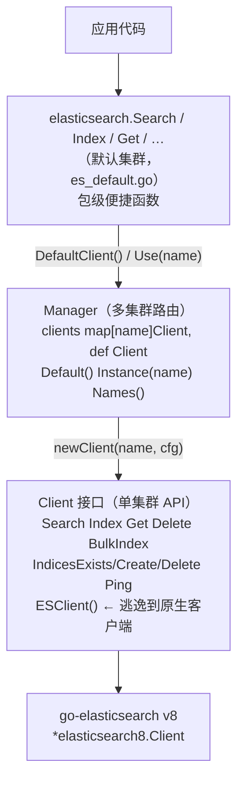

# Aifei-Go Elasticsearch 插件：多集群搜索统一封装

> **以 `Client` 接口 + `Manager` 多集群路由 + 包级默认函数这三层结构，把 go-elasticsearch v8 封装成一行 `elasticsearch.Search(ctx, idx, query)` 即可用的形态。**应用代码不直接依赖 ES 客户端，隔离了第三方库耦合，并在未配置时以 `errClient` 优雅降级而非 panic。

---

## 1. 背景与定位

Elasticsearch 是全文检索与日志分析的事实标准。Aifei-Go 的核心库遵循「零外部依赖、仅用 Go 标准库」的约束，但搜索场景下绕不开 ES 官方客户端——因此搜索能力放在 **Plugin 层**，由用户按需 `go get`，不污染核心。

`plugins/elasticsearch` 是 Aifei-Go 的 ES 集成插件，扮演三个角色：

| 角色 | 职责 |
|------|------|
| **API 封装** | 把 go-elasticsearch v8 的低层 `esapi.*Request` 包成 `Search`/`Index`/`Get`/`Delete`/`BulkIndex`/`IndicesCreate` 等强类型方法，返回 `*SearchResult`/`*IndexResult` 等结构体，免去手写 JSON 解码 |
| **多集群路由** | 一个 `Manager` 管多套 ES 集群（生产日志集群、搜索集群、测试集群……），按名字路由，并提供「默认集群」 |
| **框架集成** | 实现 `aifei.Plugin` 接口，在 `Start()` 读 `elasticsearch.*` 配置、建 `Manager`、安装为包级默认，让顶层 `elasticsearch.Search(...)` 直接可用 |

### 与 Java Aifei 的关系

Java Aifei 生态中 ES 集成一般直接用 Spring Data Elasticsearch 或 RestHighLevelClient。Go 版本是全新实现，但在「封装一层业务友好的 API + 多实例路由」这个思路上与 Java 侧一致——也与本项目 `plugins/kafka`、`plugins/storage`、`plugins/cache` 的 Manager/Plugin 形态对齐（详见 [第 7 节](#7-与其它-plugin-的一致性)）。

### 依赖

| 类型 | 依赖 |
|------|------|
| 外部第三方库 | `github.com/elastic/go-elasticsearch/v8 v8.18.0`（官方 v8 客户端）、`elastic-transport-go/v8`（间接） |
| 内部模块 | `aifei`（Plugin 接口）、`config`（读 `elasticsearch.*`）、`log`（日志） |
| 标准库 | `net/http`、`crypto/tls`、`crypto/x509`、`encoding/json`、`bytes`、`io`、`os` |

模块路径：`github.com/crazy-airhead/aifei-go/plugins/elasticsearch`，`go get` 时会带入 ES 官方客户端及其 OpenTelemetry 传递依赖。

---

## 2. 总体架构

插件分三层：**Client（单集群）→ Manager（多集群路由）→ Plugin（框架集成 + 包级默认）**。上层依赖下层，包级便捷函数直通默认 Manager。



组件职责一览：

| 组件 | 文件 | 职责 |
|------|------|------|
| `Client`（接口） | `client.go` | 对单个 ES 集群的业务友好 API |
| `esClient`（实现） | `client.go` | 包装 `*elasticsearch8.Client`，处理 JSON 编解码、错误解析、TLS |
| `Manager` | `manager.go` | 多集群 facade，按名字路由，维护默认集群 |
| `Plugin` | `plugin.go` | `aifei.Plugin` 实现，启动时建 Manager 并设为包级默认 |
| 包级默认 | `es_default.go` | `SetDefault`/`Use`/`DefaultClient` 及顶层便捷函数 |
| `Config` | `config.go` | `elasticsearch.*` 配置加载 |

---

## 3. Client 接口：单集群 API

`Client` 是整个插件的核心抽象，定义在 `client.go`。13 个方法按职责分四组：

```go
type Client interface {
    Name() string

    // 文档搜索
    Search(ctx context.Context, index string, query map[string]any) (*SearchResult, error)
    SearchRaw(ctx context.Context, index string, body io.Reader) (*SearchResult, error)

    // 文档写入
    Index(ctx context.Context, index, id string, doc any) (*IndexResult, error)
    Get(ctx context.Context, index, id string) (*GetResult, error)
    Delete(ctx context.Context, index, id string) (*DeleteResult, error)
    BulkIndex(ctx context.Context, index string, docs []BulkDoc) (*BulkResult, error)

    // 索引管理
    IndicesExists(ctx context.Context, index string) (bool, error)
    IndicesCreate(ctx context.Context, index string, mappings map[string]any) error
    IndicesDelete(ctx context.Context, index string) error

    // 集群/逃逸
    Ping(ctx context.Context) error
    Close() error
    ESClient() *elasticsearch8.Client
}
```

| 方法 | 行为要点 |
|------|---------|
| `Search` | 把 `query map[string]any` 序列化为 JSON 后查询；适合程序构造的 DSL |
| `SearchRaw` | 接 `io.Reader`，传原始 JSON body；适合模板拼接或多查询场景 |
| `Index` | `id=""` 时由 ES 自动生成；已存在则替换（`result:"updated"`） |
| `Get` | 未命中不报错，看 `GetResult.Found` 区分命中/缺失 |
| `Delete` | 删除不存在的文档不报错，看 `DeleteResult.Result == "not_found"` |
| `BulkIndex` | 批量索引，部分失败收集在 `BulkResult.Errors` + `Items` |
| `IndicesExists` | 用 `200`/`404` 判定，其他状态码当作错误 |
| `IndicesCreate` | `mappings=nil` 时仅创建索引；非 nil 则同时下发 mappings |
| `IndicesDelete` | 删不存在的索引不报错（`404` 忽略） |
| `Ping` | 探活，仅判 `IsError()` |
| `Close` | 幂等；go-elasticsearch v8 无显式 Close，连接由 transport 连接池管理，故目前为 no-op |
| `ESClient` | **逃逸口**：返回底层 `*elasticsearch8.Client`，用于 scroll、reindex、aggregation、集群管理等高级需求；调用方自此与 go-elasticsearch 耦合 |

### 返回结构体

为减少手写 `json.Unmarshal`，插件预定义了所有常用响应结构体：

| 结构体 | 字段摘要 |
|--------|---------|
| `SearchResult` | `Took`、`TimedOut`、`Hits *SearchHits` |
| `SearchHits` | `Total *TotalHits`（`Value`/`Relation`）、`MaxScore`、`Hits []SearchHitItem` |
| `SearchHitItem` | `Index`、`ID`、`Score`、`Source map[string]any` |
| `IndexResult` | `Index`、`ID`、`Version`、`Result`（`"created"`/`"updated"`） |
| `GetResult` | `Index`、`ID`、`Version`、`Found bool`、`Source` |
| `DeleteResult` | `Index`、`ID`、`Version`、`Result`（`"deleted"`/`"not_found"`） |
| `BulkDoc` | `ID string`（可空）、`Doc any` |
| `BulkResult` | `Errors bool`、`Items []map[string]any`、`Took` |

### 错误处理：parseError

所有 ES 错误响应都走 `parseError()`（`client.go`）：读取 body 里的 `error.reason` 字段拼进错误消息；若 body 非法 JSON，退化为 `"elasticsearch: <status>"`。错误统一加 `elasticsearch:` 前缀，便于在日志里过滤。

### TLS 与鉴权

`newClient`（`client.go`）按 `ClusterConfig` 配置鉴权与 TLS：

| 配置 | 处理 |
|------|------|
| `Username` + `Password` | Basic 认证（仅在有 `Username` 时生效） |
| `APIKey` | Base64 编码的 API key（与 Basic 二选一） |
| `CACert` / `InsecureSkipVerify` | 任一非默认值即构建自定义 `*http.Transport`，注入 `tls.Config`（`CACert` 读 PEM 文件加入 `RootCAs`） |
| 都不设 | go-elasticsearch 默认 transport（仍走 HTTPS 如果地址是 `https://`） |

`buildTLSConfig` 的实现思路与 `plugins/kafka` 的 TLS 一致，便于跨插件复用经验。

---

## 4. Manager：多集群路由

`Manager`（`manager.go`）是「一实例管多集群」的 facade，形态完全对齐 `kafka.Manager`、`storage.Manager`、`cache.Manager`：

```go
type Manager struct {
    clients map[string]Client
    def     Client
    mu      sync.RWMutex
    log     log.Logger
}
```

| 方法 | 行为 |
|------|------|
| `NewManager(cfg, logger)` | 遍历 `cfg.Clusters` 为每个集群建一个 Client；默认集群取 `cfg.Default`，若为空则**任意挑一个**（不保证确定性，建议显式设 `default`） |
| `Default() Client` | 返回默认集群 Client |
| `Instance(name) Client` | 按名查 Client；`name==""` 等价于 `Default()`；未知 name 返回 `nil` |
| `Names() []string` | 所有已配置集群名（无序） |
| `Close() error` | 关闭所有 Client，返回首个错误 |

### 默认集群选择规则

`NewManager` 内部的判定是 `name == cfg.Default || m.def == nil`——这意味着：

- 显式配置 `default`：选定的就是该集群
- 未配置 `default`：选中的是 `range map` 迭代命中的第一个（**非确定性**）

**生产建议**：始终在 `app.yml` 里写明 `elasticsearch.default`，避免不同机器构建顺序不同导致默认漂移。

### 失败回滚

`NewManager` 在某个集群 `newClient` 失败时，会先把已建好的所有 Client `Close()` 再返回错误，避免「半建」状态泄漏资源（虽然当前 `Close` 是 no-op，但保留了正确语义以兼容未来变更）。

---

## 5. 包级默认与便捷函数

`es_default.go` 提供了与 `kafka`/`storage`/`cache` 插件一致的「包级默认」模式，让业务代码不必每次显式传递 `*Manager`。

### 安装与访问

| 函数 | 用途 |
|------|------|
| `SetDefault(mgr *Manager)` | 安装包级默认 Manager（由 `Plugin.Start()` 调用） |
| `DefaultManager() *Manager` | 取已安装的默认 Manager（可能为 nil） |
| `Use(name string) Client` | 按名取 Client；未配置返回 `nil`；`name==""` 取默认 |
| `DefaultClient() Client` | 取默认集群 Client；**未配置时返回 `errClient`**（不返回 nil） |

### 顶层便捷函数（作用于默认集群）

```
Search / SearchRaw / Index / Get / Delete / BulkIndex
IndicesExists / IndicesCreate / IndicesDelete
Ping
```

每个都是一行 `DefaultClient().Xxx(...)` 的封装，签名与 `Client` 接口一致。

### errClient：未配置时的优雅降级

`errClient` 实现了完整的 `Client` 接口，但每个方法都返回 `ErrNoDefault`（`"elasticsearch: no default manager configured"`）。这样设计的好处：

- **不 panic**：忘记初始化插件、或单测里没建 Manager 时，调用 `elasticsearch.Search(...)` 只会得到一个清晰错误
- **不 nil**：`DefaultClient()` 返回值总是非 nil，业务代码不必写 `if c == nil` 防御

```go
// ErrNoDefault 定义
var ErrNoDefault = errors.New("elasticsearch: no default manager configured")
```

`ESClient()` 在 `errClient` 上返回 `nil`（因为根本没有底层客户端）。

---

## 6. 配置

配置根 key 默认为 `elasticsearch`（可通过 `NewPlugin(logger, "custom.prefix")` 改写）。

### YAML 示例

```yaml
elasticsearch:
  default: search                     # 必填，避免默认集群非确定性

  clusters:
    search:                           # 业务搜索集群
      addresses:
        - http://es-search-1:9200
        - http://es-search-2:9200
      username: elastic
      password: ${ES_SEARCH_PASSWORD}
      apiKey: ""                      # 与 Basic 二选一

    logs:                             # 日志集群（HTTPS + 自签证书）
      addresses:
        - https://es-logs:9200
      caCert: /etc/aifei/es-ca.pem
      insecureSkipVerify: false
```

### Config 结构体

```go
type Config struct {
    Default  string                   `yaml:"default"`
    Clusters map[string]ClusterConfig `yaml:"clusters"`
}

type ClusterConfig struct {
    Addresses         []string `yaml:"addresses"`         // ES 节点 URL
    Username          string   `yaml:"username"`          // Basic 认证用户名
    Password          string   `yaml:"password"`          // Basic 认证密码
    APIKey            string   `yaml:"apiKey"`            // Base64 API key
    CACert            string   `yaml:"caCert"`            // PEM 格式 CA 证书路径
    InsecureSkipVerify bool    `yaml:"insecureSkipVerify"` // 跳过 TLS 校验
}
```

### 加载机制

`LoadConfig(prefix)`（`config.go`）的加载分两步：

1. `config.GetStr(prefix + ".default")` —— 直接取默认集群名
2. `config.SubBind(prefix+".clusters", &cfg.Clusters)` —— **YAML round-trip 绑定**整棵 clusters 子树

第二步是关键：`SubBind`（见 [config.md](config.md)）会把 `clusters` 子树序列化为 YAML 再反序列化到 `map[string]ClusterConfig`，保留所有嵌套字段。比逐键 `GetStr` 健壮得多，也是插件支持任意集群名作为 map key 的基础。

### 配置 key 一览

| Key | 类型 | 必填 | 说明 |
|-----|------|------|------|
| `elasticsearch.default` | string | 推荐 | 默认集群名（未设则非确定性挑一个） |
| `elasticsearch.clusters.<name>.addresses` | []string | 是 | ES 节点 URL 列表 |
| `elasticsearch.clusters.<name>.username` | string | 否 | Basic 认证用户名 |
| `elasticsearch.clusters.<name>.password` | string | 否 | Basic 认证密码 |
| `elasticsearch.clusters.<name>.apiKey` | string | 否 | Base64 API key |
| `elasticsearch.clusters.<name>.caCert` | string | 否 | PEM CA 证书文件路径 |
| `elasticsearch.clusters.<name>.insecureSkipVerify` | bool | 否 | 跳过 TLS 校验（仅测试用） |

---

## 7. 与其它 Plugin 的一致性

本插件刻意与 `plugins/kafka`、`plugins/storage`、`plugins/cache` 保持一致的 Manager/Plugin 形态。对照：

| 关注点 | elasticsearch | kafka / storage / cache |
|--------|---------------|-------------------------|
| 单实例抽象 | `Client` 接口 | `Client` 接口 |
| 多实例路由 | `Manager` + `Default`/`Instance` | 同名方法 |
| 包级默认 | `SetDefault` + 顶层便捷函数 | 同名模式 |
| 未配置降级 | `errClient` 返回 `ErrNoDefault` | 各插件同类 sentinel |
| Plugin 形态 | `NewPlugin(logger, prefix...)` + `Start`/`Stop` | 同签名 |
| 配置根 | `elasticsearch.default` + `clusters.<name>.*` | `kafka.default` + `clusters.<name>.*` 等 |
| 逃逸口 | `Client.ESClient()` | `Client.KgoClient()` 等 |

这种一致性让熟悉任一插件的开发者能零摩擦切换到另一个。`aifei.Plugin` 接口本身的说明见 [core.md](core.md)。

---

## 8. 集成方式

### 最小可用代码

```go
package main

import (
    "context"
    "os"

    "github.com/crazy-airhead/aifei-go/aifei"
    "github.com/crazy-airhead/aifei-go/config"
    "github.com/crazy-airhead/aifei-go/plugins/elasticsearch"
    "github.com/crazy-airhead/aifei-go/server"
)

func main() {
    // 1. 加载配置（app.yml 里读 elasticsearch.* 子树）
    if err := config.Init(os.Args); err != nil {
        panic(err)
    }

    // 2. 创建插件并注册
    p, err := elasticsearch.NewPlugin(nil)
    if err != nil {
        panic(err)
    }

    app := aifei.New(aifei.WithPlugin(p))
    server.Run(app, ":8080")
}
```

### 业务代码使用包级便捷函数

```go
// 写入
_, err := elasticsearch.Index(ctx, "orders", "o-123", order)

// 按 id 取
res, err := elasticsearch.Get(ctx, "orders", "o-123")
if res.Found { /* res.Source 是 map[string]any */ }

// 搜索（程序构造 DSL）
sr, err := elasticsearch.Search(ctx, "orders", map[string]any{
    "query": map[string]any{
        "bool": map[string]any{
            "must": []map[string]any{
                {"term": map[string]any{"status": "paid"}},
            },
        },
    },
    "from": 0,
    "size": 20,
})
for _, hit := range sr.Hits.Hits {
    fmt.Println(hit.ID, hit.Source)
}

// 批量
_, err = elasticsearch.BulkIndex(ctx, "orders", []elasticsearch.BulkDoc{
    {ID: "o-1", Doc: order1},
    {ID: "o-2", Doc: order2},
})

// 多集群：指定 logs 集群
logsCli := elasticsearch.Use("logs")
if logsCli != nil {
    _ = logsCli.Ping(ctx)
}
```

### 高级需求：逃逸到底层客户端

```go
// 需要做 scroll、reindex、aggregation 等未封装的操作时
import elasticsearch8 "github.com/elastic/go-elasticsearch/v8"

var raw *elasticsearch8.Client = elasticsearch.DefaultClient().ESClient()
// 此后调用方与 go-elasticsearch 直接耦合
```

### Service 层代码

aifei-go 的 Service 无需感知插件存在：

```go
func (s *OrderService) Search(in aifei.Input) aifei.Output {
    sr, err := elasticsearch.Search(in.Context(), "orders", in.GetMap())
    if err != nil {
        return server.Fail().SetMsg(err.Error())
    }
    return server.Ok().SetData(sr.Hits.Hits)
}
```

---

## 9. 模块结构

```
plugins/elasticsearch/
├── plugin.go        # aifei.Plugin 实现（Start 建 Manager、设默认；Stop 关 Manager）
├── config.go        # Config / ClusterConfig + LoadConfig（SubBind 加载 clusters 子树）
├── manager.go       # Manager：多集群路由 + 默认集群
├── client.go        # Client 接口（13 方法）+ esClient 实现 + 全部 Result 类型 + TLS/error helper
├── es_default.go    # 包级默认（SetDefault/Use/DefaultClient）+ 顶层便捷函数 + errClient
├── type.go          # 常量 defaultClusterName（占位）
├── go.mod           # 依赖 go-elasticsearch/v8 v8.18.0
└── go.sum
```

源码约 780 行（不含 go.mod/go.sum）。无测试文件（参考 [第 10 节](#10-总结) 关于测试策略）。

---

## 10. 总结

Aifei-Go Elasticsearch 插件围绕几个核心设计原则构建：

1. **插件化隔离**：ES 客户端依赖完全在 `plugins/elasticsearch` 内，核心库零感知；用户不 `go get` 本插件就不会带入 go-elasticsearch 及其 OpenTelemetry 传递依赖
2. **三层清晰**：`Client`（单集群 API）→ `Manager`（多集群路由）→ `Plugin`（框架集成），每层可独立使用——不想要 Plugin 自动加载，直接 `NewManager` + `SetDefault` 手动控制
3. **业务友好**：13 个方法返回结构化的 `*SearchResult`/`*IndexResult`/…，免去手写 `json.Unmarshal`；错误统一 `parseError` 提取 `error.reason`
4. **逃逸口保留**：`ESClient()` 暴露底层 `*elasticsearch8.Client`，scroll、reindex、aggregation、集群管理等高级需求不被封死
5. **多集群原生支持**：`Manager` + `Use(name)` 让「搜索集群 + 日志集群」共存在一个进程里，无需自建路由
6. **与其它插件一致**：Manager/Plugin/包级默认/`errClient` 的形态与 `kafka`/`storage`/`cache` 对齐，跨插件迁移零学习成本
7. **优雅降级**：未配置时 `errClient` 返回清晰的 `ErrNoDefault`，业务代码不必 nil 检查、不会 panic

### 延伸阅读

- [core.md](core.md) — `aifei.Plugin` 接口（`Start()`/`Stop()` 生命周期）
- [config.md](config.md) — `config.SubBind` 的 YAML round-trip 机制
- [data-isolate.md](data-isolate.md) — 同系列 Plugin/Manager 风格范例
- `plugins/kafka`、`plugins/storage`、`plugins/cache` — 同形态的多集群/多实例插件（对照阅读）
- go-elasticsearch v8 官方文档：`github.com/elastic/go-elasticsearch/v8`
