# Aifei-Go Enjoy：自研模板与表达式引擎

> **一套引擎，两种用法：HTML 模板渲染 + SQL 拼装。**DKFF 词法 + DLRD 递归下降解析，零外部依赖、解析期完成 AST 缓存，渲染期仅反射求值。

---

## 1. 背景与定位

Enjoy 是 Aifei 的**签名特性**：独立设计、独立实现的模板语言，自带词法器、语法器、表达式引擎，**不基于 Go `text/template`**。它同时承担两个角色：

- **HTML/文本模板引擎**：变量插值、条件、循环、宏（`#define`/`#@name`）、模板包含（`#include`）。
- **SQL 拼装引擎**：[db](db.md)/sql 的 `SqlKit` 在 Enjoy 之上注册 `#sql`/`#para`/`#where`/`#and`/`#or`/`#orderBy` 七条 SQL 专用指令，把动态条件查询写成静态观感的模板，空值参数自动省略、占位符自动对齐。

本模块是 Java Aifei `aifei-enjoy`（约 15K 行）的 Go 移植：DKFF 状态机词法、DLRD 双层递归下降语法、表达式 AST、指令可扩展机制全部保留；Java 反射改为 Go 反射，Java 静态方法 `Class.forName` 改为按命名空间注册的对象反射（见 §6.5）。

**依赖关系**：零外部依赖，仅用 Go 标准库（`reflect`、`strconv`、`time`、`math`）。[db](db.md)、[tools/damigen](damigen.md)、[tools/generator](generator.md) 均依赖它。

---

## 2. 总体架构

Enjoy 的执行模型是一条经典的「Source → 词法 → 语法 → AST → 缓存 → 渲染」管线：

```mermaid
flowchart TD
    subgraph COMPILE["编译期（一次性，结果缓存到 Engine.templateCache）"]
        SRC["Source (FileSource | StringSource)"] -->|"GetContent()"| LEX["Lexer (DKFF)"]
        LEX -->|"Token 流"| PAR["Parser (DLRD)"]
        PAR --> AST["Stat AST + Expr AST"]
        AST --> TPL["*Template (env+ast)"]
    end
    subgraph RENDER["渲染期（每次 Render 都跑一遍，无再解析）"]
        TPLR["Template.Render(data, writer)"] --> SCOPE["Scope(data, sharedObjectMap)<br/>+ Ctrl + IOAdapter"]
        SCOPE --> EXEC["Stat.Exec(env, scope, writer, ctrl)<br/>（AST 递归）"]
        EXEC -->|"遇到表达式节点"| EVAL["Expr.Eval(scope, ctrl)<br/>（反射 + 共享方法/扩展方法）"]
    end
```



核心类型职责：

| 类型 | 文件 | 职责 |
|------|------|------|
| `Engine` | `template.go` | 引擎入口；按 name 注册；模板缓存（`sync.Map`） |
| `EngineConfig` | `engine_config.go` | 指令表、共享对象、共享方法、日期/数字 pattern、压缩器、sourceFactory |
| `Template` | `template.go` | 已编译模板；`Render` / `RenderToString0` / `RenderToString` |
| `Env` | `env.go` | 模板执行环境（engineConfig、engine、functionMap、fileName） |
| `Scope` | `scope.go` | 变量作用域（父子链 + 共享对象回退） |
| `Ctrl` | `ctrl.go` | 流程控制标志（Break/Continue/Return/NullSafe）+ 当前行号 |
| `Lexer` / `Token` | `lexer.go` / `tok.go` | DKFF 词法器与 Token 类型 |
| `Stat` / AST | `stat.go` / `stat_parser.go` | 语句 AST 与 DLRD 解析器 |
| `Expr` / AST | `expr.go` / `expr_parser.go` / `expr_eval.go` | 表达式 AST、解析与求值 |
| `Directive` | `directive.go` | 自定义指令接口（应用/插件可扩展） |
| `Source` | `source/source.go` | 模板来源（文件/字符串） |

---

## 3. 关键 API

### 3.1 Engine：引擎入口

```go
// 创建具名引擎（同时登记到全局 engines 表，Use(name) 可找回）
engine := enjoy.NewEngine("my-engine")

// 取默认 "main" 引擎（不存在则自动创建）
engine = enjoy.Use()

// 编译模板（带缓存：非 devMode 下命中缓存且文件未改即复用）
tpl := engine.GetTemplate("templates/hello.html")     // 文件来源
tpl  = engine.GetTemplateByString("Hello, #(name)!")  // 字符串来源

// 配置（全部可在任何时刻调用；devMode 关掉缓存以支持热重载）
engine.SetDevMode(true)
engine.SetBaseTemplatePath("templates")

// 扩展点（见 §7 / §8）
engine.AddDirective("sql", func() enjoy.Directive { return &MyDirective{} })
engine.AddSharedObject("now", time.Now())
engine.AddSharedMethod("isAdmin", func(args []interface{}) interface{} { ... })
engine.AddExtensionMethod(reflect.String, "shout", func(t interface{}, _ []interface{}) interface{} {
    return strings.ToUpper(t.(string))
})
engine.AddStatic("math", &mathLib{})        // 需同时 engine.GetConfig().SetStaticMethodExpressionEnabled(true)

// 缓存清理
engine.RemoveAllTemplateCache()
```

### 3.2 Template：渲染

```go
// 推荐路径：错误以 error 返回（渲染出错时返回 ("", err)，半成品输出丢弃）
out, err := tpl.RenderToString0(map[string]interface{}{"name": "Aifei"})

// 便捷路径：渲染出错 panic（适合确定模板无误的场景，如 db SqlKit）
out := tpl.RenderToString(data)

// 流式渲染到 io.Writer（中途 panic 已写入的部分无法撤回）
var buf bytes.Buffer
err := tpl.Render(data, &buf)
```

三种入口共享同一棵 AST——`Render` 写 `io.Writer`、`RenderToString0` 写 `bytes.Buffer` 并返回 error、`RenderToString` 是前者的 panic 版本。

### 3.3 最小完整示例

```go
package main

import (
    "fmt"
    "github.com/crazy-airhead/aifei-go/enjoy"
)

func main() {
    engine := enjoy.NewEngine("demo")
    tpl := engine.GetTemplateByString(`Hello, #(name)! You have #(count ?? 0) messages.`)

    out, _ := tpl.RenderToString0(map[string]interface{}{
        "name":  "Aifei",
        "count": 3,
    })
    fmt.Println(out) // Hello, Aifei! You have 3 messages.
}
```

---

## 4. 编译管线：DKFF 词法 + DLRD 解析

### 4.1 Lexer：DKFF 状态机

DKFF（Dynamic Key Feature Forward）的核心思路是「**前瞻关键字符 → 决定状态分支**」：遇到 `#` 触发指令扫描，否则按纯文本吞噬。`Scan()` 按以下顺序分派：

```
非 '#'                       scanText（吞噬直到下一个 '#' 触发字符）
'#--' ... '--#'               注释块（跳过）
'#[[' ... ']]#'               原始块（内容当 TEXT 返回，不解析）
'###' ... '\n'                单行注释（跳过）
'#(' ... ')'                  #(expr) 输出指令（按括号深度配对，跳过字符串字面量）
'#@name(p)' / '#@name?(p)'    scanAtCall：静态调用糖（name 存入 Token.Name）
'#id'                         scanDirective：按名查 mapDirective 分类
```

`mapDirective` 把名字映射为 Token 类型，新增支持 `#elseif` 与 `#elif` 同义、`#returnIf` 条件返回：

| 名字 | Token | 名字 | Token |
|------|-------|------|-------|
| `if` | `TokIf` | `set` / `setLocal` / `setGlobal` | `TokSet*` |
| `elseif` / `elif` | `TokElseIf` | `define` | `TokDefine` |
| `else` | `TokElse` | `include` | `TokInclude` |
| `end` | `TokEnd` | `call`（指令形式） | `TokCall`（仅出现在 `#call(...)`，与 `#@name` 不同） |
| `for` | `TokFor` | `switch` / `case` / `default` | `TokSwitch` / `TokCase` / `TokDefault` |
| `break` / `continue` / `return` / `returnIf` | 同名 | 其他任意 `#id` | `TokID`（交由自定义指令表查） |

**Token 携带行号**：词法器构造时预计算每行首个字节偏移（`lineStarts`），`lineOf(pos)` 二分查找得到 1-based 行号，存入 `Token.Line`——后续解析期错误与渲染期 panic 都靠它定位。

**行首指令吃换行**：当 `#xxx` 独占一行（前面只有空白）时，词法器顺手吃掉尾部换行，避免输出多余空行；需要保留时设 `engine.GetConfig().SetKeepLineBlankDirectives(true)`。

### 4.2 Parser：DLRD 递归下降

DLRD（Double Layer Recursive Descent）指语句层（`parseStatList` / `parseOneStat`）与表达式层（`exprParser.parseAssign` 等）共用递归下降模式。入口：

```go
func ParseTemplate(lexer *Lexer, env *Env) (Stat, error) {
    return parseStatList(lexer, env, TokEOF)
}
```

语句层解析的分流（`parseOneStat` 按 Token 类型分派）：

| Token | 解析为 | 备注 |
|-------|--------|------|
| `TokText` | `Text` | 编译期应用 `Compressor`（若配置）压缩静态文本 |
| `TokOutput` | `Output{Expr}` | `#(expr)` 的 expr 走表达式解析 |
| `TokIf` | `IfStat` | 递归 `collectUntil(ElseIf, Else, End)` 收集分支体 |
| `TokFor` | `ForStat` | 仅迭代形式 `#for(id : expr)` 或 `#for(id in expr)`，支持 `#else` |
| `TokSet*` | `SetStat{Assign}` | 参数整体解析为 `AssignExpr`，支持 `m[k]=v` |
| `TokDefine` | `DefineStat` | 解析期即注册到 env，支持前向引用 |
| `TokCall` / `TokCallIfDefined` | `CallStat` | `#@name(args)` / `#@name?(args)` 的静态糖 |
| `TokBreak` / `TokContinue` / `TokReturn` / `TokReturnIf` | 对应 Stat | `#returnIf(cond)` 条件返回 |
| `TokInclude` | `IncludeStat` | 路径须为字符串字面量；赋值参数绑子作用域 |
| `TokSwitch` | `SwitchStat` | 链式 `CaseStat.NextCase`，`#default` 兜底 |
| `TokID` | `DirectiveStat` | 查 `directiveMap`；`HasEnd()` 为真时收 `#end` 体 |

### 4.3 AST 节点

| 语句节点 | 表达式节点 |
|---------|-----------|
| `StatList` / `Text` / `Output` / `NullStat` | `IDExpr` / `ConstExpr`（string/int/float/bool/null） |
| `IfStat` / `ElseIfStat` / `ForStat` | `ArithExpr`（+ - * / % neg）/ `CompareExpr`（== != < <= > >=） |
| `SetStat` / `IncludeStat` / `SwitchStat` / `CaseStat` / `DefaultStat` | `LogicExpr`（&& \|\| !）/ `TernaryExpr` |
| `DefineStat` / `CallStat` / `BreakStat` / `ContinueStat` / `ReturnStat` / `ReturnIfStat` | `NullCoalesceExpr`（??）/ `NullSafeExpr`（?.） |
| `DirectiveStat`（包装自定义指令） | `FieldExpr`（.）/ `MethodExpr`（.method()）/ `IndexExpr`（[]） |
|  | `AssignExpr`（=）/ `IncDecExpr`（++ --）/ `RangeExpr`（a..b） |
|  | `ArrayExpr`（[...]）/ `MapExpr`（{k:v}）/ `StaticMethodExpr`（::） |

每个 Stat 节点内嵌 `nodeLoc`，由 `setStatLoc(stat, line)` 在解析期统一设置行号；渲染期 `StatList.Exec` 进入每个 stat 前更新 `ctrl.curLine`，panic 时由 `exec` 的 recover 把它拼进错误信息（`template render "foo.html": line 17: ...`）。

---

## 5. 指令清单

### 5.1 输出与文本

```enjoy
Hello, #(name)!                    表达式输出（nil 不输出）
#(user.name ?? "匿名")              ?? 空合并
#(list[0]?.title)                  ?. 空安全取字段
#[[ 这段 #(不会被解析) ]]#          原始块（整体当文本）
#-- 这是注释 --#                   注释块
### 这是单行注释                    行注释（吃独占行的尾随换行）
```

### 5.2 控制流

```enjoy
#if(user.admin)
  管理员
#elseif(user.vip)
  VIP
#else
  普通
#end

#for(item : items)                  迭代 slice / array / map（map 取 entry.key/entry.value）
  #(for.index)-#(item.name)         for.index/count/first/last/odd/even/size/outer
#else
  空空如也                          #for 的 #else：一次未迭代时执行
#end

#switch(status)
  #case("A", "B") AB #end            多值匹配
  #case("C") C #end
  #default 其他 #end
#end

#set(localCount = count + 1)        普通赋值（自内向外查找已存在变量并改写）
#setLocal(i = 0)                    仅当前作用域
#setGlobal(trace = "x")             写入顶层（root scope）
#set(map["k"] = "v")                索引赋值（map/slice/array）
#break / #continue / #return        流程跳转
#returnIf(cond)                     条件返回（cond 为真才 return）
```

### 5.3 模板复用

```enjoy
#define greet(name)                 定义模板函数（解析期注册，支持前向引用）
  Hi, #(name)!
#end
#@greet("Aifei")                    静态调用（函数名为字面量）
#@missing?("x")                     nullSafe 调用：未定义不抛错
#call(funcName, "Aifei")            动态调用（函数名是表达式）
#call(true, missing, "x")           首参 true：函数不存在时跳过

#include("_header.html")            包含子模板（路径须为字符串字面量）
#include("_hot.html", title = "热门", n = 10)   传参：赋值表达式

#string(msg)                         把 #string 到 #end 的体捕获为字符串变量
  大段多行文本，#(name) 仍会被求值
#end
#(msg)
```

`#include` 相对路径按**父模板文件所在目录**解析（仅文件模板设置 `env.currentFile`），字符串模板回退到 `baseTemplatePath`。

### 5.4 内置指令（directive）

`NewEngineConfig()` 默认注册 7 条指令。它们与 `#if` 等语句节点的区别是：**走 `Directive` 接口、参数解析为 `ExprList`、可由应用用 `AddDirective` 覆盖或追加**。

| 指令 | 形式 | 说明 |
|------|------|------|
| `#date` | `#date(var)` / `#date(var, "yyyy-MM-dd HH:mm:ss")` / `#date()` | 格式化日期（仅 `time.Time`；pattern 为 Java `SimpleDateFormat` 风格，翻译为 Go layout；无参输出当前时间） |
| `#escape` | `#escape(value)` | HTML 转义 `< > " ' &` |
| `#number` | `#number(n)` / `#number(n, "#.##")` / `#number(0.951, "#.##%")` | Java `DecimalFormat` 风格：小数位、千分位分组、`%` 百分号、字面前后缀；舍入模式由 `EngineConfig.SetRoundingMode` 控制 |
| `#random` | `#random` | 输出一个随机整数 |
| `#render` | `#render("_hot.html")` / `#render(file, k = v, ...)` | 动态渲染子模板（路径为表达式，区别于 `#include` 的字面量） |
| `#string` | `#string(name, isLocal?) ... #end` | 把指令体捕获为字符串变量（`HasEnd()` 为 true） |
| `#call` | `#call(name, args...)` / `#call(true, name, args...)` | 动态调用 `#define` 的函数（与 `#@name` 静态糖互补） |

自定义指令详见 §8。

---

## 6. 表达式引擎

### 6.1 运算符优先级（从低到高）

```
 1  赋值        =                                  右结合，支持 a = b = 1
 2  三元        ? :                                右结合
 3  逻辑或      ||
 4  逻辑与      &&
 5  相等        == !=
 6  比较        < <= > >=
 7  加减        + -                                + 任一侧为 string 即拼接
 8  乘除模      * / %                              整数运算保留整型
 9  空合并      ??                                 左结合，a ?? b ?? c
10  一元        ! - ++ --                          前缀 ++/-- 与后缀 ++/--
11  后缀        .  ?.  []  ()                      方法调用、字段访问、索引
12  原子        id  常量  (expr)  [array]  [a..b]  {map}
```

`??` 故意位于乘除与一元之间（与 Java 对齐），使 `a + b ?? c` 解析为 `a + (b ?? c)`。

### 6.2 字面量与 null-safe

```enjoy
#(123)              整数（int64）
#(3.14)             浮点（float64）
#("hi") / #('hi')   字符串（单/双引号等价）
#(true) / #(false)  布尔
#(null) / #(nil)    空值（两者等价）
#([1, 2, 3])        数组字面量 → []interface{}
#([0..9])           Range 字面量 → []interface{}
#({"a": 1, b: 2})   Map 字面量（key 可不加引号）→ map[string]interface{}

#(user?.name)              若 user 为 nil，整条短路返回 nil（不抛 panic）
#(user.name ?? "匿名")     ?? 仅判 nil；与 ?. 配合构成兜底链
```

`NullSafeExpr` 通过 `ctrl.NullSafe = true` 通知内层表达式「短路」；内层的字段/方法/索引访问见 nil 即返回 nil，不再向 reflect 喂 nil。

### 6.3 字段、方法、索引访问

`obj.field` 求值顺序（`getField`，对照 Java `Field.access`）：

1. **getter 方法**：`Get<Field>()`（首字母大写、零参、值或指针接收者均可）
2. **导出 struct 字段**：按名匹配
3. **map key**：`map["field"]`（覆盖 Java 的 `Map` / `Record` / `Model.get`）

`obj.method(args)` 求值顺序（`MethodExpr`）：

1. 若 `obj` 为 nil（裸调用 `name(args)`）：先查 scope 变量 → 共享对象 → **共享方法库**（`isEmpty`/`notEmpty` 等进程级注册）
2. 若 `obj` 是 `map[string]interface{}` 且含该 key：调用其值（注入的函数对象）
3. **扩展方法库**：按 `obj` 的 `reflect.Kind` 查（string 的 `length`/`trim`、数值的 `toInt`/`toLong` 等）
4. **对象自身方法**：`reflect.ValueOf(obj).MethodByName(name)`

`obj[i]` 索引访问支持 map（任意 key 类型）、slice/array/string（整数下标）；越界返回 nil 而非 panic。

### 6.4 共享方法与扩展方法（默认已注册）

| 类别 | 注册方式 | 默认值 |
|------|---------|--------|
| 共享方法（裸调用 `name(args)`） | `AddSharedMethod(name, fn)` 或 `Engine.AddSharedMethod` | `isEmpty(x)`、`notEmpty(x)` |
| 字符串扩展（`s.method(args)`） | `AddExtensionMethod(reflect.String, name, fn)` | `length/len/size`、`trim`、`upper/toLowerCase`、`contains/startsWith/endsWith/indexOf`、`substring/sub`、`replace`、`split`、`isEmpty`、`toBoolean/toInt/toLong/toFloat/toDouble/toShort/toByte/toBigInteger/toBigDecimal` |
| 数值扩展（所有整型/浮点 kind） | `AddExtensionMethod(reflect.Int, name, fn)` 等 | `toBoolean/toInt/toLong/toFloat/toDouble/toShort/toByte/toBigInteger/toBigDecimal` |

三类方法库都是**进程级**注册（与 Java 扩展方法一致），对所有 engine 生效；Go 版的取舍是表达式 `Eval` 入参只有 `(scope, ctrl)`，无法逐层穿透 EngineConfig，故选择全局表简化调用。

### 6.5 静态访问 `::`（默认禁用）

```enjoy
#(Strings::upper("hi"))     ← 默认报错：static method/field expression is not enabled
```

Java 版 `Cls::method` 用 `Class.forName` 反射，默认关闭。Go 无运行时类型查找，等价落地是「按命名空间注册对象，反射其导出方法」：

```go
type MathLib struct{}
func (m *MathLib) Pi() float64 { return math.Pi }

engine.GetConfig().SetStaticMethodExpressionEnabled(true)
engine.AddStatic("math", &MathLib{})
```

模板内即可 `#(math::Pi())`。`Alias::field`（无参形式）按无参方法调用，对应 Java 静态字段。

未开启时，解析期预扫描整个表达式（`exprContainsStatic`，跳过字符串字面量内的 `::`）发现 `::` token 即报错——避免旧伪实现把 `::` 当字段名静默失效。

---

## 7. 配置点：EngineConfig

```go
type EngineConfig struct {
    directiveMap         map[string]DirectiveFactory   // 指令表（含 7 条内置）
    sharedFunctionMap    map[string]*DefineStat        // AddSharedFunction 加载的 #define
    sharedObjectMap      map[string]interface{}        // AddSharedObject 注入的对象
    baseTemplatePath     string                        // #include / #render 的相对基准
    datePattern          string                        // #date 默认 pattern
    roundingMode         string                        // #number 舍入（HALF_EVEN / HALF_UP）
    devMode              bool                          // true：GetTemplate 每次重编译
    keepLineBlankDirectives bool                       // true：保留行首指令的尾随换行
    staticMethodExpressionEnabled bool                 // :: 静态方法开关
    staticFieldExpressionEnabled bool                  // :: 静态字段开关
    compressor           Compressor                    // 静态文本压缩器
    sourceFactory        func(string) source.Source    // 默认 NewFileSource
}
```

主要 setter：`SetDatePattern` / `SetRoundingMode`（`RoundingModeHalfEven` 默认 / `RoundingModeHalfUp`）/ `SetDevMode`（通过 `Engine.SetDevMode`）/ `SetKeepLineBlankDirectives` / `SetStaticMethodExpressionEnabled` / `SetStaticFieldExpressionEnabled` / `SetCompressor`（用 `NewLineCompressor()`）/ `SetSourceFactory` / `AddSharedFunction(fileName) error`（从文件加载 `#define` 到 sharedFunctionMap）。

---

## 8. 自定义指令

实现 `Directive` 接口并通过 `AddDirective` 注册：

```go
type Directive interface {
    SetExprList(exprList *ExprList)   // 解析期注入参数表达式列表
    SetStat(stat Stat)                // 解析期注入指令体（HasEnd=true 时）
    Exec(env *Env, scope *Scope, writer *IOAdapter, ctrl *Ctrl)
    HasEnd() bool                     // true：需要 #end 收体（块指令）
}

type DirectiveFactory func() Directive  // 每次解析调一次，返回新实例
```

实例：一个把变量写入作用域的 `#let(name = expr)` 块指令（`HasEnd` 为 false 表示行内指令）：

```go
type LetDirective struct {
    name string
    val  enjoy.Expr
}

func (d *LetDirective) SetExprList(el *enjoy.ExprList) {
    // 参数形态：name = expr（解析为 AssignExpr）
    if el.Length() != 1 { panic("#let expects one assignment expression") }
    ae, ok := el.GetExpr(0).(*enjoy.AssignExpr)
    if !ok { panic("#let parameter must be assignment") }
    d.name, d.val = ae.Name, ae.Value
}
func (d *LetDirective) SetStat(enjoy.Stat)         {}
func (d *LetDirective) HasEnd() bool               { return false }
func (d *LetDirective) Exec(env *enjoy.Env, scope *enjoy.Scope, w *enjoy.IOAdapter, ctrl *enjoy.Ctrl) {
    scope.Set(d.name, d.val.Eval(scope, ctrl))
}

engine.AddDirective("let", func() enjoy.Directive { return &LetDirective{} })
```

[db](db.md)/sql 的 `SqlKit` 正是用这套机制注册 `#sql`/`#where`/`#and`/`#or`/`#orderBy`/`#para`/`#p` 七条 SQL 指令，把 Enjoy 变成 SQL 拼装引擎——这是 Enjoy 作为「通用模板框架」而非「HTML 专用模板」的最直接证据。

---

## 9. 错误模型、热重载与并发

### 9.1 错误模型：解析期 vs 渲染期分离

- **解析期错误**：`parseTemplateRecovered` 用 `defer recover` 把指令参数校验（如 `#date` 多于 2 参的 panic）与语法错误（如 `#for` 缺 `:`）转为 `error`，存入 `Template.parseErr`；AST 置 `NullStat` 以防调用方忽略错误时误渲染。
- **渲染期错误**：`Template.exec` 的 `defer recover` 捕获 `reflect` 调用异常等，转成带「文件名:行号」的 `error`。行号来自 `ctrl.curLine`——StatList 进入每个 stat 前更新。
- **`RenderToString` 仍 panic**：保留给「确定模板无误、不想逐处处理 error」的场景（如 `db` 的 SqlKit 渲染 SQL、代码生成器）；上层若想兜底，自行 `recover`。

### 9.2 热重载

`Engine.GetTemplate(fileName)` 在非 devMode 下走缓存：命中且 `Source.IsModified()` 为 false 即复用。`FileSource.IsModified` 对比 `os.Stat` 的 `ModTime.UnixNano()`——改文件即触发热重载。devMode 下每次都重新编译。

### 9.3 并发安全

`Engine.templateCache` 是 `sync.Map`；三个进程级 kit（`sharedMethodKit` / `extensionMethodKit` / `staticMethodKit`）用 `sync.RWMutex` 保护，运行期动态注册也安全。`Scope` 为单次渲染私有、不跨请求共享。`Render` 不修改 `Template`/`Env` 的可写状态，同一 `*Template` 可并发渲染。

---

## 10. 模块结构

```
enjoy/
├── template.go             # Engine + Template（编译缓存、Render 三入口、错误模型）
├── engine_config.go        # EngineConfig（指令表/共享对象/pattern/compressor）+ LineCompressor
├── env.go                  # Env（engineConfig/engine/functionMap/fileName/currentFile）
├── scope.go                # Scope（父子链 + sharedObjectMap 回退；Set/SetLocal/SetGlobal）
├── ctrl.go                 # Ctrl（Break/Continue/Return/NullSafe/curLine）
├── directive.go            # Directive 接口 + DirectiveFactory
├── stat.go                 # Stat 接口 + nodeLoc 行号嵌入 + IOAdapter
├── stat_parser.go          # DLRD 语句解析（ParseTemplate/parseOneStat/collectUntil + 全部 Stat AST）
├── lexer.go                # DKFF 模板词法器（#注释/#[[ raw]]/#(expr)/#@name 糖）
├── tok.go                  # TokType 常量与 Token 结构
├── expr.go                 # Expr 接口
├── expr_eval.go            # 表达式 AST 节点 + 求值（getField/扩展方法/数值算术/for 状态）
├── expr_lexer.go           # 表达式词法器（含 ?? ?. :: .. ++ -- 等多字符 token）
├── expr_parser.go          # 表达式递归下降解析（按优先级分层 + :: 预扫描禁用拦截）
├── expr_list.go            # ExprList（指令参数容器）
├── shared_methods.go       # 进程级 SharedMethodKit/ExtensionMethodKit/StaticMethodKit + 默认方法
├── builtin_directives.go   # 7 条内置指令（date/escape/number/random/render/string/call）
└── source/source.go        # Source 接口 + FileSource（mtime 热重载）+ StringSource
```

源码约 4,770 行（不含测试），测试约 2,100 行在 `_test/enjoy_test/`（覆盖表达式求值、全部指令、自定义指令、共享方法/对象、issue 回归）。`go.mod` 仅声明 `go 1.26`，**无任何外部依赖**。

---

## 11. 总结

Aifei-Go 的 Enjoy 围绕几个核心设计原则构建：

1. **自研语言、零外部依赖**：词法、语法、表达式引擎全部自实现，仅用 `reflect`/`strconv`/`time`/`math`；不被 Go `text/template` 的语法束缚，也不引入第三方库。
2. **一引擎两用途**：同一套 Engine + Directive 机制既跑 HTML 模板，又通过注册 SQL 指令变身为 [db](db.md)/sql 的 SQL 拼装引擎——指令扩展点是「模板」与「SQL」同构的关键。
3. **解析期与渲染期清晰切分**：AST 编译一次、缓存复用；渲染期只递归执行 + 反射求值；错误按两阶段分别处理（`parseErr` vs `exec` 的 recover）。
4. **Java 语义、Go 落地**：getter 优先的字段访问、`??`/`?.` 空安全、共享方法/扩展方法库、`#date`/`#number` 的 Java pattern；用「命名空间对象反射」落地 Java 静态方法，避开 Go 无 `Class.forName` 的硬约束。
5. **可扩展、可热重载**：`AddDirective`/`AddSharedObject`/`AddSharedMethod`/`AddExtensionMethod`/`AddStatic` 五个扩展点；文件模板基于 mtime 自动热重载，devMode 下完全禁缓存。
6. **错误可定位**：Token 行号贯穿解析错误与渲染期 panic（`template render "foo.html": line 17: ...`），模板调试不抓瞎。

---

### 延伸阅读

- [db](db.md) — `SqlKit` 在 Enjoy 上注册 7 条 SQL 指令，把动态查询写成静态模板
- [generator](generator.md) — 代码生成器用 Enjoy 模板（`_base.af`/`_dao.af`/`_service.af` 等）产出 typed Dao
- [damigen](damigen.md) — dami 事件总线代码生成器，同样以 Enjoy 为模板后端
- [docs/arch/02-phase2-enjoy.md](../arch/02-phase2-enjoy.md) — Enjoy 原始设计文档
- [docs/arch/03-phase3-db.md](../arch/03-phase3-db.md) — db 模块设计（含 Enjoy SQL 章节）
