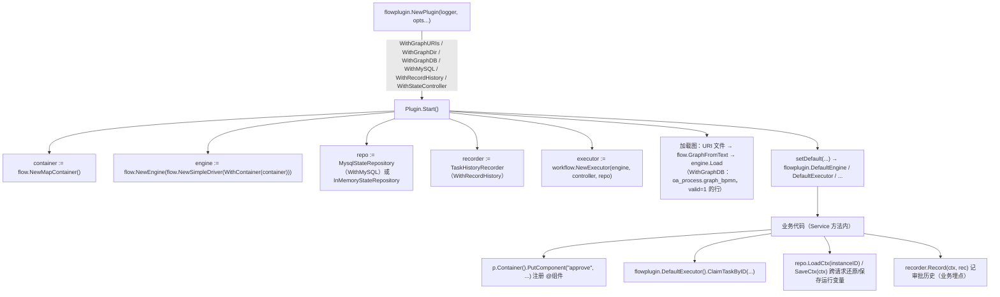
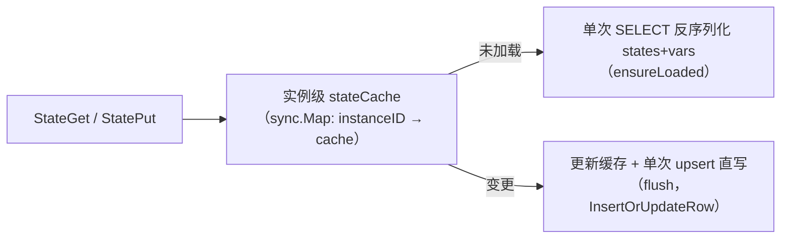

# Aifei-Go Flow 插件：引擎组装 + MySQL 状态仓储 + 任务历史

> **把 [flow](flow.md) 引擎装成 `aifei.Plugin`**：`Start` 时组装引擎 + 工作流执行器，从文件或流程定义表加载图，可选启用 **MySQL 状态仓储**（`bpm_flow_repository`，实例状态 + 运行变量 + 图快照）与**任务历史记录器**（`bpm_flow_task`，追加式审批轨迹），并安装包级默认——业务代码用 `flowplugin.DefaultExecutor()` 等顶层入口即可。

---

## 1. 背景与定位

[flow](flow.md) 是纯库：引擎、图、工作流三件套都不关心"图从哪来、状态存到哪、审批轨迹记给谁"。生产应用里这些是标配：

- 图定义散落在 `.yml`/`.json` 文件，或已存在于流程设计器的**流程定义表**里；
- 人工任务的节点状态必须**跨请求、跨进程**存活（claim 停下的待办，下次提交还在）；
- 每次办理要留下**谁在何时把任务从哪个节点办到哪个节点**的历史。

`plugins/flow`（包名 `flowplugin`）就是这层组装：

| 维度 | 说明 |
|------|------|
| 是什么 | flow 引擎到 `aifei.Plugin` 的生产适配器（组装 + 加载 + 持久化） |
| 不是什么 | 不重新实现任何编排/工作流能力，全部来自 [flow](flow.md) + `flow/workflow` |
| 依赖 | [aifei](core.md)（Plugin 接口）+ [flow](flow.md) + [db](db.md) + [log](log.md)，无第三方库 |
| 是否读配置 | **否**。全部通过 `PluginOption` 传入（与 [dami 插件](dami-plugin.md)同风格；db 连接复用 `db` 包既有初始化） |
| 代码量 | ~715 行（plugin 201 + mysql_state 346 + mysql_task 95 + schema/use 73） |

设计契约见 [../arch/flow/06-mysql-repository.md](../arch/flow/06-mysql-repository.md)；表结构来自参考项目（ficus-catl-oa）的 OA 库。

---

## 2. 总体架构



两处关键协作：

- `Plugin` 把已加载的**图文本**（`map[graphID]string`）交给仓储（`SetGraphTexts`）：实例**首次**持久化时，把该实例所跑图的定义原文写进 `bpm_flow_repository.graph` 列作**实例快照**——即使后来流程定义升级，老实例仍按创建时的图跑。
- `MysqlStateRepository` 通过 `flow.Context` 实现类的 `GoContext()` 拿 Go `context.Context`，所有读写走 `db.WithCtx(...)`——业务把 db 事务放进 flow 上下文后，**状态落库自动加入同一事务**。

---

## 3. 关键 API

### 3.1 Plugin 与选项

```go
var _ aifei.Plugin = (*Plugin)(nil)

func NewPlugin(logger log.Logger, opts ...PluginOption) *Plugin

// Start 组装引擎/仓储/执行器并加载图；Stop 为 no-op（引擎无状态，db 生命周期在外）
func (p *Plugin) Start() error
func (p *Plugin) Stop() error

// 组装件访问（Start 之前为 nil）
func (p *Plugin) Engine() *flow.Engine
func (p *Plugin) Executor() *workflow.Executor
func (p *Plugin) Container() *flow.MapContainer   // 在此注册 @组件
func (p *Plugin) MysqlRepo() *MysqlStateRepository // 未启用 MySQL 时为 nil
func (p *Plugin) Recorder() *TaskHistoryRecorder   // 未启用历史时为 nil
```

| 选项 | 作用 |
|------|------|
| `WithGraphURIs(uris ...string)` | 追加图文件路径（`.yml`/`.yaml`/`.json`），Start 时逐个 `GraphFromText` 加载 |
| `WithGraphDir(dir)` | 把目录下全部 `.yml`/`.yaml`/`.json` 加入加载列表 |
| `WithGraphDB()` | 从流程定义表 `oa_process.graph_bpmn`（`valid=1`）加载图；**解析不成引擎格式的行（如 Flowable 时代遗留的 BPMN XML）跳过并告警**，不阻断启动 |
| `WithMySQL()` | 启用 MySQL 状态仓储（默认 `InMemoryStateRepository`） |
| `WithRecordHistory()` | 启用任务历史记录器 |
| `WithStateController(c)` | 覆盖状态控制器（默认 `workflow.NewBlockStateController()`） |

图来源常量（匹配参考库表结构，需要时再参数化）：

```go
const (
    GraphTable      = "oa_process"    // 流程定义表
    GraphBpmnColumn = "graph_bpmn"    // 设计器部署的引擎格式图 JSON
)
```

### 3.2 包级默认（use.go）

`Start` 把组装件安装为包级默认，业务代码免于层层透传：

```go
func DefaultEngine() *flow.Engine
func DefaultExecutor() *workflow.Executor
func DefaultMysqlRepo() *MysqlStateRepository  // 未启用 MySQL 时 nil（LoadCtx/SaveCtx 不可用）
func DefaultRecorder() *TaskHistoryRecorder    // 未启用历史时 nil
```

> 与 [storage](storage.md)/[cache](cache.md) 等读 `config.Props` 的插件不同，本插件**无 `flow.*` 配置键**：图路径、表名、开关全走 `PluginOption`；数据库连接复用 `db` 包既有初始化（务必在插件 `Start` 前完成）。

---

## 4. 核心机制：MysqlStateRepository

`workflow.StateRepository` 的 MySQL 实现（表 `bpm_flow_repository`，建表 DDL 在 `plugins/flow/ddl.sql`）：

### 4.1 存储模型：一行一实例

| 列 | 内容 |
|----|------|
| `instant_id` | 流程实例 id（`flow.Context.InstanceID()`），**唯一键**，upsert 目标 |
| `states` | JSON：`{"graphId:nodeId": 状态码}` 整图状态地图 |
| `vars` | JSON：运行变量（见 4.3 过滤规则） |
| `graph` | 实例图快照（首次创建行时写入当时的图定义原文） |
| `creator`/`create_time`/`updater`/`update_time` | 审计（操作人取上下文 `auditor` → `creator` 变量） |

### 4.2 内存缓存：惰性加载 + 直写

引擎每次进节点都要读状态（`StateGet`）、每次变更都要写（`StatePut`），不能每个动作都打数据库：



- `Evict(instanceID)`：实例终结后清缓存，防长期运行内存增长。
- 持久化函数可替换：`SetStatePersisters(persist PersistFunc, load LoadFunc)`——测试用内存假实现（`_test/flow_plugin_test` 即此法），也可换 PostgreSQL 等后端。
- 表名可覆盖：`NewMysqlStateRepository(logger, flowplugin.WithRepoTable("my_repo"), WithTaskTable("my_task"))`。

### 4.3 运行变量：LoadCtx / SaveCtx 跨请求还原

审批流的网关条件（`agree == true`、`formData.xxx`）依赖上下文变量，而 HTTP 是无状态的——两次请求间变量活在 `vars` 列里：

```go
repo := flowplugin.DefaultMysqlRepo()

// 请求开始：从库里还原该实例的运行变量
ctx, err := repo.LoadCtx(instanceID)
ctx.Put("actor", currentUser)          // 本次请求的瞬时变量

task, _ := flowplugin.DefaultExecutor().ClaimTaskByID(graphID, ctx)

// 提交办理前：把（过滤后的）变量存回，再执行 submit
_ = repo.SaveCtx(ctx)
_ = flowplugin.DefaultExecutor().SubmitTaskByID(graphID, task.NodeID(),
    workflow.ActionForward, ctx)
```

- `LoadCtx(instanceID)`：查 `vars` 列灌进新 `flow.Context`；无行则返回空上下文。
- `SaveCtx(ctx)`：`persistableVars` 过滤后写库。**永不持久化**的瞬时键：`actor`/`creator`/`auditor`（当前用户，恢复会顶掉操作者）、`instanceId`/`context`、`WorkflowIntent`（引擎内部态）；不可 JSON 化的值（func、`*Exchanger`）同样剔除。
- `VarsGet`（接口方法）在**每次节点进入**时把持久变量并回上下文——同一请求内网关条件与首算一致。

### 4.4 事务联动

所有库操作走 `db.WithCtx(goCtx(ctx))`；`goCtx` 从 flow 上下文取绑定的 Go context（`*flowContext.GoContext()`，类型断言获取）。业务侧在 Service 里开 `db` 事务并 `SetGoContext` 后，claim/submit 触发的状态落库**同生共死**——办理失败回滚，状态不落，待办原样。

---

## 5. 核心机制：TaskHistoryRecorder

追加式审批历史（表 `bpm_flow_task`，只插不改）：

```go
type TaskRecord struct {
    GraphID  string       // → proc_def_id
    TaskID   string       // → task_id（节点 id）
    Source   *flow.Node   // → source_node_code/name/type（三列，nil 则跳过）
    Target   *flow.Node   // → target_node_code/name/type
    Assignee string       // → assignee（办理人）
    State    workflow.TaskState // → status（状态码）
    FormID   any          // → form_id（可选，SetIfNotNull）
    Message  string       // → message（审批意见，SetIfNotBlank）
}

func (r *TaskHistoryRecorder) Record(ctx flow.Context, rec TaskRecord) error
```

- `Record` 同时写入当时上下文变量的 JSON 快照（`variables` 列，剔除不可序列化项）——历史行自证"当时看到了什么"。
- **埋点是显式的**：记录器不拦截引擎，业务在提交动作处调用（何时记、记什么由业务定）；`SetInserter(f)` 可替换写入函数（测试）。
- 与状态仓储共用 `RepoSchema`，`WithTaskTable` 覆盖表名。

---

## 6. 典型用法

### 6.1 最小集成（文件加载 + MySQL + 历史）

```go
func main() {
    db.Init("mysql", dsn)                      // 先备好 db

    p := flowplugin.NewPlugin(nil,
        flowplugin.WithGraphDir("flows"),
        flowplugin.WithGraphDB(),              // 兼从 oa_process.graph_bpmn 加载
        flowplugin.WithMySQL(),
        flowplugin.WithRecordHistory(),
        flowplugin.WithStateController(workflow.NewActorStateController()),
    )

    app := aifei.New(
        aifei.WithPlugin(p),
        // 组件注册须在插件 Start 之后（Container 在 Start 时创建；
        // OnStart 回调晚于全部插件启动）
        aifei.WithOnStart(func() {
            p.Container().PutComponent("approve", flow.TaskFunc(doApprove))
        }),
    )
    server.AutoRegisterServices(app)
    server.Run(app, ":8080")
}
```

### 6.2 审批待办 Service（claim → 提交 → 记历史）

```go
type FlowService struct{}

// Get /flow/todo?instanceId=...  当前待办
func (s *FlowService) GetTodo(in aifei.Input) aifei.Output {
    repo := flowplugin.DefaultMysqlRepo()
    ctx, err := repo.LoadCtx(in.GetStr("instanceId"))
    if err != nil { return out.Fail() }
    ctx.Put("actor", currentActor(in))

    task, err := flowplugin.DefaultExecutor().ClaimTaskByID(in.GetStr("graphId"), ctx)
    if err != nil { return out.Fail() }
    _ = repo.SaveCtx(ctx)
    if task == nil { return out.Ok() }          // 无待办（已办完/已终止）
    return out.Ok().SetData(map[string]any{"node": task.NodeID(), "state": task.State()})
}

// Post /flow/submit  提交办理
func (s *FlowService) PostSubmit(in aifei.Input) aifei.Output {
    repo, exec := flowplugin.DefaultMysqlRepo(), flowplugin.DefaultExecutor()
    ctx, _ := repo.LoadCtx(in.GetStr("instanceId"))
    ctx.Put("actor", currentActor(in))
    ctx.Put("agree", in.GetBool("agree"))

    node := /* in.GetStr("nodeId") → g.GetNode(id) */
    err := exec.SubmitTaskByID(in.GetStr("graphId"), node.ID(),
        workflow.ActionForward, ctx)
    if err != nil { return out.Fail() }
    _ = repo.SaveCtx(ctx)

    _ = flowplugin.DefaultRecorder().Record(ctx, flowplugin.TaskRecord{
        GraphID: in.GetStr("graphId"), TaskID: node.ID(),
        Source: node, Assignee: fmt.Sprint(ctx.Get("actor")),
        State: workflow.TaskStateCompleted, Message: in.GetStr("comment"),
    })
    return out.Ok()
}
```

---

## 7. 模块结构

```
plugins/flow/
├── plugin.go       # Plugin 组装：选项、Start 加载（文件 + oa_process 表）、包级默认访问器
├── mysql_state.go  # MysqlStateRepository：bpm_flow_repository 一行一实例、缓存直写、
│                   #   LoadCtx/SaveCtx 运行变量、图快照、事务联动（GoContext）
├── mysql_task.go   # TaskHistoryRecorder：bpm_flow_task 追加式历史 + TaskRecord
├── schema.go       # RepoSchema（表名，默认 bpm_flow_repository / bpm_flow_task）
├── use.go          # 包级默认：DefaultEngine/DefaultExecutor/DefaultMysqlRepo/DefaultRecorder
└── ddl.sql         # 两表建表语句（含注释与索引）

测试：_test/flow_test（引擎本体）、_test/flow_plugin_test（仓储/历史/集成；
      MySQL 方言集成测试经 FLOW_MYSQL_DSN 环境变量启用）
```

---

## 8. 总结

1. **组装器定位**：引擎/工作流语义全部来自 [flow](flow.md)，插件只做"组装 + 图加载 + 持久化"三件事。
2. **一行一实例的状态仓储**：整图状态地图与运行变量各一个 JSON 列，内存缓存惰性加载、变更直写，`Evict` 收尾。
3. **实例图快照**：首次持久化固化图定义原文，流程定义后续升级不影响在途实例。
4. **变量跨请求还原**：`LoadCtx`/`SaveCtx` + 瞬时键过滤（actor/creator/auditor/Intent 不落库），网关条件跨请求可复算。
5. **历史显式埋点**：`TaskHistoryRecorder` 不劫持引擎，业务在提交处 `Record`（含当时变量快照），何时记、记什么自己定。
6. **零配置键**：一切经 `PluginOption`；表名可覆盖、持久化函数可替换（测试/换库）。

### 延伸阅读

- [Flow 流程编排](flow.md) —— 引擎与工作流本体（图模型、网关、claim/submit 语义）
- [db](db.md) —— 仓储所用 `db.Row`/`WithCtx`/事务模型
- [dami 插件](dami-plugin.md) —— 同为"零配置、Option 驱动"的轻组装插件对照
- 设计文档：[../arch/flow/06-mysql-repository.md](../arch/flow/06-mysql-repository.md)
