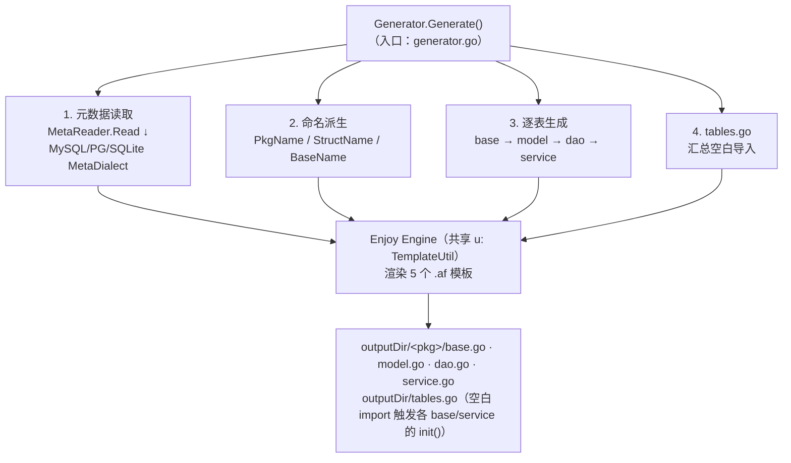
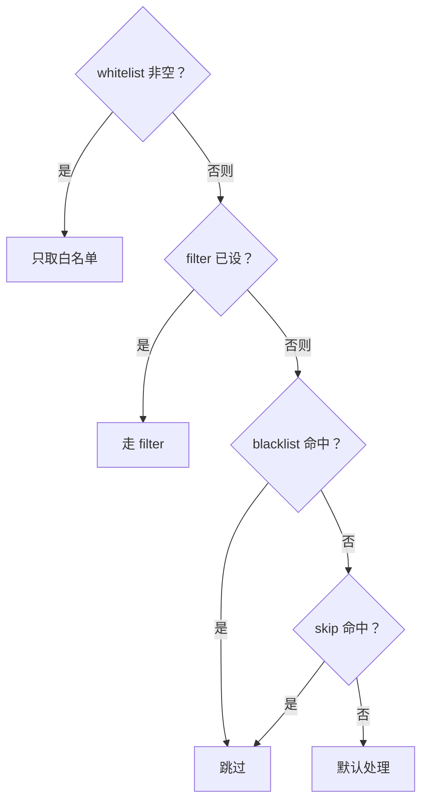
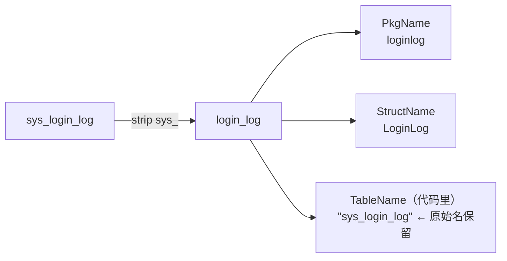

# Aifei-Go 代码生成器：从数据库 schema 到类型安全的 ORM 与 Service

> **一份 schema，五个产物，零样板。**`tools/generator` 读取数据库元数据（MySQL/PostgreSQL/SQLite），通过嵌入式 Enjoy 模板批量产出 `base.go` / `model.go` / `dao.go` / `service.go` / `tables.go`，把 `db.Row` 包装成强类型的 Active Record 与开箱即用的 HTTP Service。

---

## 1. 背景与定位

Aifei-Go 的数据访问层 [db](db.md) 提供 `Row`（Active Record）与 `Dao`（链式查询）两套 API，对单表 CRUD 几乎不需要手写 SQL。但每个业务表仍要做一堆重复劳动：

- 为每列写类型安全的 getter/setter（`r.GetInt("user_id")` 写到处都是）
- 重复写 `FindByID` / `FindBy` / `DeleteByID` 等同构方法
- 在 HTTP 服务里把 `in.GetBean(...)`、`FindById(...)`、`server.Of(...)` 来回拼装
- 维护 `db.Table` 元数据，保证 `db.RegisterTable` 能被框架发现

`tools/generator` 就是把这些样板代码**生成出来**的工具：一次 `Generate()` 调用，按表产出五个 Go 文件，并自动注册到 [db](db.md) 与 [server](server.md)。它是 Java Aifei `jfinal-generator` 的 Go 对应物，核心思路一致（schema → 代码、生成 typed Dao），只是模板引擎换成了项目自带的 Enjoy。

依赖范围克制到最小：

| 依赖 | 用途 |
|------|------|
| `github.com/crazy-airhead/aifei-go/db` | 复用 `db.Dialect` / `db.KeyFormat` / `db.Table` 定义，不重复发明 |
| `github.com/crazy-airhead/aifei-go/enjoy` | 模板引擎，渲染 `.af` 文件 |
| Go 标准库 `database/sql` | 元数据读取的统一接口 |
| Go 标准库 `go/embed` | 把 `.af` 模板编译进二进制 |

用户需自行提供驱动（如 `modernc.org/sqlite` 或 `go-sql-driver/mysql`），generator 自身不绑任何驱动。

---

## 2. 总体架构



核心抽象（关键类型一览）：

| 类型 | 文件 | 职责 |
|------|------|------|
| `Generator` | `generator.go` | 入口；持有所有子 generator 与 Engine |
| `Engine` | `generator.go` | 享元式 Enjoy 引擎；模板编译结果按内容缓存 |
| `MetaReader` | `meta_reader.go` | 读库元数据，产出 `[]*TableInfo` |
| `MetaDialect` | `meta_dialect.go` | 在 `db.Dialect` 之上加元数据查询能力 |
| `TypeMapping` | `type_mapping.go` | SQL 类型 → Go 类型（30+ 映射，可覆盖） |
| `TableInfo` / `FieldInfo` | `types.go` | 生成过程的中间数据模型 |
| `TemplateUtil` | `template_util.go` | 模板里可调用的 `u.PkgName(...)` 等辅助方法 |
| `*Generator`（5 个） | `*_generator.go` | 每个负责一种产物文件 |

---

## 3. 关键 API

### 3.1 入口：`generator.New`

```go
func New(pool *sql.DB, dialect MetaDialect, outputDir, importRoot string) *Generator
```

四个参数：

| 参数 | 含义 | 示例 |
|------|------|------|
| `pool` | 已连上的 `*sql.DB`，元数据读取直接用它 | `pool, _ := db.GetConfig().Pool()` |
| `dialect` | 元数据方言（`MySQLMetaDialect` / `PostgresMetaDialect` / `SQLiteMetaDialect`） | `&generator.SQLiteMetaDialect{}` |
| `outputDir` | 生成代码的根目录（每张表会在此目录下建子目录） | `./internal` |
| `importRoot` | `outputDir` 对应的 Go import 路径，用于 `tables.go` 的空白导入 | `github.com/x/y/internal` |

`Generator` 暴露的可定制字段与方法：

```go
type Generator struct {
    // 字段
    TablePrefix    string                                  // 表名前缀，生成前剥离（如 "sys_"）
    PkgNameFunc    func(string) string                     // 表名 → 包名
    StructNameFunc func(string) string                     // 表名 → 结构体名
    BaseNameFunc   func(string) string                     // 结构体名 → base 结构体名

    // 链式配置（深入子 generator）
    func (g *Generator) ConfigMetaReader(fn func(*MetaReader)) *Generator
    func (g *Generator) ConfigBaseGenerator(fn func(*BaseGenerator)) *Generator
    func (g *Generator) ConfigServiceGenerator(fn func(*ServiceGenerator)) *Generator

    // 执行
    func (g *Generator) Generate() error
}
```

### 3.2 最小可用示例

```go
package main

import (
    "github.com/crazy-airhead/aifei-go/db"
    "github.com/crazy-airhead/aifei-go/tools/generator"
    _ "modernc.org/sqlite"
)

func main() {
    _ = db.Init("sqlite", "./app.db")
    pool, _ := db.GetConfig().Pool()

    gen := generator.New(
        pool,
        &generator.SQLiteMetaDialect{},
        "./internal",
        "github.com/me/app/internal",
    )
    gen.TablePrefix = "sys_"          // sys_user → user，sys_login_log → login_log
    gen.ConfigServiceGenerator(func(s *generator.ServiceGenerator) {
        s.APIPrefix = "/api/v1"        // 路由前缀
    })
    gen.ConfigMetaReader(func(mr *generator.MetaReader) {
        mr.AddBlacklist("sys_log")     // 跳过日志表
    })

    if err := gen.Generate(); err != nil { panic(err) }
}
```

执行后产物结构（假设库中有 `user` 与 `sys_login_log` 两表）：

```
internal/
├── tables.go              # import _ "./user"  ./loginlog" 触发自注册
├── user/
│   ├── base.go            # 总是覆盖
│   ├── model.go           # 已存在则跳过
│   ├── dao.go             # 已存在则跳过
│   └── service.go         # 已存在则跳过
└── loginlog/
    ├── base.go
    ├── model.go
    ├── dao.go
    └── service.go
```

---

## 4. 元数据读取：MetaReader

`MetaReader` 是生成质量的基础——它读得越准，生成代码越贴近真实 schema。

### 4.1 核心字段

```go
type MetaReader struct {
    TypeMapping       *TypeMapping          // SQL → Go 类型表
    FieldToAttrFn     func(string) string   // 列名 → Go 字段名（默认 snake → Pascal）
    ReadView          bool                  // 是否处理视图（视图无 PK 时塞 fake_id）
    ReadRemarks       bool                  // 是否读取表/列注释
    ReadAutoIncrement bool                  // 是否推断自增标记
    ResolveNullable   bool                  // NULL 列是否映射成 sql.Null*
    KeyFormat         db.KeyFormat          // json tag 的命名风格
    // ... 内部：whitelist / blacklist / filter / skip
}
```

默认配置（`NewMetaReader`）：

| 字段 | 默认值 | 含义 |
|------|--------|------|
| `TypeMapping` | `NewTypeMapping()` | 30+ SQL→Go 映射 |
| `FieldToAttrFn` | `FieldToAttr` | snake_case → PascalCase |
| `ReadRemarks` | `true` | 读注释 |
| `KeyFormat` | `db.KeyFormatCamel` | json tag 为 camelCase，与 `db.DefaultKeyFormat` 对齐 |

### 4.2 表过滤：四层优先级

```go
mr.AddWhitelist("user", "order")   // 只生成这几张表
mr.AddBlacklist("sys_log")          // 排除某几张表
mr.SetFilter(func(t string) bool { return !strings.HasPrefix(t, "tmp_") })
mr.SetSkip(func(t string) bool { return strings.HasPrefix(t, "bak_") })
```

判定顺序（`shouldProcess`）：



### 4.3 NULL 处理与 KeyFormat

- **默认 `ResolveNullable=false`**：NULL 列按普通 Go 类型生成（如 `string`）。运行时由 [db](db.md) 的 `Row` getter 处理 NULL（返回零值）。这是与 Java 版一致的体验。
- **`ResolveNullable=true`**：生成 `sql.NullInt64` / `sql.NullString` / `sql.NullTime` 等，类型层面区分 NULL 与零值。
- **`KeyFormat=db.KeyFormatSnake`**：json tag 直接用列名（`"user_id"`），而非默认的 camelCase（`"userId"`）。与运行时 `db.DefaultKeyFormat` 必须保持一致，否则生成代码的 json tag 与 `Row` 序列化字段对不上。

### 4.4 双路读列：information_schema vs 驱动反射

`MetaReader.readFieldInfo` 会按方言能力分流：

```go
if cr, ok := dialect.(ColumnMetaReader); ok {
    return mr.readFieldsFromMeta(...)   // MySQL/PG：information_schema
}
return mr.readFieldsFromDriver(...)      // SQLite 等回退：rows.ColumnTypes()
```

| 路径 | 方言 | 能拿到 | 不能拿到 |
|------|------|--------|----------|
| `ColumnMetaReader.ReadColumns` | MySQL、PostgreSQL | 注释、`NULL` 标记、自增、**生成列**（VIRTUAL/STORED） | — |
| `readFieldsFromDriver` | SQLite、其他 | 类型、可空（来自驱动） | 注释、生成列标记 |

对生成列的处理尤其关键——MySQL 的 `DEFAULT CURRENT_TIMESTAMP`（`DEFAULT_GENERATED`）**不算**生成列（生成器会专门排除它，确保 `gmt_create` 这种字段仍能进 INSERT/UPDATE），只有 `VIRTUAL GENERATED` / `STORED GENERATED` 才被列入 `Table.GeneratedColumns`，从而在 INSERT/UPDATE 时跳过。

---

## 5. 方言层：MetaDialect

`MetaDialect` 在 [db](db.md) 的 `Dialect`（SQL 方言）之上，加了两个生成器专用的方法：

```go
type MetaDialect interface {
    db.Dialect
    QueryTableNames(pool *sql.DB) ([]string, error)
    QueryTableInfo(table string) string
}
```

两个**可选能力接口**（能力检测，按需组合）：

```go
type ColumnMetaReader interface {
    ReadColumns(pool *sql.DB, table string) ([]ColumnMeta, error)
}
type TableMetaReader interface {
    ReadTableRemarks(pool *sql.DB) (map[string]string, error)
}
```

三个内置实现：

| 方言 | 表名来源 | 列元数据来源 | 注释 | 生成列 |
|------|----------|--------------|------|--------|
| `MySQLMetaDialect` | `SHOW TABLES` | `INFORMATION_SCHEMA.COLUMNS`（含 `COLUMN_COMMENT`、`EXTRA`） | ✅ | ✅（VIRTUAL/STORED） |
| `PostgresMetaDialect` | `pg_catalog.pg_tables` | `information_schema.columns` + `col_description` + `identity_generation` | ✅ | ✅（`is_generated='ALWAYS'`） |
| `SQLiteMetaDialect` | `sqlite_master` | `rows.ColumnTypes()`（驱动反射） | ❌ | ❌ |

> 注：PostgreSQL 的列元数据查询按 `information_schema` 规范编写，CI 未接真实 PG 实例，但 SQLite + MySQL 的同等路径在 `_test/generator_test` 与 `_test/demo` 中持续验证。

工厂函数从 `db.Dialect` 出发构造：

```go
d := generator.NewMetaDialect(db.NewDialect("sqlite"))   // → *SQLiteMetaDialect
```

---

## 6. 类型映射：TypeMapping

30+ 条内置映射覆盖主流 SQL 类型：

| 分类 | SQL 类型 | Go 类型 |
|------|----------|---------|
| 整数 | `INT` / `INTEGER` / `TINYINT` / `SMALLINT` / `MEDIUMINT` | `int` |
| 大整数 | `BIGINT` / `SERIAL` / `BIGSERIAL` | `int64` |
| 浮点 | `FLOAT` / `DOUBLE` / `REAL` | `float64` |
| 精度 | `DECIMAL` / `NUMERIC` | `string`（避免精度丢失） |
| 字符串 | `VARCHAR` / `CHAR` / `TEXT` / `LONGTEXT` / `MEDIUMTEXT` / `TINYTEXT` / `ENUM` / `SET` | `string` |
| 时间 | `DATE` / `DATETIME` / `TIMESTAMP` / `TIME` | `time.Time` |
| 布尔 | `BOOL` / `BOOLEAN` / `BIT` | `bool` |
| 二进制 | `BLOB` / `LONGBLOB` / `MEDIUMBLOB` / `TINYBLOB` / `VARBINARY` / `BINARY` | `[]byte` |
| JSON | `JSON` / `JSONB` | `string`（见 §9） |
| 未识别 | 其他 | `string`（兜底） |

可按需覆盖：

```go
tm := generator.NewTypeMapping()
tm.AddMapping("MONEY", "float64")     // 新增
tm.RemoveMapping("JSON")              // 删除，回退到 string
```

`MetaReader` 默认持有 `NewTypeMapping()`，要替换只需在 `ConfigMetaReader` 里改 `mr.TypeMapping` 字段。

---

## 7. 命名派生

生成器对名字的控制全在 `TemplateUtil` 里，通过 `Generator.PkgNameFunc` / `StructNameFunc` / `BaseNameFunc` 三个字段暴露，默认实现：

| 函数 | 输入 → 输出 | 规则 |
|------|-------------|------|
| `PkgName` | `sys_user` → `sysuser` | 去掉所有下划线直接拼接 |
| `StructName` | `login_log` → `LoginLog` | snake_case → PascalCase |
| `BaseName` | `LoginLog` → `BaseLoginLog` | `"Base" + StructName` |
| `FieldToAttr` | `user_id` → `UserId` | snake_case → PascalCase（列名 → Go 字段） |
| `ToCamelCase` | `UserId` → `userId` | PascalCase → camelCase（json tag、ServicePrefix） |
| `EscapeKeyword` | `type` → `type_` | Go 关键字加尾下划线（短 setter 用） |

`TablePrefix` 剥离发生在命名之前：



测试明确验证：包名/结构体名用去前缀的版本，但 `base.go` 里 `Table.Name` 字段仍是原始 `sys_login_log`，保证运行时 SQL 打到正确的表。

---

## 8. 五种产物与覆盖策略

生成器对"是否覆盖"采用**三档策略**：

| 文件 | 生成器 | 覆盖策略 | 文件头注释 |
|------|--------|----------|-----------|
| `base.go` | `BaseGenerator` | **总是覆盖** | `// Generated by Aifei Generator. DO NOT EDIT.` |
| `tables.go` | `TablesGenerator` | **总是覆盖** | `// Generated by Aifei Generator. DO NOT EDIT.` |
| `model.go` | `ModelGenerator` | **已存在则跳过** | `// This file is NOT overwritten on re-generation. Add custom logic here.` |
| `dao.go` | `DaoGenerator` | **已存在则跳过** | `// This file is NOT overwritten on re-generation. Add custom queries here.` |
| `service.go` | `ServiceGenerator` | **已存在则跳过** | `// This file is NOT overwritten on re-generation. Add custom queries here.` |

设计意图：

- **base.go / tables.go 是机械的、纯元数据派生的** → 永远以最新 schema 为准，反复覆盖。
- **model.go / dao.go / service.go 是要被开发者编辑的** → 只在首次生成；后续重跑 generator 不破坏你的业务代码。

每张表的生成顺序固定为 `base → model → dao → service`（见 `Generator.Generate` 主循环），保证依赖方向正确：model 依赖 base 的 `NewBase()`；dao 依赖 model 的结构体；service 依赖 dao 的 typed 方法。

### 8.1 base.go 产物（每张表都生成）

`BaseGenerator.buildData` 装配的数据：表名、表注释、字段名串、主键、生成列、字段类型 map、每列的 `RowGetter` 与 `Zero`。生成的 `base.go` 包含：

```go
var Table = &db.Table{
    Name:             "user",
    Fields:           "id,name,age,email,created_at",
    PrimaryKeys:      []string{"id"},
    GeneratedColumns: []string{},          // MySQL VIRTUAL/STORED 才会出现
    FieldTypes: map[string]reflect.Type{
        "id":         reflect.TypeOf(int(0)),
        "name":       reflect.TypeOf(""),
        "created_at": reflect.TypeOf(time.Time{}),
        // ...
    },
}

type BaseUser struct { *db.Row }
func NewBase() *BaseUser { return &BaseUser{Row: db.NewRow(Table.Name)} }
func NewWithRow(row *db.Row) *BaseUser { return &BaseUser{Row: row} }

// 三类方法（每列一组，JSON 列除外）：
func (r *BaseUser) Age() int            { return r.GetInt("age") }              // typed getter
func (r *BaseUser) SetAge(v int) *BaseUser { r.Set("age", v); return r }        // typed setter
func (r *BaseUser) Age_(v int) *BaseUser { return r.SetAge(v) }                 // 短 setter（链式）

// 实例级 CRUD：
func (r *BaseUser) Insert() (*BaseUser, error) { ... }
func (r *BaseUser) Update() (bool, error)      { ... }
func (r *BaseUser) Delete() (bool, error)      { ... }

func init() { db.RegisterTable(Table) }       // ← 自注册到 db 全局表注册表
```

关键设计：

- **JSON 列从 base.go 里剔除**（不出 typed getter/setter）——把方法名让给 `model.go`，方便用户在 model 里覆盖成结构体类型（见 §9）。
- **短 setter（`Age_(v)`）** 默认开启（`GenerateShortSetter=true`），让链式构造更顺眼：`New().Name_("alice").Age_(30).Insert()`。列名是 Go 关键字时（如 `type`、`select`）自动加 `_`（`EscapeKeyword`）避免冲突。
- **`init()` 自注册**：`db.RegisterTable(Table)` 让框架在启动时就能找到表元数据，给 [dataisolate](data-isolate.md) 这类插件做字段过滤、给 JSON 自动解码等。

### 8.2 model.go 产物（首次生成）

```go
type User struct { *BaseUser }              // 嵌入 BaseUser，获得全部 getter/setter/CRUD
func New() *User { return &User{BaseUser: NewBase()} }

// JSON 列的脚手架（默认 string，可升级成 struct）：
func (m *User) Profile() string { return m.GetStr("profile") }
func (m *User) SetProfile(v string) *User { m.Set("profile", v); return m }
```

`model.go` 是用户加自定义业务逻辑、自定义类型、覆盖 JSON 列类型的地方，所以只生成一次。

### 8.3 dao.go 产物（首次生成，typed Dao）

`DaoGenerator` 产出的 `dao.go` 是生成器最核心的产物——**类型安全的 Dao**。详见 §10。

### 8.4 service.go 产物（首次生成）

直接产出一个可用的 HTTP Service，按 [server](server.md) 的命名约定挂路由：

```go
const (
    ServicePrefix = "/api/v1/user"
    listSql = `SELECT * FROM user
    #where(name, '=', name)
    #and(age, '=', age)
    ORDER BY id DESC`
)

func init() { server.RegisterService(ServicePrefix, &Service{}) }
type Service struct{}

func (s *Service) List(in aifei.Input) aifei.Output      { ... }
func (s *Service) Paginate(in aifei.Input) aifei.Output   { ... }
func (s *Service) Create(in aifei.Input) aifei.Output     { ... }
func (s *Service) GetById(in aifei.Input) aifei.Output    { ... }   // 单主键才有
func (s *Service) UpdateById(in aifei.Input) aifei.Output { ... }   // 单主键才有
func (s *Service) DeleteById(in aifei.Input) aifei.Output { ... }   // 单主键才有
```

要点：

- **`listSql` 用 Enjoy SQL 指令**（`#where` / `#and`）自动拼查询条件——`buildQueryConditions` 遍历所有非主键列，每列生成一条 `#and(col, '=', col)`，请求里没传该参数则该条件被 Enjoy 引擎自动省略（详见 [db](db.md) 的 Enjoy SQL 部分）。
- **主键参数解析按类型分流**（`buildPKParamParse`）：`int` 用 `strconv.Atoi`、`int64` 用 `strconv.ParseInt`、`string` 直接取。其余类型退化为 `string`。
- **`ServicePrefix` 用 camelCase**：`ToCamelCase(StructName)` 把 `LoginLog` 转成 `/loginLog`，符合 REST 路径风格。
- **自注册**：`init()` 调 `server.RegisterService` 把前缀与实现登记进全局注册表。`server.AutoRegisterServices(app)` 在应用启动时遍历这个表，按方法名映射路由（`GetById` → `GET /:id`、`Create` → `POST /`，详见 [server](server.md)）。

### 8.5 tables.go 产物（汇总）

`tables.go` 位于 `outputDir` 根目录，用**空白导入**把所有子包拉进来，从而触发它们的 `init()`：

```go
package internal

import (
    _ "github.com/me/app/internal/user"
    _ "github.com/me/app/internal/loginlog"
)

// Tables are registered via init() functions in each per-table package.
// Use db.Tables() to retrieve all registered tables.
```

应用代码只要 import 一次 tables.go 所在的包，就完成了全部表与服务的注册——无需手动罗列。

---

## 9. JSON 列的升级路径

JSON/JSONB 列在数据库里是 `json` 类型，生成器默认按 `string` 处理，但留好了升级通道。`_model.af` 模板为每个 JSON 列生成带有详细注释的脚手架：

```go
// profile is a JSON column. It defaults to string. To expose it as a struct:
//   1. define the struct type in this file (e.g. type Profile struct{...})
//   2. in an init() here, register it: Table.FieldTypes["profile"] = reflect.TypeOf(Profile{})
//      (db.Row.DecodeJSONFields will then auto-decode it on read)
//   3. replace these two methods with typed versions:
func (m *User) Profile() string { return m.GetStr("profile") }
func (m *User) SetProfile(v string) *User { m.Set("profile", v); return m }
```

升级流程只需三步：

1. 在 `model.go` 里定义结构体类型（`type Profile struct { ... }`）
2. 在 `init()` 里注册到 `Table.FieldTypes`
3. 把脚手架的两个方法替换成类型化版本

之后 `db.Row.DecodeJSONFields`（在 `base.go` 的 `initRow` 里被调用）会在读取时自动把 JSON 解码成注册的结构体类型。注意：升级后该方法名在 model 里覆盖掉了 base 里脚手架的版本，Go 的方法解析自然优先用 model 的——这正是 JSON 列从 base.go 里被剔除的原因。

---

## 10. 生成的 typed Dao

`_dao.af` 产出的 `dao.go` 把通用 `db.Dao` 包成一个**绑定到具体表、返回具体类型**的 Dao：

```go
type Dao struct { *db.Dao }
func NewDao() *Dao { return &Dao{Dao: db.Use()} }    // 默认 db config
```

### 10.1 两段式 API：setup → terminal

链式查询分两层，类型签名在每层都正确返回 `*Dao`：

| 层 | 方法 | 作用 |
|----|------|------|
| **setup**（返回 `*Dao`） | `Sql(tpl, data)` / `SqlWithArgs(tpl, args...)` / `SqlById(id, data)` / `SqlByIdWithArgs(id, args...)` / `RawSql(sql, args...)` / `Select(fields)` | 设置查询来源 |
| **terminal**（返回结果） | `Find()` → `[]*User`；`FindFirst()` → `*User`；`FindOne()` → `*User`；`FindExists()` → `bool`；`Paginate(p,s)` → `*db.Page`；`Count()` / `CountBy(...)`；`FindBy(...)` / `FindFirstBy(...)`；`FindByID(id)` / `DeleteByID(id)` | 真正执行 |

`db.Dao` 本身要求每次调用都传表名，typed Dao 把表名在构造时就绑定好（`Table.Name`），后续调用无需再传。

### 10.2 包级便捷函数

除了 `NewDao().Xxx()`，还生成了一组包级函数（委托到 `NewDao()`），更接近 Java Aifei 的 `Db.findById(...)` 风格：

```go
user, err := FindById(42)                          // 单主键时才有
rows, err := FindBy("age > ?", 18)                 // 按 where 查
n, err := DeleteBy("status = ?", "deleted")        // 按条件删
total, err := Count()                              // 全表计数
```

| 方法 | 生成条件 |
|------|----------|
| `FindByID` / `DeleteByID`（实例与包级两种） | **仅单主键**生成；复合主键不生成，避免签名歧义 |
| 其他包级函数 | 总是生成 |

### 10.3 typed row 转换

`db.Dao.Find()` 返回的是 `[]*db.Row`，typed Dao 通过 `toRow` / `toRows` 包成 `[]*User`：

```go
func toRow(row *db.Row) *User {
    if row == nil { return nil }
    return &User{BaseUser: NewWithRow(initRow(row))}
}
```

`initRow`（在 `base.go` 里）干三件事：

1. `row.SetTable(Table.Name)` —— 把表名写回 Row（db.Dao 查询出来的 Row 不知道原表）
2. `row.SetPrimaryKeys(Table.PrimaryKeys...)` —— 写回主键列名（`Row.Update()` / `Delete()` 需要）
3. `db.DecodeJSONFields(row)` —— 按注册的 `Table.FieldTypes` 把 JSON 列解码成结构体（见 §9）

---

## 11. 模板引擎：嵌入式 Enjoy

五个 `.af` 模板（`templates/_base.af`、`_model.af`、`_dao.af`、`_service.af`、`_tables.af`）通过 `//go:embed` 编进二进制：

```go
//go:embed templates/_base.af
var baseTemplateContent string
```

模板渲染统一走 `Engine`（`generator.go`）：

```go
func NewEngine() *Engine {
    e := enjoy.NewEngine("generator")
    e.AddSharedObject("u", &TemplateUtil{})       // 模板里 #u.PkgName(...) 可直接调用
    return &Engine{enjoy: e}
}
```

`Engine.RenderTemplate(content, data)` 用 `sync.Map` 按模板内容做编译缓存——同一份模板多次渲染只编译一次，对批量生成（几十上百张表）性能有意义。

模板里用到的 Enjoy 语法（与 [db](db.md) 的 SQL 模板同源）：

| 语法 | 含义 | 在哪些模板里用 |
|------|------|-----------------|
| `#(expr)` | 输出表达式值 | 所有 |
| `#if (cond) ... #end` | 条件 | `_base.af`（表注释）、`_dao.af`（单主键分支）、`_service.af` |
| `#for (x : list) ... #end` | 遍历 | 所有（字段循环、import 循环、表循环） |
| `u.Method(...)` | 调用共享对象 | `_base.af`（`u.RowGetter` 等） |

`TemplateUtil` 暴露的方法：`RowGetter(type)` → `GetInt` / `GetStr` / `GetTime`...；`ZeroValue(type)` → `int(0)` / `""`...；`ImportPath(type)` → `time` 或空；`PkgName` / `StructName` / `BaseName` / `EscapeKeyword` / `JoinNames` / `Quote`。

---

## 12. 配置与集成

`tools/generator` 是库 + 命令行（用户自行写 `main` 调 `Generate()`），不读配置文件。典型集成两种形态：

### 12.1 形态一：项目内独立的 `cmd/gen`

`_test/demo/cmd/gen/main.go` 是范例——一个独立 main，按需手动跑：

```bash
go run ./cmd/gen        # 生成到 ./internal
go run .                # 启动 demo，自动注册所有表与服务
```

好处：生成动作显式，可在生成前后插自定义步骤（如生成完打 patch、跑 swag 等）。

### 12.2 形态二：`go:generate` 批量

在业务包里写一行：

```go
//go:generate go run ../../cmd/gen
package myapp
```

随后 `go generate ./...` 就会批量重生成。由于 `model.go` / `dao.go` / `service.go` 已存在即跳过，重跑是安全的——只有 `base.go` / `tables.go` 会随 schema 变更刷新。

### 12.3 接入应用的代码

应用 `main.go` 只需 import 生成代码所在包一次，再调 `server.AutoRegisterServices`：

```go
import (
    _ "github.com/me/app/internal"     // 触发 tables.go 的空白导入链
    "github.com/crazy-airhead/aifei-go/server"
)

func main() {
    app := aifei.New()
    server.AutoRegisterServices(app)    // 遍历 RegisterService 注册过的 service
    server.Run(app, ":8080")
}
```

整个链路：`import _ ".../internal"` → `tables.go` 的空白导入 → 各子包 `base.go` 的 `init()` 调 `db.RegisterTable`、各 `service.go` 的 `init()` 调 `server.RegisterService` → `AutoRegisterServices` 把它们映射成路由。

---

## 13. 模块结构

```
tools/generator/
├── generator.go         # Generator 入口 + Engine（Enjoy 封装）
├── meta_reader.go       # MetaReader：读库元数据 → []*TableInfo
├── meta_dialect.go      # MetaDialect 接口 + MySQL/Postgres/SQLite 三实现
├── type_mapping.go      # TypeMapping：30+ SQL → Go 类型映射
├── types.go             # TableInfo / FieldInfo 中间数据模型
├── field_to_attr.go     # snake_case → PascalCase 命名派生
├── go_keyword.go        # Go 关键字检测 + 转义
├── template_util.go     # 模板里可调用的 TemplateUtil（u 共享对象）
├── base_generator.go    # BaseGenerator：base.go（总是覆盖）
├── model_generator.go   # ModelGenerator：model.go（已存在则跳过）
├── dao_generator.go     # DaoGenerator：dao.go（已存在则跳过）
├── service_generator.go # ServiceGenerator：service.go（已存在则跳过）
├── tables_generator.go  # TablesGenerator：tables.go（总是覆盖）
└── templates/
    ├── _base.af         # base.go 模板
    ├── _model.af        # model.go 模板（含 JSON 列升级注释）
    ├── _dao.af          # dao.go 模板（typed Dao）
    ├── _service.af      # service.go 模板（HTTP Service + listSql）
    └── _tables.af       # tables.go 模板（空白 import）
```

源码约 1,537 行（含模板）；测试在 `_test/generator_test`（黑盒，SQLite + 驱动反射路径）与 `_test/demo/cmd/gen`（端到端样例）。

---

## 14. 总结

Aifei-Go 代码生成器的设计原则：

1. **schema 即真理**：类型、主键、生成列、注释全来自数据库，生成代码与 schema 严格对齐；改库即生效，无需手写 model struct。
2. **三档覆盖策略**：机械产物（base/tables）每次覆盖，业务产物（model/dao/service）只生成首次——保留用户的定制空间。
3. **自注册、零连线**：`base.go` 的 `init()` 注册 `db.Table`、`service.go` 的 `init()` 注册 Service，应用代码 import 一次就接入框架。
4. **typed Dao 不妥协**：`db.Dao` 的表名/类型痛点由 typed Dao 解决，调用方拿到的是 `[]*User` 而非 `[]*db.Row`，重构友好。
5. **复用而非重发明**：在 `db.Dialect` 之上加 `MetaDialect`、用项目自己的 Enjoy 做模板、与 [server](server.md) 的命名约定对齐——生成器只补 schema→代码这一段缺口。
6. **依赖极简**：只依赖 `db` + `enjoy` + 标准库；驱动由使用者提供，不绑任何具体数据库。

### 延伸阅读

- [db](db.md) —— `Row` / `Dao` / `Table` / `Dialect` 的运行时定义，生成器的下游
- [server](server.md) —— Service 注册与路由命名约定（`GetById` → `GET /:id` 等）
- [data-isolate](data-isolate.md) —— 直接消费生成器产出的 `db.Table` 元数据做字段/行隔离
- [enjoy](enjoy.md) —— 生成器与 db SQL 模板共用的渲染内核（`#()` / `#for` / `#if` 等指令）
