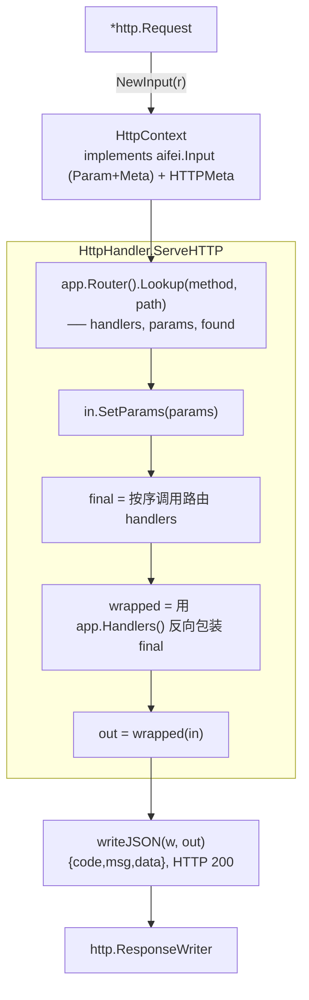

# Aifei-Go HTTP 适配器（./http）：net/http 与 aifei 内核的桥梁

> **`HttpContext` 实现 `aifei.Input`，`HttpHandler` 把 `*http.Request` 翻译成一次 aifei 调用。** 本包只做桥接——不自带中间件、不做模板渲染；生产级响应分派交给 [`server`](server.md)。

---

## 1. 背景与定位

[`aifei`](core.md) 核心包故意不绑定 HTTP：它定义 `Input`/`Output`/`Router`/`Handler` 契约，但**不实现 `http.Handler`**。要把这套契约接到真实网络上，需要一个适配层：

- 把 `*http.Request` 包装成 `aifei.Input`
- 把 aifei 的 `Output` 序列化回 `http.ResponseWriter`
- 提供 `net/http` server 的启停抽象

这就是 `http` 包的全部职责。它对应 Java Aifei 的 `aifei-undertow` 模块——只是把 Undertow 换成了 Go 标准库 `net/http`，零外部依赖。

| 议题 | 决策 |
|------|------|
| 依赖 | 仅 [`aifei`](core.md) + Go 标准库 |
| 职责边界 | 请求读取 + 路由查找 + JSON 序列化；**不含**中间件、模板、文件下载 |
| HTTP 状态码 | 本包的 `HttpHandler` **恒返回 200**，业务语义放在 `code` 字段；状态码映射在 [`server.IoHandler`](server.md) |
| 替换实现 | `Server` 接口可换 fasthttp/fcgi；`HttpContext` 可被 `server.In` 内嵌复用 |

---

## 2. 总体架构



`HttpHandler` 持有一个 `*aifei.Aifei`，实现 `http.Handler`。它把全局 Handler 链（`app.Handlers()`）作用在"依次调用所有路由 handlers"的最内层函数上——等价于 [`aifei.ChainHandlers`](core.md) 的从外到内折叠。

### 类型一览

| 类型 | 定义于 | 职责 |
|------|--------|------|
| `HttpContext` | `context.go` | `*http.Request` 的 `aifei.Input` 适配；额外实现 `HTTPMeta` |
| `HTTPMeta` | `context.go` | HTTP 专属元数据接口（method/remoteIP/cookie） |
| `HttpHandler` | `handler.go` | 把 `*aifei.Aifei` 适配为 `http.Handler` |
| `Server` / `DefaultServer` | `server.go` | `net/http` server 启停抽象 |

---

## 3. HttpContext：实现 aifei.Input

### 3.1 编译期保证

`HttpContext` 用四个编译期断言锁定契约——接口实现错误在编译期就暴露：

```go
var (
    _ aifei.Param = (*HttpContext)(nil)
    _ aifei.Meta  = (*HttpContext)(nil)
    _ aifei.Input = (*HttpContext)(nil)
    _ HTTPMeta    = (*HttpContext)(nil)
)
```

`Input` 是 `Param` 与 `Meta` 的组合，所以前两行蕴含第三行；这里显式写出是为了让"我确实要满足 `Input`"成为可读的契约声明。

### 3.2 HTTPMeta：HTTP 专属扩展

HTTP 特有的概念（method 动词、客户端 IP、cookie）**不在核心 `aifei.Input` 上**，而是定义在 `http` 包的 `HTTPMeta` 接口里。需要它们的代码用类型断言获取：

```go
type HTTPMeta interface {
    Method() string
    RemoteIP() string
    Cookie(name string) string
}

// 用法（例如日志中间件）
if h, ok := in.(aifeihttp.HTTPMeta); ok {
    method = h.Method()
}
```

这样核心包的 `Input` 保持传输无关，而 HTTP 概念只在真正需要时才被"拉"出来——[`server.Logger`](server.md) 正是这么做的（它不强制 `Input` 有 `Method()`）。

### 3.3 Meta 实现

```go
func (c *HttpContext) Context() context.Context        // r.Context()，客户端断开时自动取消
func (c *HttpContext) SetContext(ctx context.Context)  // 替换 r 的 context（事务注入用）
func (c *HttpContext) Path() string                    // r.URL.Path
func (c *HttpContext) Header(name string) string       // "Host" 特判返回 r.Host
func (c *HttpContext) Body() []byte                    // 懒读取，缓存
```

几个细节值得注意：

- **`Context()` 可安全透传**到 `db`/RPC：客户端断连或请求结束时自动取消。
- **`SetContext`** 是事务注入的入口——[`server.TxInterceptor`](server.md) 用它把 `*sql.Tx` 塞进请求，service 方法通过 `db.Ctx(in.Context())` 自动加入事务。
- **`Header("Host")`** 特判：`net/http` 把 Host 放在 `r.Host` 而非 `Header` map，这里统一暴露，方便子域名解析（如租户识别，见 [dataisolate](data-isolate.md)）。
- **`RemoteIP()`** 依次读 `X-Real-IP` → `X-Forwarded-For` 首段 → `r.RemoteAddr`（`net.SplitHostPort` 取 host）。

### 3.4 Param 实现：参数读取的优先级

`HttpContext` 的参数读取统一走 `getVal`：**query 优先于 form**，form 优先于 body 解析。

```go
func (c *HttpContext) getVal(key string) string {
    if v := c.Request.URL.Query().Get(key); v != "" { return v }
    if bt, _ := c.ensureBody(); bt == bodyForm { /* c.Request.Form.Get(key) */ }
    return ""
}
```

类型化 getter（`GetStr`/`GetInt`/`GetInt64`/`GetFloat64`/`GetBool`）全部接受 variadic 默认值，缺失/空/非法时返回默认：

```go
page := in.GetInt("page", 1)            // 缺省返回 1
enabled := in.GetBool("enabled", true)  // 缺省返回 true
```

数组版 `GetStrs`/`GetInts` 取**一个 key 下的全部值**：query/form 源读重复键（`ids=1&ids=2`）或逗号分隔列表（`ids=1,2,3`），JSON body 源读 `body[key]` 数组；解析不了的元素**跳过**，key 缺失或无值时返回默认：

```go
ids := in.GetInts("ids")                // [1 2 3]（ids=1&ids=2 或 ids=1,2,3）
kinds := in.GetStrs("kinds", []string{"all"})  // 缺省返回 ["all"]
```

### 3.5 body 类型探测

`ensureBody()` 把请求体归为三类，调用方据此分流，不必反复看 `Content-Type`：

| `bodyType` | 触发条件 | 说明 |
|------------|---------|------|
| `bodyNone` | 无 `Content-Type` 且无 `ContentLength` | 只从 query 读 |
| `bodyForm` | `application/x-www-form-urlencoded` 或 `multipart/form-data` | `ParseForm()` 后读 `r.Form`（已合并 query） |
| `bodyJSON` | 其他 `Content-Type` 或有 `ContentLength` | 当作原始 body（JSON 等） |

注意 `multipart/form-data` 也归为 `bodyForm`——文本字段走 `r.Form`，文件上传由 [`server.In`](server.md) 的 `GetFile` 单独处理。

### 3.6 GetBean：结构化绑定

`GetBean` 把请求参数绑定到 struct。它对 form/query（字符串类型源）和 JSON body 走两条不同路径：

```go
in.GetBean(&user)                 // 整个 form/query 或整个 body
in.GetBean(&user, "data")         // JSON body["data"]
in.GetBean(&city, "data", "addr") // body["data"]["addr"]（仅 JSON 路径）
```

**关键设计**：`encoding/json` 无法把字符串 `"48"` 强转进 `int64` 字段，所以对**纯 struct 目标 + form/query 源**，走逐字段 `strconv` 强转（`bindFormStruct`）。但若目标实现了 `json.Unmarshaler`（如 [`db`](db.md) 的 `*Row` 模型），则回落到 JSON 路径，由目标自定义的 `UnmarshalJSON` 处理字符串。

- 切片字段消费所有同名值；标量消费首个（自动解引用已初始化的指针）
- 嵌入式匿名 struct 会被递归绑定（`bindStructFields`）
- 数字型字符串（如 `"007"`）绑到 `string` 字段时**保持字符串**，不强转
- `keys` 路径仅对 JSON body 有效——form/query 是扁平的

### 3.7 GetMap：参数→map

```go
in.GetMap()                 // 全部参数（form/json/query 视 bodyType 而定）
in.GetMap("user")           // 前缀 "user." 的参数，剥离前缀
in.GetMap("user", "addr")   // 前缀 "user.addr."
```

数据源与 `GetBean` 同序：`bodyForm` 读 `r.Form`、`bodyJSON` 读 body、`bodyNone` 读 query。前缀过滤后剥离，方便把一组带命名空间的参数（如 `user.name`、`user.age`）收敛成一个子 map。

---

## 4. HttpHandler：net/http → aifei

```go
type HttpHandler struct {
    App *aifei.Aifei
}

func NewHttpHandler(app *aifei.Aifei) *HttpHandler
func (h *HttpHandler) ServeHTTP(w http.ResponseWriter, r *http.Request)
```

`ServeHTTP` 的执行序列（见架构图）：

1. `NewInput(r)` 建 `HttpContext`
2. `app.Router().Lookup(r.Method, r.URL.Path)` 查路由；未命中 → `aifei.NewResult(-1, "Not Found", nil)`
3. `in.SetParams(params)` 注入路径参数
4. 构造最内层 `final`：**按序调用所有路由 handlers**，返回最后一个 `Output`
5. 用 `app.Handlers()` 从右往左包 `final`（全局 Handler 在最外层）
6. `out = wrapped(in)`
7. `writeJSON(w, out)`

### writeJSON：统一 200 + 三元组

```go
func writeJSON(w http.ResponseWriter, out aifei.Output) {
    if out == nil { out = aifei.NewResult(0, "ok", nil) }
    w.Header().Set("Content-Type", "application/json; charset=utf-8")
    w.WriteHeader(200)
    json.NewEncoder(w).Encode(map[string]interface{}{
        "code": out.Code(),
        "msg":  out.Msg(),
        "data": out.Data(),
    })
}
```

**HTTP 状态码恒为 200**，业务语义完全由 `code` 承载。这是 aifei 的统一约定——前端按 `code` 判定成败。若需要把业务码映射到 HTTP 状态码（如 404/500），用 [`server.IoHandler`](server.md)，它内部的 `writeJSON` 会按 `code` 推导 status。

### 与 server.IoHandler 的分工

两者都是 `http.Handler` 适配器，但定位不同：

|  | `http.HttpHandler` | `server.IoHandler` |
|---|-------------------|--------------------|
| Input | `HttpContext` | `*In`（内嵌 `HttpContext`，多了 `GetFile`/`GetFiles`） |
| Output 处理 | 只序列化 `{code,msg,data}` | 按 `Out` 的渲染意图分派：redirect/view/file/raw/json |
| HTTP 状态码 | 恒 200 | 按 `code` 映射（<0→404, 4xx→自身, ≥500→500, 其他→200） |
| Forward | 不支持 | 支持 forward 链（≤8 跳） |
| 模板/文件 | 不支持 | 支持 enjoy 视图、`FileSender` 下载、`OfRaw` 内联字节 |
| 适用 | 极简 JSON API、教学、测试 | 生产 Web 应用 |

生产环境几乎总是用 `server.Run` → `IoHandler`；`HttpHandler` 适合"只要 JSON"的轻量场景或作为理解桥接逻辑的参考。

---

## 5. Server 接口与 DefaultServer

```go
type Server interface {
    Start(handler http.Handler) error
    Stop() error
}

type DefaultServer struct {
    addr   string
    server *http.Server
}

func NewDefaultServer(addr string) *DefaultServer
func (s *DefaultServer) Start(handler http.Handler) error  // ListenAndServe
func (s *DefaultServer) Stop() error                        // Shutdown，5 秒超时
```

`Server` 是个可替换的抽象——实现它即可换 fasthttp、fcgi 或任意传输。`DefaultServer` 是基于 `net/http` 的默认实现：

- `Start` 用传入的 `handler` 构造 `http.Server` 并 `ListenAndServe`
- `Stop` 用 `context.WithTimeout(5*time.Second)` 调 `Shutdown`，等待在途请求结束

实际调用 `Start`/`Stop` 的是 [`server.Run`](server.md)：它负责 plugin 生命周期、信号监听、优雅停机——本包只提供"能启停的 server 原语"。

---

## 6. 最小可用示例

```go
package main

import (
    "net/http"
    aifei "github.com/crazy-airhead/aifei-go/aifei"
    aifeihttp "github.com/crazy-airhead/aifei-go/http"
)

func main() {
    app := aifei.New()
    app.GET("/ping", func(in aifei.Input) aifei.Output {
        return aifei.NewResult(0, "pong", nil)
    })
    app.GET("/users/:id", func(in aifei.Input) aifei.Output {
        return aifei.NewResult(0, "ok", map[string]any{
            "id": in.Param("id"),
        })
    })

    h := aifeihttp.NewHttpHandler(app)
    http.ListenAndServe(":8080", h)
}
```

注意这里没有用 [`server.Run`](server.md)——直接把 `HttpHandler` 丢给 `http.ListenAndServe`，是最薄的一层接入。生产请用 `server.Run(app, ":8080")`，它会自动用功能更全的 `IoHandler`。

---

## 7. 模块结构

```
http/
├── context.go   # HttpContext（Param+Meta+HTTPMeta）；body 探测；GetBean form 强转
├── handler.go   # HttpHandler（aifei→http.Handler）+ writeJSON（恒 200）
└── server.go    # Server 接口 + DefaultServer（net/http，5s 优雅停）
```

共 3 个文件，约 730 行，零外部依赖。

---

## 8. 总结

1. **只做桥接**：把 `*http.Request`→`aifei.Input`、`aifei.Output`→JSON，不掺入中间件/模板/状态码映射
2. **HTTP 概念外置**：method/remoteIP/cookie 在 `HTTPMeta` 上，核心 `aifei.Input` 保持传输无关
3. **body 三分类**：`bodyNone`/`bodyForm`/`bodyJSON` 让 `GetBean`/`GetMap` 自动选源，form/query 走逐字段强转、JSON 走 `encoding/json`
4. **统一 200**：业务语义在 `code`；需要 HTTP 状态码映射时升级到 [`server`](server.md)
5. **Server 可替换**：`Server` 接口允许换 fasthttp/fcgi，`DefaultServer` 是 net/http 默认实现

### 延伸阅读

- [aifei 核心](core.md) —— `Input`/`Output`/`Router`/`Handler` 契约
- [server 启动层](server.md) —— `IoHandler`、中间件、`Run`、`In`/`Out`
- [config](config.md) —— 配置加载
- [dataisolate](data-isolate.md) —— 用 `Header("Host")` 做子域名租户识别
