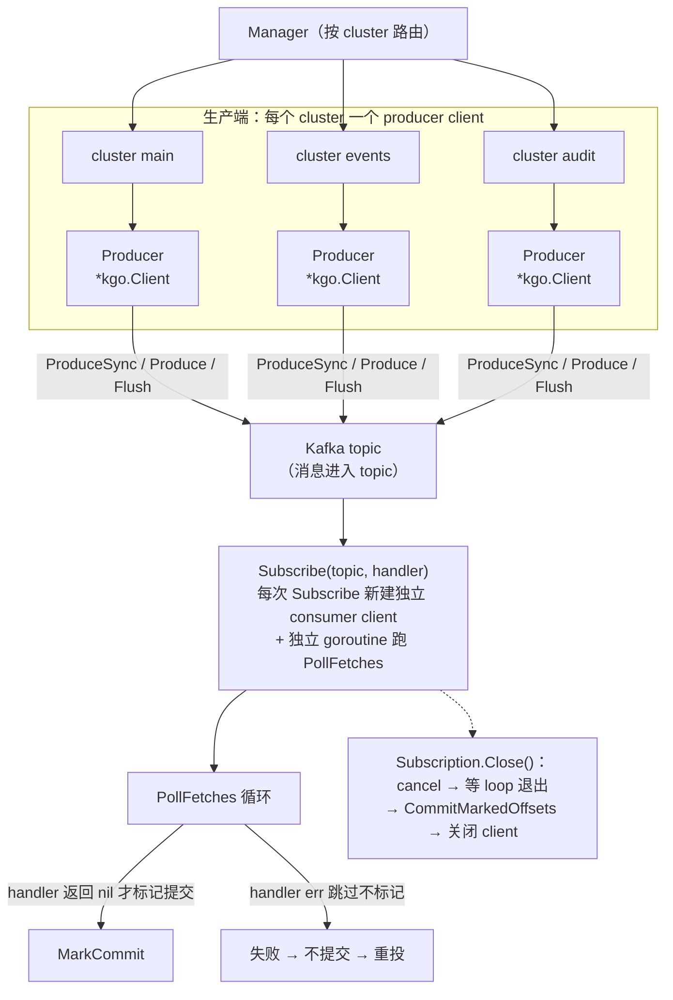

# Aifei-Go Kafka 插件：多集群生产/消费集成

> **生产/消费客户端分离 + 标记式提交 = 可控的 at-least-once。** 每个 `Subscribe` 起一个独立 franz-go 消费 client，handler 返回 `nil` 才 `MarkCommitRecords`，失败记录不提交、下次 rebalance/重启重投。

---

## 1. 背景与定位

Kafka 是高吞吐消息系统的事实标准。Aifei-Go 应用接入 Kafka 通常有三类需求：业务事件投递（订单下单后发消息）、领域异步消费（消费订单触发后续流程）、多集群隔离（业务消息与审计消息走不同集群）。

`plugins/kafka` 是基于 [franz-go](https://github.com/twmb/franz-go)（`twmb/franz-go`，纯 Go、活跃维护、API 现代化）封装的 Kafka 集成插件，把这些场景收敛到一套统一的接口背后：

- **是什么**：实现 `aifei.Plugin` 的 Kafka 多集群门面（facade），形如 `plugins/cache`、`plugins/storage` 的 Manager 模式
- **解决什么**：让业务代码只面向 `kafka.ProduceSync` / `kafka.Subscribe` 等包级函数，无需关心 client 构造、SASL/TLS、offset 提交策略
- **依赖**：内部模块 `aifei` / `config` / `log`；外部库 `github.com/twmb/franz-go`
- **不解决什么**：流处理语义、 Exactly-once 事务、复杂的路由拓扑——这些走 `KgoClient()` 逃逸口直接用 franz-go

> 想了解插件在整体框架中的位置，见 [core.md](core.md)。

---

## 2. 核心概念与数据流

插件的核心设计是**生产 client 与消费 client 物理隔离**：一个集群对应一个 producer `*kgo.Client`，但每次 `Subscribe` 都新建一个独立的 consumer `*kgo.Client`，跑在独立 goroutine 里。生产与消费互不阻塞、可独立停止。



关键类型清单：

| 类型 | 职责 |
|------|------|
| `Client` | 绑定单个集群的 facade：`ProduceSync` / `Produce` / `Flush` / `Subscribe` / `Close` / `KgoClient` |
| `Message` | Kafka 记录的统一模型，同时用于生产与消费 |
| `Header` | 记录头（`Key` + `Value`），Kafka 不解释 |
| `Handler` | 消费回调：返回 `nil` 表示确认，非 `nil` 表示失败 |
| `Promise` | 异步生产的完成回调：`func(msg *Message, err error)` |
| `Subscription` | 一个运行中的消费订阅，`Close` 时提交标记 offset |
| `Manager` | 多集群门面，按名路由 + 默认集群 |
| `Plugin` | `aifei.Plugin` 实现，读 `kafka.*` 配置并装包级默认 |

---

## 3. 关键 API

### 3.1 `Message` 与 `Header`

`Message` 是 Kafka 记录的统一表示，生产与消费共用同一个结构：

```go
type Header struct {
    Key   string
    Value []byte
}

type Message struct {
    Topic     string
    Partition int32
    Key       []byte
    Value     []byte
    Headers   []Header
    Timestamp time.Time
    Offset    int64  // 仅消费回调和异步 produce 完成时有值；生产时忽略
}
```

构造 helper 与链式 header：

```go
m := kafka.NewMessageWithKey("orders", []byte("order-42"), payloadJSON).
    WithHeader("trace-id", []byte("abc123")).
    WithHeader("source", []byte("checkout"))
```

- **`NewMessage(topic, value)`**：无 key，默认 partitioner 按 round-robin 分配分区
- **`NewMessageWithKey(topic, key, value)`**：同 key 的消息哈希到同一分区（默认 partitioner 下保证顺序）
- **`WithHeader(k, v)`**：链式追加 header，返回 `*Message`

### 3.2 `Client` 接口

每个集群对应一个 `Client`：

```go
type Client interface {
    Name() string
    ProduceSync(ctx context.Context, msgs ...*Message) error
    Produce(ctx context.Context, msg *Message, promise Promise)
    Flush(ctx context.Context) error
    Subscribe(ctx context.Context, topics []string, handler Handler) (*Subscription, error)
    Close() error
    KgoClient() *kgo.Client
}
```

最小消费示例：

```go
sub, err := kafka.DefaultClient().Subscribe(ctx, []string{"orders"},
    func(ctx context.Context, m *kafka.Message) error {
        return processOrder(m.Value) // nil → 确认；err → 不提交，等重投
    })
if err != nil { return err }
defer sub.Close()
```

### 3.3 `Handler` 与 `Subscription`

```go
type Handler func(ctx context.Context, msg *Message) error

type Subscription struct { /* 内部字段不暴露 */ }
func (s *Subscription) Close() error
func (s *Subscription) KgoClient() *kgo.Client
```

`Handler` 的返回值是整个 at-least-once 语义的核心开关——见下一节。

---

## 4. 生产者：同步、异步与 Flush

三种生产方式对应不同可靠性/吞吐诉求：

| 方式 | 签名 | 阻塞？ | 错误如何送达 | 适用场景 |
|------|------|--------|-------------|---------|
| **同步** | `ProduceSync(ctx, msgs...)` | 是（等全部 ack） | 返回值（首个错误） | 不能丢的关键事件、事务边界 |
| **异步** | `Produce(ctx, msg, promise)` | 否（入队即返） | `Promise` 回调 | 高吞吐、可容忍少量丢失 |
| **刷盘** | `Flush(ctx)` | 是（等缓冲排空） | 已通过 `Promise` 送达 | 关机前/批次末尾确保落地 |

### 同步生产

```go
if err := kafka.ProduceSync(ctx,
    kafka.NewMessage("orders", payload),
); err != nil {
    return fmt.Errorf("produce orders: %w", err)
}
```

底层是 `kgo.ProduceSync(ctx, recs...).FirstErr()`——返回**第一条**失败记录的错误，全部成功返回 `nil`。

### 异步生产 + Promise

```go
kafka.Produce(ctx, msg, func(m *kafka.Message, err error) {
    if err != nil {
        log.Printf("produce failed: topic=%s err=%v", m.Topic, err)
        // 应用可在此重投、落 DLQ、上报指标
    }
})
```

- `Produce` 入队即返回，ack 由 franz-go 后台完成后再回调 `Promise`
- `Promise` 可传 `nil`：纯 fire-and-forget，错误被吞掉（与 franz-go 一致）
- 异步生产**所有错误都走 Promise**，调用方拿不到同步返回值——这是为什么 `errClient.Produce` 也通过 promise 回灌错误

### Flush

```go
// 优雅关停前确保缓冲区落地
if err := kafka.Flush(shutdownCtx); err != nil {
    log.Printf("flush: %v", err)
}
```

---

## 5. 消费者：at-least-once 投递语义

这是插件最关键的设计决策，所有可靠性保证都围绕它。

### 5.1 标记式提交（`AutoCommitMarks`）

`buildConsumerOpts` 默认开启 `kgo.AutoCommitMarks()`（除非显式 `autoCommit.enable: false`）：

```go
if !ac.Enable {
    opts = append(opts, kgo.DisableAutoCommit())
} else {
    opts = append(opts, kgo.AutoCommitMarks())   // 关键
    if d := time.Duration(ac.IntervalMs) * time.Millisecond; d > 0 {
        opts = append(opts, kgo.AutoCommitInterval(d))
    }
}
```

`AutoCommitMarks` 把「提交什么 offset」从「当前消费位置」改成「`MarkCommitRecords` 显式标记的记录」。后台仍然周期性提交（默认 5s），但提交的是**被标记的**最新 offset，而不是当前位置。

### 5.2 poll 循环：handler 决定是否标记

`Subscription.loop` 是 at-least-once 的实现核心：

```go
fetches := s.cl.PollFetches(ctx)
// ... 错误处理 ...
iter := fetches.RecordIter()
for !iter.Done() {
    r := iter.Next()
    if err := handler(ctx, fromRecord(r)); err != nil {
        s.log.Warn("kafka: handler %s offset %d: %v (not committed)", r.Topic, r.Offset, err)
        continue                          // ← 失败：不标记
    }
    s.cl.MarkCommitRecords(r)             // ← 成功：标记
}
```

| handler 返回 | 标记？ | 下次提交是否含该 offset | 后果 |
|-------------|--------|----------------------|------|
| `nil` | 是 | 是 | 不再重投（modulo rebalance/崩溃前未落地） |
| 非 `nil` | 否 | 否 | 该记录 offset 未提交，下次 rebalance 或消费重启时重投 |

### 5.3 关键：失败记录不会立即重试

poll 循环**总是推进 fetch 位置**。handler 失败的记录被跳过、不标记，但它**不会被立即重新投递**——它的 offset 在下一次 rebalance（分区被撤销后重新获得）或消费重启时才会重投。这是真正的 at-least-once 语义：**至少投一次，可能投多次**。

应用如果需要：
- **立即进程内重试**：在 handler 内部 for 循环重试
- **seek 到失败位置重投**：用 `Subscription.KgoClient()` 逃逸口手动 `Seek` + 手动 commit

### 5.4 优雅关闭：最后一次提交

`Subscription.Close()` 三步：

```go
func (s *Subscription) Close() error {
    s.cancel()                                     // 1. 取消 ctx → loop 退出
    select {
    case <-s.done:
    case <-time.After(10 * time.Second):           //    最多等 10s
        s.log.Warn("kafka: subscription did not stop within 10s")
    }
    ctx, cancel := context.WithTimeout(context.Background(), 10*time.Second)
    defer cancel()
    if err := s.cl.CommitMarkedOffsets(ctx); err != nil { ... }  // 2. 最终提交标记 offset
    s.cl.Close()                                   // 3. 关闭 client
    return nil
}
```

`CommitMarkedOffsets` 是关键：应用关停前，把所有已成功处理但还没到 5s 周期提交的 offset **一次性提交**，避免重启后大量重投。`Manager.Close()` / `Plugin.Stop()` 会逐个调用每个 `Subscription.Close()`。

### 5.5 `Subscribe` 前置条件

```go
if cc == nil {
    return nil, fmt.Errorf("kafka: cluster %q has no consumer config", c.name)
}
if cc.GroupID == "" {
    return nil, fmt.Errorf("kafka: cluster %q consumer.groupId is required to subscribe", c.name)
}
```

要 `Subscribe`，集群配置必须有 `consumer` 块且 `consumer.groupId` 非空——否则报错。这是 fail-fast：避免无意中以「无 group 的裸消费者」跑（无法做 offset 提交，语义混乱）。

---

## 6. 多集群 Manager 与包级默认

### 6.1 `Manager`：按集群名路由

```go
type Manager struct { /* ... */ }

func NewManager(cfg *Config, logger log.Logger) (*Manager, error)
func (m *Manager) Default() Client           // 默认集群
func (m *Manager) Instance(name string) Client  // 空名 = 默认
func (m *Manager) Names() []string
func (m *Manager) Close() error              // 关每个 Subscription + 每个 producer
```

`NewManager` 为 `cfg.Clusters` 中每个集群建一个 `Client`；`cfg.Default` 指定默认集群，未设则取首个（建议显式设默认以保证确定性）。任一集群构造失败会清理已建的 client 后整体失败。

> 方法叫 `Instance(name)` 而非 `Client(name)`，因为 Go 不允许方法与其返回类型同名。

### 6.2 包级默认与顶层 helper

为了让业务代码完全无感知 client 句柄，插件提供包级默认 + 顶层函数：

```go
func SetDefault(mgr *Manager)
func DefaultManager() *Manager
func Use(name string) Client          // 命名集群；空名 = 默认
func DefaultClient() Client           // 默认集群

// 顶层 helper（作用在默认集群）
func ProduceSync(ctx, msgs...) error
func Produce(ctx, msg, promise)
func Flush(ctx) error
func Subscribe(ctx, topics, handler) (*Subscription, error)
```

未配置时 `DefaultClient()` 返回一个 `errClient`，所有调用返回 `ErrNoDefault`（异步 `Produce` 的错误通过 promise 回灌）——业务代码无需 `if manager == nil` 防御。多集群用法：默认集群走包级 helper，命名集群走 `kafka.Use("audit").ProduceSync(...)`。

---

## 7. 配置

插件读取全局配置的 `kafka.*` 子树（`prefix` 默认 `"kafka"`，可被 `NewPlugin` 覆盖）。`LoadConfig` 用 `config.SubBind` 做 YAML 往返绑定：

```go
cfg := &Config{Default: config.GetStr(prefix + ".default")}
if err := config.SubBind(prefix+".clusters", &cfg.Clusters); err != nil { ... }
```

### 完整 YAML

```yaml
kafka:
  default: main                          # 默认集群名

  clusters:
    main:                                # 一个集群条目 = 一个 Client
      brokers:                           # 必填，种子 broker 列表
        - "kafka-1:9092"
        - "kafka-2:9092"
        - "kafka-3:9092"
      clientId: "order-service"          # 可选，Kafka server 端日志里的 client.id

      producer:                          # 可选，nil 用默认
        acks: all                        # none | one | all（默认 all）
        compression: snappy              # none | gzip | snappy | lz4 | zstd（默认 snappy）
        lingerMs: 5                      # 批等待毫秒；0 = 立即发
        maxAttempts: 10                  # 重试次数；0 = franz-go 默认（无限）

      consumer:                          # 可选；为 nil 则该集群无法 Subscribe
        groupId: "order-consumer"        # 必填（Subscribe 要求）
        offsetReset: latest              # earliest | latest | none（默认 latest）
        balancer: cooperativeSticky      # roundRobin | range | sticky | cooperativeSticky
        autoCommit:
          enable: true                   # 关闭则需用 KgoClient() 手动提交
          intervalMs: 5000               # 默认 5000

    events:                              # 第二个集群（带鉴权 + TLS）
      brokers: ["events-kafka:9092"]
      clientId: "order-service-events"
      sasl:
        mechanism: scram-sha-512         # plain | scram-sha-256 | scram-sha-512
        user: "app"
        password: "${KAFKA_EVENTS_PASS}" # 推荐走环境变量注入
      tls:
        enabled: true                    # 必须为 true 才激活 TLS
        caFile: "/etc/kafka/ca.pem"      # 可选，root broker 证书
        certFile: "/etc/kafka/client.pem"  # mTLS：certFile + keyFile 必须同时给
        keyFile: "/etc/kafka/client-key.pem"
        insecureSkipVerify: false        # 测试用；生产别开
      consumer:
        groupId: "events-consumer"
        offsetReset: earliest
```

### 默认值速查

| 配置项 | 默认值 | franz-go 映射 |
|--------|--------|--------------|
| `producer.acks` | `all` | `kgo.AllISRAcks()` |
| `producer.compression` | `snappy` | `kgo.SnappyCompression()` |
| `producer.lingerMs` | 0（立即发） | 不设 `ProducerLinger` |
| `producer.maxAttempts` | 0（无限重试） | 不设 `RecordRetries` |
| `consumer.offsetReset` | `latest` | `NewOffset().AtEnd()` |
| `consumer.balancer` | `cooperativeSticky` | `CooperativeStickyBalancer()` |
| `consumer.autoCommit.enable` | `true` | `AutoCommitMarks()` |
| `consumer.autoCommit.intervalMs` | `5000` | `AutoCommitInterval(5s)` |

> **offset 起点的两个钩子都设**：`buildConsumerOpts` 同时设 `ConsumeStartOffset` 与 `ConsumeResetOffset`。因为 franz-go 的默认起始位置是 `earliest`，若不同时设，`offsetReset: latest` 对一个全新 group 不会真的从末尾开始。

### 字符串匹配是宽松的

`lower()` 做了 `TrimSpace + ToLower`，故 `"scram-sha-256"`、`"scram-sha256"`、`"scram256"` 都识别为 SCRAM-SHA-256；`"roundRobin"` 与 `"round-robin"` 等价；`"1"` / `"leader"` 等同 `"one"`。

---

## 8. 安全：SASL 与 TLS

### SASL

支持三种机制，由 `sasl.mechanism` 选择（大小写/连字符不敏感）：

| mechanism | franz-go 映射 |
|-----------|--------------|
| `plain` | `plain.Auth{User, Pass}.AsMechanism()` |
| `scram-sha-256` | `scram.Auth{...}.AsSha256Mechanism()` |
| `scram-sha-512` | `scram.Auth{...}.AsSha512Mechanism()` |

不识别的 mechanism 在构造 client 时报错（fail-fast，不会默默降级到 plain）。

### TLS / mTLS

```yaml
tls:
  enabled: true              # 总开关；false 或缺省 = 不启用 TLS
  caFile: "ca.pem"           # 校验 broker 证书的 root CA
  certFile: "client.pem"     # mTLS 客户端证书
  keyFile: "client-key.pem"  # mTLS 客户端私钥（必须与 certFile 同时给）
  insecureSkipVerify: true   # 跳过证书校验，仅测试用
```

行为约束（在 `buildTLSConfig` 里强制）：

- `enabled: false` 或缺省 → 不启用 TLS（明文连接）
- 只给 `certFile` 没给 `keyFile`（或反之）→ **报错**：mTLS 必须两者齐全
- `caFile` 缺省 + `certFile`/`keyFile` 齐全 → 用系统 root 做 broker 校验 + mTLS 客户端证书
- 鉴权/TLS 错误在 `newClient` 构造时暴露（而非首次 dial 时）——配置错误在启动即发现

### SASL + TLS 组合

两者可叠加（典型云上 Kafka：SCRAM 鉴权 + TLS 加密），`seedAndAuth` 把 `SeedBrokers` / `ClientID` / `SASL` / `DialTLSConfig` 组装成共享 opts，producer 与每个 consumer 都复用同一套鉴权配置。

---

## 9. 逃逸口：KgoClient

高级需求不被高层 API 覆盖时，直接取底层 `*kgo.Client`：

```go
// 逃逸到 producer client（事务、admin）
kgo := kafka.DefaultClient().KgoClient()

// 逃逸到 consumer client（手动提交、seek-on-error）
sub, _ := kafka.Subscribe(ctx, topics, handler)
defer sub.Close()
ckgo := sub.KgoClient()
```

通过 `KgoClient()` 可达的高级能力（与 franz-go 文档一致）：

| 能力 | 说明 |
|------|------|
| **事务**（Exactly-once） | `BeginTransaction` / `EndTransaction` |
| **手动提交** | `CommitRecords` 自定义提交边界（替代 `AutoCommitMarks`） |
| **seek-on-error** | 失败时 `Seek` 回 partition 起点重投 |
| **Admin 操作** | 用 `kgo.NewAdminClient` 或 `kadm` 包做 topic/partition 管理 |
| **消费 lag 监控** | `LagForPartitions` |

> 一旦使用 `KgoClient()`，调用方就与 franz-go 耦合了——这是有意识的设计取舍：80% 常见场景走高层 API 零依赖，20% 高级场景显式耦合。

---

## 10. 集成方式

### main()

```go
func main() {
    // 1. 加载配置（kafka.* 在 L1-L5 任一层都可）
    if err := config.Init(os.Args); err != nil {
        log.Fatal(err)
    }

    // 2. 创建插件（prefix 默认 "kafka"）
    p, err := kafka.NewPlugin(nil)
    if err != nil {
        log.Fatal(err)
    }

    // 3. 应用注册插件 —— server.Run 会在启动时调 p.Start()，关停时调 p.Stop()
    app := aifei.New(aifei.WithPlugin(p))
    app.Use(
        server.Logger(),
        server.Recover(),
    )
    server.AutoRegisterServices(app)
    server.Run(app, ":8080")
}
```

`Plugin.Start()` 读配置 → 建 `Manager` → `SetDefault(mgr)`；`Plugin.Stop()` 调 `Manager.Close()`：停每个 `Subscription`（提交标记 offset）+ 关每个 producer client。

### Service 层：生产

```go
func (s *OrderService) Create(in aifei.Input) aifei.Output {
    order := s.doCreate(in)
    payload, _ := json.Marshal(order)

    // 同步生产：不能丢的事件
    if err := kafka.ProduceSync(in.Context(),
        kafka.NewMessageWithKey("orders", []byte(order.ID), payload),
    ); err != nil {
        return server.Fail().SetMsg("publish order event: " + err.Error())
    }
    return server.Ok().SetData(order)
}
```

### Service 层：消费（后台启动）

`Subscribe` 通常在应用启动后单独起，不在请求路径里：

```go
func handleOrderEvent(ctx context.Context, m *kafka.Message) error {
    var ev OrderEvent
    if err := json.Unmarshal(m.Value, &ev); err != nil {
        return nil // 返回 nil 确认：坏消息别重投，避免毒丸阻塞分区
    }
    return processOrderEvent(ctx, ev) // nil = 确认；err = 不提交，等重投
}
```

> **handler 返回值的业务取舍**：对「格式坏/语义无效」返回 `nil`（确认并丢弃）；对「下游暂时不可用」的瞬时错误返回 `err`（让 Kafka 重投）。

---

## 11. 模块结构

```
plugins/kafka/
├── plugin.go         # aifei.Plugin 实现（Start 读配置建 Manager；Stop 关闭）
├── config.go         # Config / ClusterConfig / SASL/TLS/Producer/Consumer 配置类型
├── manager.go        # Manager 多集群门面（Default/Instance/Names/Close）
├── kafka_default.go  # 包级默认 + 顶层 helper（ProduceSync/Produce/Subscribe …）+ errClient
├── client.go         # Client 接口 + kgoClient 实现（producer + Subscribe 工厂）
├── consumer.go       # Handler / Subscription + at-least-once poll 循环
├── message.go        # Message / Header / Promise + 与 kgo.Record 互转
├── options.go        # 配置 → franz-go kgo.Opt（SASL/TLS/producer/consumer 选项 + 默认值映射）
└── type.go           # 字符串枚举常量（Acks/Compression/SASLMechanism/OffsetReset/Balancer）+ lower()
```

源码约 970 行。集成测试在 `_test/kafka_test`（用 franz-go 内置 `kfake` 内存 broker，零外部依赖）：produce→consume 往返、多集群路由、at-least-once 重投、`Subscribe` 无 group 报错。

---

## 12. 总结

Aifei-Go 的 Kafka 插件围绕几条核心设计原则：

1. **生产/消费物理隔离**：一个集群一个 producer client；每次 `Subscribe` 起独立 consumer client + 独立 goroutine，互不阻塞、可独立关停
2. **可控的 at-least-once**：`AutoCommitMarks` + handler 返回值控制标记——只有成功处理的消息才提交，失败的不提交、等下次 rebalance/重启重投
3. **优雅关停不丢数据**：`Close` 先等循环退出，再 `CommitMarkedOffsets` 一次性提交所有未周期提交的标记 offset
4. **fail-fast 配置校验**：鉴权/TLS 错误在构造时暴露，`Subscribe` 缺 group 即报错，未配置时顶层 helper 返回 `ErrNoDefault` 而非 panic
5. **Manager 模式一致性**：与 `cache.Manager` / `storage.Manager` 同形——按名路由 + 默认集群 + 包级 helper，学习曲线为零
6. **80/20 逃逸口**：常见场景走零依赖高层 API；事务、手动提交、seek、admin 走 `KgoClient()` 显式耦合 franz-go

这种设计让业务代码只需 `kafka.ProduceSync` / `kafka.Subscribe` 两个入口就能完成绝大多数 Kafka 集成，而把可靠性细节下沉到插件基础设施层。

---

### 延伸阅读

- Aifei 框架与 `aifei.Plugin` 生命周期：[core.md](core.md)
- 配置加载（`kafka.*` 子树的层级关系）：见 `docs/arch/04-phase4-utils.md`
- franz-go 官方文档：<https://github.com/twmb/franz-go>
