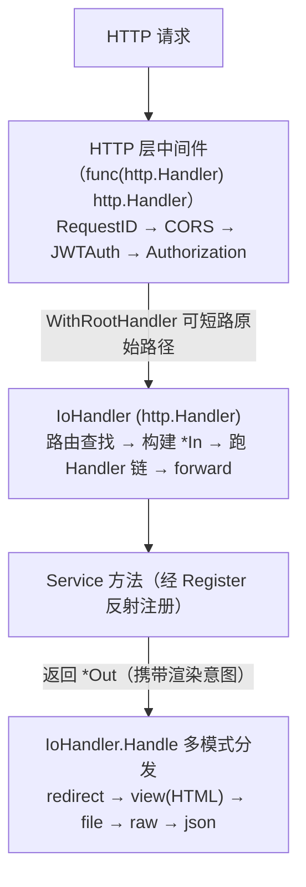
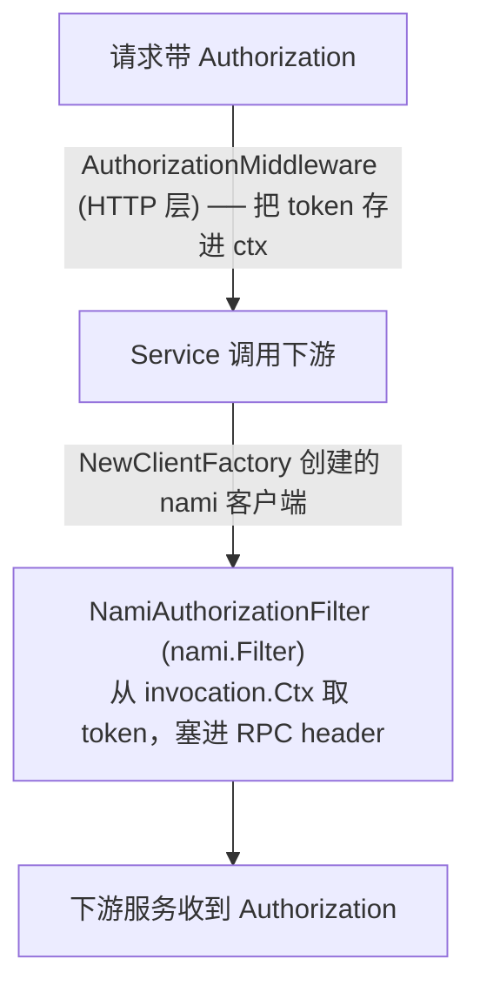

# Aifei-Go Server 定制指南

> 当 [aifei-go 自带的 `server` 包](server.md)（通用、JSON 为主、最小路由）满足不了业务诉求时，正确的做法**不是去改框架**，而是在应用仓库内**自带一套 `server` 包**做定制。本文讲清定制动机、落地模式与每一个扩展点的实现方法。

---

## 1. 背景：为什么需要定制 server

[aifei-go 的 `server` 包](server.md)定位是「通用最小实现」：`In`/`Out` 走 `{code,msg,data}` JSON、路由规则固定、中间件只给 `Logger/Recover/Timeout/CORS/...`。这对库/示例刚好，但一个真实业务系统往往还需要：

| 业务诉求 | aifei-go/server 基线 | 差距 |
|---------|---------------------|------|
| 服务端渲染（SSR）返回 HTML | 仅 JSON | 需 view 模板渲染 |
| 文件下载 / Excel 导出 | 无 | 需 FileSender + Content-Disposition |
| 重定向、原始字节流（图片/PDF/SSE） | 无 | 需 redirect / raw 模式 |
| Action 转发（forward）链 | 无 | 需 Java IoHandler 的 forward 语义 |
| JWT 登录态、登录用户上下文 | 仅 BasicAuth | 需 JWT 中间件 + LoginUser |
| 服务间 RPC 调用的鉴权透传 | 无 | 需把 Authorization 透传到 nami 调用 |
| 业务路由约定（`Add/Update` + camelCase 路径） | `Create` + kebab-case | 需定制 Register 规则 |

**架构判断**：这些都属于**应用/业务特定**的能力，塞进通用框架的 `server` 包会让它变重、且每个项目都要再改。所以 aifei-go 只下沉「核心」（`aifei` 路由 + Input/Output/Handler 接口），把 `server` 层留给应用自带——这正是 Java 版 aifei-vip-arch 的分层思路。

> 一句话：**框架提供核心契约（`aifei`），应用自带 `server` 层做业务定制。**

---

## 2. 总体模式：应用自带 server 包

应用的 `go.mod` 只依赖 aifei-go 的**核心包**，**不依赖 `aifei-go/server`**：

```
github.com/crazy-airhead/aifei-go/aifei      // 路由 + Input/Output/Handler 契约
github.com/crazy-airhead/aifei-go/http        // DefaultServer (net/http)
github.com/crazy-airhead/aifei-go/enjoy       // 视图模板引擎
github.com/crazy-airhead/aifei-go/log
github.com/crazy-airhead/aifei-go/nami        // RPC 客户端
github.com/crazy-airhead/aifei-go/plugins/nacos // 服务发现
// 注意：没有 aifei-go/server
```

应用在自己的 `pkg/server`（路径随意）下**自己实现**一整套：`IoHandler`/`In`/`Out`/`Run`/`Register`/中间件（与基线同名、但按业务改造），并**额外扩展** JWT、登录上下文、鉴权透传、RPC 工厂、文件下载等业务能力。

请求生命周期（定制后的全貌）：



---

## 3. Out：多模式响应信封

定制后的 `Out` 不再只是 JSON 容器，而是携带**渲染意图**的统一信封。两点关键：

**① JSON 线格式按业务对齐**——例如用 `status`/`msg`/`result`（而非 aifei-go 的 `code`/`data`），与前端/网关约定一致：

```go
const (
    CodeOK   = 200
    CodeFail = 500
)

// writeJSON 实际输出：{"status":200,"msg":"ok","result":{...}}
```

**② 一组「渲染意图」字段**，由 `IoHandler.Handle` 消费，决定如何写响应：

| 构造器 | 渲染意图 | 用途 |
|--------|---------|------|
| `Ok()/Fail()/Failf()/Of()/OfField()` | JSON | 常规接口响应 |
| `Redirect(url, status...)` | HTTP 重定向 | 302/301/307/308 |
| `Forward(path)` | 转发到另一 action | 服务端内部跳转（不回客户端） |
| `OfFile(fn func(*FileSender))` | 文件下载 | Excel 导出、附件下载 |
| `OfRaw(ct, bytes)` / `OfRawReader(ct, r)` | 原始字节流 | 图片、PDF、SSE |
| `SetView(path)` | enjoy 模板 → HTML | SSR 页面 |

```go
// 导出 Excel
return server.OfFile(func(s *server.FileSender) {
    s.SetSaveAsName("users.xlsx").SetData(excelBytes)
})

// SSR 渲染
return server.Ok().SetView("user/detail").SetData(map[string]any{"u": user})

// 流式返回图片
return server.OfRaw("image/png", pngBytes)
```

`Out` 同时满足 `aifei.Output`（`Code()/Msg()/Data()`）与事务契约（`ShouldRollback()`：code≠OK 即回滚）。

---

## 4. IoHandler：多模式分发 + forward 链

`IoHandler` 是定制的核心——完整移植 Java `aifei-vip-arch` 的 `IoHandler`，实现 `http.Handler`：

```go
type IoHandler struct {
    app *aifei.Aifei
    engine           *enjoy.Engine // view 引擎，懒加载
    engineName       string        // 引擎名
    baseTemplatePath string        // 模板根目录
    downloadBase     string        // FileSender 磁盘下载根目录
    devMode          bool          // enjoy dev 模式（关模板缓存）
}
```

**分发优先级**（`Handle` 方法，镜像 Java `handleOutput`）：

```
1. redirect  — Location + status（无 body）
2. headers   — 先套业务响应头/cookie；模式的 Content-Type 覆盖之
3. view      — enjoy 模板 → HTML
4. file      — FileSender → 附件下载/导出
5. raw       — 原始字节（自定义 Content-Type）
6. json      — {status,msg,result}（默认）
```

**forward 链**（Java `IoHandler.handle` 语义）：当 `Out.ForwardPath()` 非空，`ServeHTTP` 在服务端**重新分发**到目标路径（不把 forward 响应回客户端），链深度有上界（如 `maxForwards = 8`）防止自环：

```go
for depth := 0; depth < maxForwards; depth++ {
    o, ok := out.(*Out)
    if !ok || o.ForwardPath() == "" { break }
    target := o.ForwardPath()
    if target == path { /* 自环，报错 */ }
    out, _ = h.invoke(in, target)   // 重新分发
    path = target
}
```

**HTTP 状态由业务 code 映射**（`writeJSON`/`httpStatus`）：

| 业务 code | HTTP status |
|-----------|-------------|
| `< 0` | 404（路由未命中等） |
| `400–499` | 原样透传（客户端错误） |
| `≥ 500` | 500（统一，避免泄露内部） |
| 其他（含 200） | 200 |

配置通过函数式选项：`WithViewEngine`/`WithEngineName`/`WithBaseTemplatePath`/`WithDownloadBase`/`WithDevMode`。

> 实现细节亮点：用一个 `writeTracker` 包裹 `ResponseWriter` 记录 header 是否已写，这样 `FileSender` 出错时能判断「还没写头 → 回退 JSON 错误」还是「已写头 → 只能记日志」。

---

## 5. 路由规则定制（Register）

定制的 `Register` 与 aifei-go 基线规则**不同**，体现业务命名习惯：

**① 默认动作映射**（一个 `defaultMethodMap`，按业务约定；下面是一种常见约定：查询类 GET、写操作 POST）：

| 方法名 | HTTP 方法 |
|--------|----------|
| `Paginate` / `List` / `Get` | GET（或统一 POST，视团队约定） |
| `Add` / `Update` / `Delete` | POST |

**② 动词前缀**（显式指定方法，前缀从路径剥离）：`Get`→GET、`Post`→POST、`Put`→PUT、`Delete`→DELETE，剩余部分转路径。

**③ `camelToPath` 的命名规则可选**——camelCase（只把首字母小写，内部大写保留）或 kebab-case，按团队习惯：

```
PreviewPath → previewPath     （camelCase 约定）
PreviewPath → preview-path    （kebab-case，aifei-go 基线）
```

与基线的关键对比（定制时可自由调整）：

| 维度 | aifei-go/server | 可定制成 |
|------|-----------------|----------|
| 默认动作 | `Paginate`→GET、`Create`→POST、`List`→GET `/list` | `Add/Update/Delete` 等，方法按约定 |
| `ById` → `:id` | 有 | 可保留或去掉 |
| 路径命名 | kebab-case | camelCase 或其他 |
| `Update` 前缀 | 有（→PUT） | 可改为默认动作 |

仍支持方法级 AOP：service 实现 `aifei.MethodInterceptors` 即可按方法名挂拦截器。

---

## 6. Run 与中间件链

`Run(app, addr, opts...)` 组装 handler 链并优雅启停。定制点：**两层中间件** + **`WithRootHandler` 短路**：

```go
// 链组装顺序：核心 aifei handler 可被 rootWrapper 包裹，再套 HTTP 中间件
core := http.Handler(NewIoHandler(app, o.ioOptions...))
if o.rootWrapper != nil { core = o.rootWrapper(core) }   // WithRootHandler
h := core
for i := len(o.httpHandlers) - 1; i >= 0; i-- { h = o.httpHandlers[i](h) }
```

| 选项 | 作用 |
|------|------|
| `WithRootHandler(wrap)` | 在最内层（HTTP 中间件链**之前**）包裹核心 handler，用于**短路特定路径**（如原始文件端点直接写二进制/302，绕开 aifei JSON 路由） |
| `WithHTTPHandler(m)` / `WithCORS` / `WithBasicAuth` / `WithRequestID` | 追加 HTTP 层中间件 |
| `WithIoOptions(opts...)` | 配置 `IoHandler`（view 引擎、下载根、dev 模式） |

两层中间件各司其职：`Logger/Recover/Timeout` 是 `aifei.Handler`（Input→Output，在路由内）；`CORS/BasicAuth/RequestID/JWTAuth/Authorization` 是 `func(http.Handler) http.Handler`（在路由外，`net/http` 层）。

---

## 7. JWT 认证与登录上下文

业务定制最常见的需求。设计一个 `JWTAuthMiddleware`，从全局配置读取 JWT 参数：

```yaml
jwt:
  secret: <base64 HS256 密钥>   # 空 = 关闭验签（仅本地开发）
  issuer: <要求的 iss>          # 空 = 不校验 iss
  excludeUrls:                  # Ant 风格豁免路径
    - /public/**
    - /health
```

中间件流程：`Authorization: Bearer <token>` → `jwt.Parse` 验签 → 校验 `iss` → 把 claims 解析成 `LoginUser` → `WithLoginUser(ctx)` 写入请求上下文：

```go
type LoginUser struct {
    UserId, UserType, UserName, Name string
    DeptId, DeptName, OrgId, OrgUid, OrgName string
    Token     string
    DataLevel int
    Roles     []map[string]string
}
func (u *LoginUser) IsAdmin() bool  // UserType == "0"
func (u *LoginUser) IsMember() bool // UserType == "1"
```

业务代码无需自己解 claims，直接在 service 里取：

```go
func (s *UserService) Profile(in aifei.Input) aifei.Output {
    u := in.(*server.In).LoginUser()   // 永远非 nil（无登录态时零值）
    return server.Of(u)
}
```

要点：
- **Ant 路径豁免**（用 `go-antpath` 等库）：`/public/**` 跳过整棵子树，`/public/*` 只匹配一层。
- **空密钥安全降级**：`secret` 为空时关闭验签但仍透传 token，并用 `sync.Once` 保证「验签已关闭」警告**每进程只打一次**。
- **配置错误 fail-fast**：`secret` 非 base64 直接 `panic`（启动期暴露，而非运行期静默）。

---

## 8. 服务间鉴权透传

微服务场景下，网关验完的 JWT 要在服务间 RPC 调用时继续传递。用「HTTP 层取 token → context 透传 → nami filter 注入」三步打通：



```go
// HTTP 层取值 + context 存储
func AuthorizationMiddleware() func(http.Handler) http.Handler // header/query → ctx
func WithAuthorization(ctx, token) / AuthorizationFrom(ctx)     // context 存取

// nami filter：把 ctx 里的 token 注入每次 RPC
func NamiAuthorizationFilter() nami.Filter {
    return nami.FilterFunc(func(inv *nami.Invocation) (*nami.Result, error) {
        if _, ok := inv.Headers["Authorization"]; !ok {
            if auth := AuthorizationFrom(inv.Ctx); auth != "" {
                inv.Headers["Authorization"] = auth
            }
        }
        return inv.Invoke()
    })
}
```

业务代码完全无感——既不用在每个 endpoint 读 header，也不用每次 RPC 手动塞 token。

---

## 9. ClientFactory：RPC 客户端工厂

把「Nacos 发现 + 鉴权透传 + 超时」打包成一个 per-service 工厂，业务侧只关心路径：

```go
// 一个 factory 代表一个外部服务；不同接口仅 path 不同
factory := svr.NewClientFactory("user-service")        // 默认 60s 超时
factory := svr.NewClientFactory("user-service", 15)    // 15s 超时

result, err := factory.For("/api/users").
    Action(nami.MethodPost).
    Context(ctx).                 // 携带请求级 Authorization
    CallOrThrow(...)
```

内部实现就是 `nami.NewClientFactory()` 链式装配：

```go
return nami.NewClientFactory().
    Upstream(nacos.NewNamiUpstream(serviceName)). // Nacos 发现
    ServiceName(serviceName).
    Timeout(timeoutSeconds).
    FilterAdd(NamiAuthorizationFilter())          // 鉴权透传
```

建议再提供 `NewClientFactoryWithUpstream`，接受显式 upstream，测试时注入固定地址、绕过 Nacos，离线跑通 RPC 接线。

---

## 10. FileSender：文件下载 / 导出

`Out.OfFile(func(*FileSender){...})` 闭包里配置下载，**所有 I/O 由 `IoHandler` 完成**——业务代码永远拿不到裸 `http.ResponseWriter`（安全且可测）。

三种 body 来源，按优先级：

| 来源 | 场景 | setter |
|------|------|--------|
| `Data`（内存字节） | 生成的 Excel/PDF | `SetData([]byte)` |
| `Reader`（流） | 大文件、storage 对象体 | `SetReader(io.Reader)` + `SetSize` |
| `FileName`（磁盘） | 已有文件，按 `downloadBase` 解析 | `SetFileName(path)` |

```go
return server.OfFile(func(s *server.FileSender) {
    s.SetFileName("reports/2026-07.xlsx").
      SetSaveAsName("2026年7月报表.xlsx").   // RFC 5987 编码，支持中文
      SetContentType("application/vnd.ms-excel")
})
```

要点：
- **`Content-Disposition: attachment; filename*=UTF-8''<pct-encoded>`**——按 RFC 5987 编码，正确处理中文文件名。
- **`SetSaveAsName` 校验**：含路径分隔符直接 `panic`（防目录穿越）。
- **MIME 推断**：`mime.TypeByExtension` → 内置兜底表（zip/xlsx/pdf/csv/png/mp4 …）→ `application/octet-stream`。

---

## 11. 定制落地步骤（可复用套路）

把上述做法抽象成可复用的定制流程：

1. **只依赖核心包**：`go.mod` 引 `aifei-go/aifei`、`/http`、`/enjoy`、`/log`（按需 `/nami`、`/plugins/nacos`），**不引 `/server`**。
2. **自带 server 包**：从基线 copy `In/Out/IoHandler/Run/Register/handler` 作为起点，再按业务改。
3. **先定响应契约**：确定 `Out` 的 JSON 线格式（字段名、code 约定）与需要的渲染模式（view/file/raw/redirect/forward），这决定 `IoHandler.Handle` 的分发分支。
4. **再定路由约定**：在 `Register` 里写死本项目的「默认动作映射 + 动词前缀 + 路径命名规则」，让 `Just Service` 反射注册符合团队习惯。
5. **叠加业务横切**：JWT/登录态、鉴权透传、RPC 工厂、文件下载——每类一个独立文件，互不耦合。
6. **`Run` 装配**：用函数式选项把中间件链、`IoHandler` 配置、`WithRootHandler` 短路点串起来。

> 判断「该进框架还是该定制」的经验法则：**与具体业务/协议/命名习惯耦合的 → 应用自带 server 定制；所有项目都通用的最小契约 → 进 aifei-go 核心。**

---

## 12. 推荐的 server 包结构

按定制点划分文件，每类职责独立、按需引入：

| 文件 | 职责 |
|------|------|
| `io_handler.go` | `IoHandler`（`http.Handler`）：路由查找、forward 链、多模式分发 |
| `out.go` | `Out` 响应信封：JSON 线格式 + 渲染意图（redirect/view/file/raw/forward） |
| `in.go` | `In`（`aifei.Input`）：请求参数 + 登录态访问器 |
| `run.go` | `Run`：handler 链组装、优雅启停、`WithRootHandler` 短路 |
| `register.go` | `Register`：反射注册 + 定制路由规则（`defaultMethodMap`/`camelToPath`） |
| `handler.go` | 两层中间件：`Logger/Recover/Timeout` + `CORS/BasicAuth/RequestID/StaticFile` |
| `jwt.go` | `JWTAuthMiddleware`：JWT 验签 + claims 解析 + 豁免（按需） |
| `login_user.go` | `LoginUser` 身份模型 + context 存取（按需） |
| `auth.go` | `Authorization` 透传 + `NamiAuthorizationFilter`（按需） |
| `client_factory.go` | `NewClientFactory`：Nacos 发现 + 鉴权 + 超时的 RPC 工厂（按需） |
| `file_sender.go` | `FileSender`：文件下载/导出（Data/Reader/FileName）（按需） |
| `headers.go` | `Headers`：响应头/cookie 构造器（按需） |
| `tx_interceptor.go` | `TxInterceptor`：自动事务包裹（按需） |

前 6 个是骨架（几乎都要），后面的业务横切按需引入——不需要的就不建，保持精简。

---

## 13. 总结

1. **应用自带 server 包**是 aifei-go 的既定分层——核心契约在框架，业务定制在应用，互不污染。
2. **`Out` 携带渲染意图** + **`IoHandler` 多模式分发**，让同一套 Handler 既能出 JSON、也能出 HTML/文件/流/重定向/转发。
3. **路由规则可定制**：默认动作映射、路径命名、动词前缀都由应用说了算。
4. **业务横切独立成文件**：JWT、登录态、鉴权透传、RPC 工厂、文件下载各自闭环，按需引入。
5. **`Run` 用函数式选项**装配一切，`WithRootHandler` 提供绕过 JSON 路由的逃生舱。
6. **安全默认**：文件名防穿越、密钥错误 fail-fast、空密钥降级只警告一次、HTTP 状态统一收敛。

这种「核心契约 + 应用定制」的分层，让 aifei-go 既能作为零依赖的轻量核心被任何项目引入，又能在真实业务里长出完整的工程化能力。

### 延伸阅读

- [server](server.md) — aifei-go 自带 `server` 包（定制前的基线）
- [core](core.md) — `aifei` 核心包：路由、`Input`/`Output`/`Handler` 契约（定制依赖的根基）
- [enjoy](enjoy.md) — 模板引擎（`IoHandler` 的 view 渲染底座）
- [nami](nami.md) — RPC 客户端框架（`ClientFactory` / `NamiAuthorizationFilter` 的宿主）
- [nacos](nacos.md) — 服务发现（`NewNamiUpstream` 把发现接入 nami）
